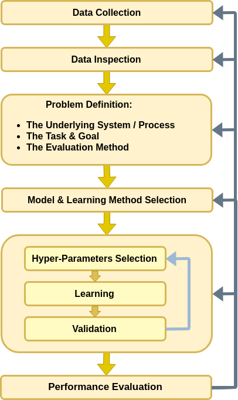

<!-- .slide: class="center" -->

<h1 class="workshop-title">Workshop 5<br>K-NN</h1>

---new slide---

## Fine-needle aspiration (FNA)

A sample of the tissue is extracted using a needle to determine whether it is:

- Malignant - cancerous tissue

- Benign - non-cancerous tissue

<center>

</center>

---new slide---

## 🦠 Dataset: Breast Cancer Wisconsin

- Includes 30 numeric properties.

- Extracted from 569 different samples.

- Labels of whether the sample is malignant or benign.

<table border="1" class="dataframe">
  <thead>
    <tr style="text-align: right;">
      <th></th>
      <th>id</th>
      <th>diagnosis</th>
      <th>radius_mean</th>
      <th>texture_mean</th>
      <th>perimeter_mean</th>
      <th>area_mean</th>
      <th>smoothness_mean</th>
      <th>compactness_mean</th>
      <th>concavity_mean</th>
      <th>concave points_mean</th>
      <th>...</th>
      <th>radius_worst</th>
      <th>texture_worst</th>
      <th>perimeter_worst</th>
      <th>area_worst</th>
      <th>smoothness_worst</th>
      <th>compactness_worst</th>
      <th>concavity_worst</th>
      <th>concave points_worst</th>
      <th>symmetry_worst</th>
      <th>fractal_dimension_worst</th>
    </tr>
  </thead>
  <tbody>
    <tr>
      <th>0</th>
      <td>842302</td>
      <td>M</td>
      <td>17.99</td>
      <td>10.38</td>
      <td>122.80</td>
      <td>1001.0</td>
      <td>0.11840</td>
      <td>0.27760</td>
      <td>0.30010</td>
      <td>0.14710</td>
      <td>...</td>
      <td>25.38</td>
      <td>17.33</td>
      <td>184.60</td>
      <td>2019.0</td>
      <td>0.1622</td>
      <td>0.6656</td>
      <td>0.7119</td>
      <td>0.2654</td>
      <td>0.4601</td>
      <td>0.11890</td>
    </tr>
    <tr>
      <th>1</th>
      <td>842517</td>
      <td>M</td>
      <td>20.57</td>
      <td>17.77</td>
      <td>132.90</td>
      <td>1326.0</td>
      <td>0.08474</td>
      <td>0.07864</td>
      <td>0.08690</td>
      <td>0.07017</td>
      <td>...</td>
      <td>24.99</td>
      <td>23.41</td>
      <td>158.80</td>
      <td>1956.0</td>
      <td>0.1238</td>
      <td>0.1866</td>
      <td>0.2416</td>
      <td>0.1860</td>
      <td>0.2750</td>
      <td>0.08902</td>
    </tr>
    <tr>
      <th>2</th>
      <td>84300903</td>
      <td>M</td>
      <td>19.69</td>
      <td>21.25</td>
      <td>130.00</td>
      <td>1203.0</td>
      <td>0.10960</td>
      <td>0.15990</td>
      <td>0.19740</td>
      <td>0.12790</td>
      <td>...</td>
      <td>23.57</td>
      <td>25.53</td>
      <td>152.50</td>
      <td>1709.0</td>
      <td>0.1444</td>
      <td>0.4245</td>
      <td>0.4504</td>
      <td>0.2430</td>
      <td>0.3613</td>
      <td>0.08758</td>
    </tr>
    <tr>
      <th>3</th>
      <td>84348301</td>
      <td>M</td>
      <td>11.42</td>
      <td>20.38</td>
      <td>77.58</td>
      <td>386.1</td>
      <td>0.14250</td>
      <td>0.28390</td>
      <td>0.24140</td>
      <td>0.10520</td>
      <td>...</td>
      <td>14.91</td>
      <td>26.50</td>
      <td>98.87</td>
      <td>567.7</td>
      <td>0.2098</td>
      <td>0.8663</td>
      <td>0.6869</td>
      <td>0.2575</td>
      <td>0.6638</td>
      <td>0.17300</td>
    </tr>
    <tr>
      <th>4</th>
      <td>84358402</td>
      <td>M</td>
      <td>20.29</td>
      <td>14.34</td>
      <td>135.10</td>
      <td>1297.0</td>
      <td>0.10030</td>
      <td>0.13280</td>
      <td>0.19800</td>
      <td>0.10430</td>
      <td>...</td>
      <td>22.54</td>
      <td>16.67</td>
      <td>152.20</td>
      <td>1575.0</td>
      <td>0.1374</td>
      <td>0.2050</td>
      <td>0.4000</td>
      <td>0.1625</td>
      <td>0.2364</td>
      <td>0.07678</td>
    </tr>
    <tr>
      <th>5</th>
      <td>843786</td>
      <td>M</td>
      <td>12.45</td>
      <td>15.70</td>
      <td>82.57</td>
      <td>477.1</td>
      <td>0.12780</td>
      <td>0.17000</td>
      <td>0.15780</td>
      <td>0.08089</td>
      <td>...</td>
      <td>15.47</td>
      <td>23.75</td>
      <td>103.40</td>
      <td>741.6</td>
      <td>0.1791</td>
      <td>0.5249</td>
      <td>0.5355</td>
      <td>0.1741</td>
      <td>0.3985</td>
      <td>0.12440</td>
    </tr>
    <tr>
      <th>6</th>
      <td>844359</td>
      <td>M</td>
      <td>18.25</td>
      <td>19.98</td>
      <td>119.60</td>
      <td>1040.0</td>
      <td>0.09463</td>
      <td>0.10900</td>
      <td>0.11270</td>
      <td>0.07400</td>
      <td>...</td>
      <td>22.88</td>
      <td>27.66</td>
      <td>153.20</td>
      <td>1606.0</td>
      <td>0.1442</td>
      <td>0.2576</td>
      <td>0.3784</td>
      <td>0.1932</td>
      <td>0.3063</td>
      <td>0.08368</td>
    </tr>
    <tr>
      <th>7</th>
      <td>84458202</td>
      <td>M</td>
      <td>13.71</td>
      <td>20.83</td>
      <td>90.20</td>
      <td>577.9</td>
      <td>0.11890</td>
      <td>0.16450</td>
      <td>0.09366</td>
      <td>0.05985</td>
      <td>...</td>
      <td>17.06</td>
      <td>28.14</td>
      <td>110.60</td>
      <td>897.0</td>
      <td>0.1654</td>
      <td>0.3682</td>
      <td>0.2678</td>
      <td>0.1556</td>
      <td>0.3196</td>
      <td>0.11510</td>
    </tr>
    <tr>
      <th>8</th>
      <td>844981</td>
      <td>M</td>
      <td>13.00</td>
      <td>21.82</td>
      <td>87.50</td>
      <td>519.8</td>
      <td>0.12730</td>
      <td>0.19320</td>
      <td>0.18590</td>
      <td>0.09353</td>
      <td>...</td>
      <td>15.49</td>
      <td>30.73</td>
      <td>106.20</td>
      <td>739.3</td>
      <td>0.1703</td>
      <td>0.5401</td>
      <td>0.5390</td>
      <td>0.2060</td>
      <td>0.4378</td>
      <td>0.10720</td>
    </tr>
    <tr>
      <th>9</th>
      <td>84501001</td>
      <td>M</td>
      <td>12.46</td>
      <td>24.04</td>
      <td>83.97</td>
      <td>475.9</td>
      <td>0.11860</td>
      <td>0.23960</td>
      <td>0.22730</td>
      <td>0.08543</td>
      <td>...</td>
      <td>15.09</td>
      <td>40.68</td>
      <td>97.65</td>
      <td>711.4</td>
      <td>0.1853</td>
      <td>1.0580</td>
      <td>1.1050</td>
      <td>0.2210</td>
      <td>0.4366</td>
      <td>0.20750</td>
    </tr>
  </tbody>
</table>

---new slide---

## ❓️ Problem: Predict the Correct Diagnostic

<br>

Help the medical crew make the correct diagnostic by giving them a prediction based on the sample.

---new slide---

## 🔃 The Workflow

<center>

</center>

---new slide---

## 🕵️ Data Inspection

<div>
<table border="1" class="dataframe">
  <thead>
    <tr style="text-align: right;">
      <th></th>
      <th>id</th>
      <th>diagnosis</th>
      <th>radius_mean</th>
      <th>texture_mean</th>
      <th>perimeter_mean</th>
      <th>area_mean</th>
      <th>smoothness_mean</th>
      <th>compactness_mean</th>
      <th>concavity_mean</th>
      <th>concave points_mean</th>
      <th>...</th>
      <th>radius_worst</th>
      <th>texture_worst</th>
      <th>perimeter_worst</th>
      <th>area_worst</th>
      <th>smoothness_worst</th>
      <th>compactness_worst</th>
      <th>concavity_worst</th>
      <th>concave points_worst</th>
      <th>symmetry_worst</th>
      <th>fractal_dimension_worst</th>
    </tr>
  </thead>
  <tbody>
    <tr>
      <th>0</th>
      <td>842302</td>
      <td>M</td>
      <td>17.99</td>
      <td>10.38</td>
      <td>122.80</td>
      <td>1001.0</td>
      <td>0.11840</td>
      <td>0.27760</td>
      <td>0.30010</td>
      <td>0.14710</td>
      <td>...</td>
      <td>25.38</td>
      <td>17.33</td>
      <td>184.60</td>
      <td>2019.0</td>
      <td>0.1622</td>
      <td>0.6656</td>
      <td>0.7119</td>
      <td>0.2654</td>
      <td>0.4601</td>
      <td>0.11890</td>
    </tr>
    <tr>
      <th>1</th>
      <td>842517</td>
      <td>M</td>
      <td>20.57</td>
      <td>17.77</td>
      <td>132.90</td>
      <td>1326.0</td>
      <td>0.08474</td>
      <td>0.07864</td>
      <td>0.08690</td>
      <td>0.07017</td>
      <td>...</td>
      <td>24.99</td>
      <td>23.41</td>
      <td>158.80</td>
      <td>1956.0</td>
      <td>0.1238</td>
      <td>0.1866</td>
      <td>0.2416</td>
      <td>0.1860</td>
      <td>0.2750</td>
      <td>0.08902</td>
    </tr>
    <tr>
      <th>2</th>
      <td>84300903</td>
      <td>M</td>
      <td>19.69</td>
      <td>21.25</td>
      <td>130.00</td>
      <td>1203.0</td>
      <td>0.10960</td>
      <td>0.15990</td>
      <td>0.19740</td>
      <td>0.12790</td>
      <td>...</td>
      <td>23.57</td>
      <td>25.53</td>
      <td>152.50</td>
      <td>1709.0</td>
      <td>0.1444</td>
      <td>0.4245</td>
      <td>0.4504</td>
      <td>0.2430</td>
      <td>0.3613</td>
      <td>0.08758</td>
    </tr>
  </tbody>
</table>

<br>
We will ourselves to the following columns:

- **diagnosis** - The correct diagnosis: 
  - M = malignant (cancerous)
  - B = benign (non-cancerous)
- **radius_mean** - The average radius of the cells in the sample.
- **texture_mean** - The average standard deviation of gray-scale values of the cells in the sample.

---new slide---

### 📉 Some Plots

The number of malignant and benign samples in the dataset

<center><div style="display:inline-block;background-color:rgba(255, 255, 255, 0.7); box-shadow: 0 0 5px 10px rgba(255, 255, 255, 0.7)">

</div></center>

---new slide---

### 📉 Some Plots - Cont.

Distribution of samples as a function of the measured values

<center><div style="display:inline-block;background-color:rgba(255, 255, 255, 0.7); box-shadow: 0 0 5px 10px rgba(255, 255, 255, 0.7)">

</div></center>

<br>

<center><div style="display:inline-block;background-color:rgba(255, 255, 255, 0.7); box-shadow: 0 0 5px 10px rgba(255, 255, 255, 0.7)">

</div></center>

---new slide---

### 📉 Some Plots - Cont 2.

2D plot

<center><div style="display:inline-block;background-color:rgba(255, 255, 255, 0.7); box-shadow: 0 0 5px 10px rgba(255, 255, 255, 0.7)">

</div></center>

---new slide---

## 📜 Problem Definition

<br>

### The Underlying System

Samples are generated based upon a conditional distribution:

<center></center>

---new slide---

## 📜 Problem Definition - Cont.

<br>

### The Task and the Goal

- Supervised learning problem: Binary classification.

- Find a prediction function `$h\left(\cdot\right)$`, mapping form `$\boldsymbol{x}=\left[\text{mean_radius},\text{mean_texture}\right]^T$` to `$y$`.

<br>

### Evaluation Method: The Misclassification Rate

`$$
R\left\{h, \left\{\boldsymbol{x},y\right\}\right\}=\frac{1}{N}\sum_i I\left\{h\left(\boldsymbol{x}_i\right)\neq y_i\right\}
$$`

---new slide---

### 📚 Splitting the dataset

<br>

```python
n_samples = len(dataset)

## Generate a random generator with a fixed seed (this is important to make our result reproducible)
rand_gen = np.random.RandomState(0)

## Generating a vector of indices
indices = np.arange(n_samples)

## Shuffle the indices
rand_gen.shuffle(indices)

## Split the indices into 80% train / 20% test
n_samples_train = int(n_samples * 0.8)
train_indices = indices[:n_samples_train]
test_indices = indices[n_samples_train:]

train_set = dataset.iloc[train_indices]
test_set = dataset.iloc[test_indices]
```

---new slide---

## 💡 Model Suggestion 1: 1-NN

<br>

- We will use the 1-NN algorithm.

- 1-NN has no learning stage.

---new slide---

### Voronoi Diagram

The prediction function.

<center><div style="display:inline-block;background-color:rgba(255, 255, 255, 0.7); box-shadow: 0 0 5px 10px rgba(255, 255, 255, 0.7)">

</div></center>

---new slide---

### ✍️ Exercise 5.1

<br>

Write a function implementing the 1-NN mapping

<br>

#### Solution 5.1


```python
def one_nn(x, stored_x, stored_y):
    distances = ((stored_x - x) ** 2).sum(axis=1)
    nn_index = np.argmin(distances)
    return stored_y[nn_index]
```

---new slide---

## ⏱️ Performance evaluation

<br>

```python
## Initilize the predictions vector
predictions = np.zeros((len(x_test)))
for i in range(len(predictions)):
    predictions[i] = one_nn(x_test[i], x, y)

test_risk = (y_test != predictions).mean()
print_math('The test risk is: ${:.2}$'.format(test_risk))
```
<br>

The test risk is: `$0.14$`

---new slide---

## 💡 Model Suggestion 2: K-NN

<br>

- We expect to improve using the K-NN algorithm.

- Select $K$ by testing all the relevant values of $K$.

---new slide---

## Hyper-parameters

Parameters for which we do not have an efficient way to optimally select.

`$K$` is an **hyper-parameters** of the model.

Three more hyper-parameters which we have encountered so far are:

- The number of bins in a histogram.
- The kernel and width in KDE.
- The $K$ in K-Means.

<br>

Optional methods for selecting the hyper-parameters:

- Brute Force / Grid Search

- Trial and error

---new slide---

## The workflow revisited - Hyper-parameters

<center></center>

---new slide---

## ⚙️ Learning

<br>

### ✍️ Exercise 5.2

- Select the optimal $K$ from the range $\left[1,100\right]$.
- Plot the risk as a function of $K$.

<br>

Use SciKit-Learn's [KNeighborsClassifier](https://scikit-learn.org/stable/modules/generated/sklearn.neighbors.KNeighborsClassifier.html) class

---new slide---

#### Solution 5.2


```python
## import KNeighborsClassifier
from sklearn.neighbors import KNeighborsClassifier

k_array = np.arange(1, 101)
risk_array = np.zeros((len(k_array), ))

for i_k in range(len(k_array)):
    knn = KNeighborsClassifier(n_neighbors=k_array[i_k])
    knn.fit(x, y)

    predictions = knn.predict(x_test)

    risk_array[i_k] = (y_test != predictions).mean()

optimal_index = np.argmin(risk_array)
optimal_k = k_array[optimal_index]
optimal_risk = risk_array[optimal_index]
```

---new slide---

#### Solution 5.2 - Cont.

The optimal `$K$` is `$K=12$`

The test risk is: `$0.061$`

<center><div style="display:inline-block;background-color:rgba(255, 255, 255, 0.7); box-shadow: 0 0 5px 10px rgba(255, 255, 255, 0.7)">

</div></center>

---new slide---

## Train-Validation-Test Separation

<br>

- Problem: We have selected the optimal $K$ based upon test set.

- Solution: 3-fold split: a train-set a validation-set and a test-set.

- A common practice is to use 60% train - 20% validation - 20% test.

---new slide---

<br>

### ✍️ Exercise 5.3

<br>

- Repeat the learning process using the 3-fold split.

---new slide---

#### Solution 5.3

Splitting the data

```python
## Generate a random generator with a fixed seed
rand_gen = np.random.RandomState(0)

## Generating a vector of indices
indices = np.arange(n_samples)

## Shuffle the indices
rand_gen.shuffle(indices)

## Split the indices into 80% train / 20% test
n_samples_train = int(n_samples * 0.6)
n_samples_validation = int(n_samples * 0.2)
n_samples_test = n_samples - n_samples_train
train_indices = indices[:n_samples_train]
validation_indices = indices[n_samples_train:(n_samples_train + n_samples_validation)]
test_indices = indices[(n_samples_train + n_samples_validation):]

train_set = dataset.iloc[train_indices]
validation_set = dataset.iloc[validation_indices]
test_set = dataset.iloc[test_indices]
```

---new slide---

#### Solution 5.3 - Cont.

<br>

```python
risk_array = np.zeros((len(k_array), ))

for i_k in range(len(k_array)):
    knn = KNeighborsClassifier(n_neighbors=k_array[i_k])
    knn.fit(x, y)
    
    predictions = knn.predict(x_validation)

    risk_array[i_k] = (y_validation != predictions).mean()

optimal_index = np.argmin(risk_array)
optimal_k = k_array[optimal_index]
optimal_risk = risk_array[optimal_index]
```

---new slide---

#### Solution 5.3 - Cont. 2

The optimal `$K$` is `$K=19$`.

The validation risk is: `$0.097$`.

<center><div style="display:inline-block;background-color:rgba(255, 255, 255, 0.7); box-shadow: 0 0 5px 10px rgba(255, 255, 255, 0.7)">

</div></center>

---new slide---

## ⏱️ Performance evaluation

```python
knn = KNeighborsClassifier(n_neighbors=optimal_k)
knn.fit(x, y)

predictions = knn.predict(x_test)
test_risk = (y_test != predictions).mean()
print_math('The test risk is: ${:.2}$'.format(test_risk))
```

<br>

The test risk is: `$0.087$`.