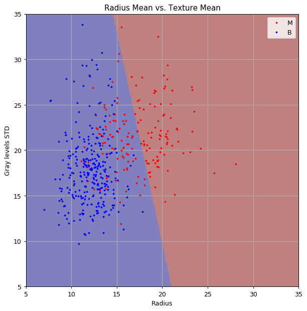
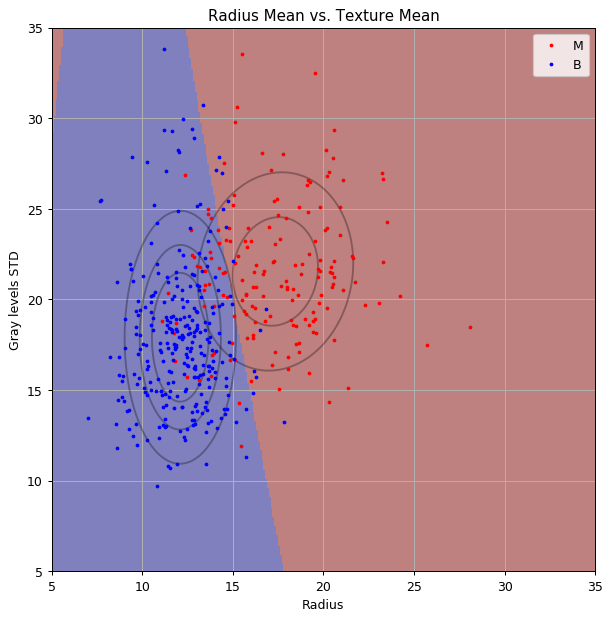
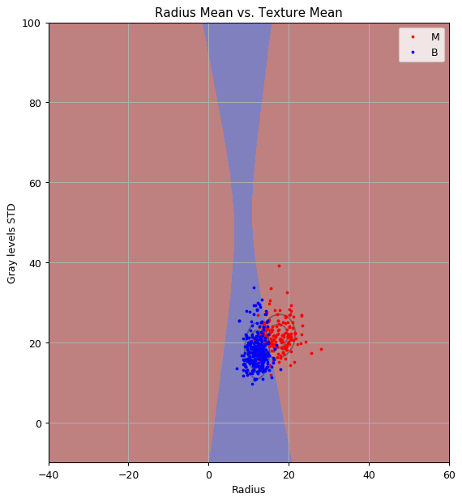
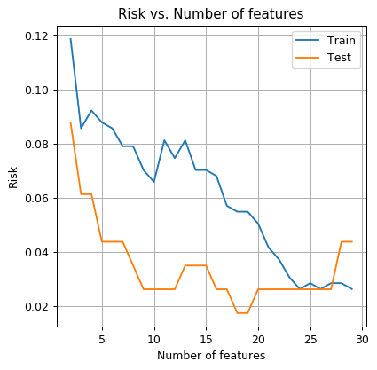

<!-- .slide: class="center" -->

<h1 class="workshop-title">Workshop 6<br>LDA & QDA</h1>

---new slide---

## 	🔮 Supervised Learning Recap

- Pairs of observables and labels: `$\left(\boldsymbol{x},y\right)$`

- An unknown distribution: `$p\left(\boldsymbol{x},y\right)$`

- A prediction function: `$\hat{y}=h\left(\boldsymbol{x}\right)$`

- A loss function: `$\mathbb{E}\left[L\left(\hat{y},y\right)\right]$`

- A risk function: `$R\left\{h\right\}=\mathbb{E}\left[L\left(\hat{y}=h\left(x\right),y\right)\right]
$`

<br>

Our goal is to find an optimal prediction function $h^*$:

`$$
h^*\left(x\right) = \underset{h}{\arg\min}\ R\left\{h\right\}= \underset{h}{\arg\min}\ \mathbb{E}\left[L\left(h\left(x\right),y\right)\right]
$$`

---new slide---

### 📋 Example: The 0-1 Loss (Misclassification Rate)

<br>

**0-1 loss**:

`$$
I\left\{\hat{y}\neq y\right\}
$$`

<br>

Risk function:

`$$
R\left\{h\right\}=\mathbb{E}\left[I\left\{h\left(x\right)\neq y\right\}\right]
$$`

<br>

Given $p\left(\boldsymbol{x},y\right)$ the solution is:

`$$
h^*\left(x\right) 
= \underset{h}{\arg\min}\ \mathbb{E}\left[I\left\{h\left(x\right)\neq y\right\}\right]
= \underset{y}{\arg\max}\ p\left(y|x\right)
$$`

---new slide---

## 🧰 Different Approaches

<br>

- The problem is that we do not know `$p\left(\boldsymbol{x},y\right)$`.
<br>

- Solved by using the dataset.
<br>

- The different methods for solving the problem can be divided into 3 approaches.

---new slide---

### Approach 1: Estimating $P\left(\boldsymbol{x},y\right)$

<br>

- A generative approach.

<br>

- Use the dataset to approximate $p\left(\boldsymbol{x}_i, y_i\right)$.

<br>

- Then solve:

$$
h^*\left(x\right) = \underset{h}{\arg\min}\ \mathbb{E}\left[L\left(h\left(x\right),y\right)\right]
$$

<br>

- In many cases, it will be simpler to estimate $P\left(\boldsymbol{x}_i,y_i\right)$ as $P\left(\boldsymbol{x}_i|y_i\right)P\left(y_i\right)$.

---new slide---

### Approach 2: Estimating $P\left(y_i|\boldsymbol{x}_i\right)$

<br>

- A discriminative approach.

<br>

- Use the law of total expectation:

`$$
R\left\{h\right\}
=\mathbb{E}\left[L\left(h\left(x\right),y\right)\right]
=\mathbb{E}\left[\mathbb{E}\left[L\left(h\left(x\right),y\right)\right|x]\right]
$$`

<br>

- Solve the problem for each $x$ independently:

`$$
h^*\left(x\right) = \underset{h\left(x\right)}{\arg\min}\ \mathbb{E}\left[L\left(h\left(x\right),y\right)|x\right]
$$`

<br>

- Use the dataset to estiamte `$p\left(y|\boldsymbol{x}\right)$`.

---new slide---

### Approach 3: Estimating the Expectation Value Directly

<br>
<br>

- Approximate the expectation value by using the empirical mean:

`$$
h^*\left(x\right) = \underset{h}{\arg\min}\ \frac{1}{N}\sum_i L\left(h\left(x_i\right),y_i\right)
$$`

---new slide---

## 🌗 Linear Discriminant Analysis (LDA)

<br>

- A classification problem.
- Misclassification rate risk.
- Here we will only talk about binary classification.

<br>

### Assumption

<br>

- `$p\left(\boldsymbol{x}|y=j\right)$` has a multivariate normal distribution with some `$\boldsymbol{\mu}_j$` and `$\Sigma$`.

<br>

---new slide---

## 🌗 Linear Discriminant Analysis (LDA) - Cont.

### Steps

- Estimate `$p\left(y\right)$`: (`$N_j$` is the number of `$y_i$` in the dataset).

`$$
p\left(y=j\right) = \frac{N_j}{N}
$$`

- Estimate the `$\boldsymbol{\mu}_j$`:

`$$
\boldsymbol{\mu}_j = \frac{1}{N_j}\sum_{i\ \text{s.t.}\ y_i=j}\boldsymbol{x}_i
$$`

- Estimate the covariance matrix:

`$$
\Sigma = \frac{1}{N}\sum_{i}\left(\boldsymbol{x}_i-\boldsymbol{\mu}_i\right)\left(\boldsymbol{x}_i-\boldsymbol{\mu}_i\right)^T
$$`

---new slide---

## 🌗 Linear Discriminant Analysis (LDA) - Cont. 2

It can then be shown that:

`$$
\begin{align*}
h^*\left(x\right) 
& = \underset{y}{\arg\max}\ p\left(y|x\right) \\
& = \underset{y}{\arg\max}\ p\left(x|y\right)p\left(y\right) \\
& = \underset{y}{\arg\min}\ \tfrac{1}{2}\left(\boldsymbol{\mu}_y-\boldsymbol{x}\right)^T\Sigma^{-1}\left(\boldsymbol{\mu}_y-\boldsymbol{x}\right) + \log\left(p\left(y\right)\right) \\
& =
\begin{cases}
1\qquad \boldsymbol{a}^T \boldsymbol{x} + b > 0 \\
0\qquad \text{otherwise}\\
\end{cases}
\end{align*}
$$`

Where:
- `$\boldsymbol{a}=\Sigma^{-1}\left(\boldsymbol{\mu}_1-\boldsymbol{\mu}_0\right)$`
- `$b=\tfrac{1}{2}\left(\boldsymbol{\mu}_0^T\Sigma^{-1}\boldsymbol{\mu}_0 - \boldsymbol{\mu}_1^T\Sigma^{-1}\boldsymbol{\mu}_1\right) + \log\left(\frac{p\left(y=0\right)}{p\left(y=1\right)}\right)$`

---new slide---

## 🌖 Quadric Discriminant Analysis (QDA)

<br>

- We no longer assume that the covariance matrix $\Sigma$ is the same for all classes.

<br>

- Now:

`$$
\Sigma_j = \frac{1}{N_J}\sum_{i\ \text{s.t.}\ y_i=j}\left(\boldsymbol{x}_i-\boldsymbol{\mu}_i\right)\left(\boldsymbol{x}_i-\boldsymbol{\mu}_i\right)^T
$$`

---new slide---

## 🌖 Quadric Discriminant Analysis (QDA) - Cont.

The resulting decision function is:

`$$
\begin{align*}
h^*\left(x\right) 
& =
\begin{cases}
0\qquad \boldsymbol{x}^T C \boldsymbol{x} + \boldsymbol{a}^T \boldsymbol{x} + b > 0 \\
1\qquad \text{otherwise}\\
\end{cases}
\end{align*}
$$`

<br>

Where:
- $C=\tfrac{1}{2}\left(\Sigma_0^{-1}-\Sigma_1^{-1}\right)$
- $\boldsymbol{a}=\Sigma_1^{-1}\boldsymbol{\mu}_1-\Sigma_0^{-1}\boldsymbol{\mu}_0$
- $b=\tfrac{1}{2}\left(\boldsymbol{\mu}_1^T\Sigma_1^{-1}\boldsymbol{\mu}_1 - \boldsymbol{\mu}_0^T\Sigma_0^{-1}\boldsymbol{\mu}_0\right) - \log\left(\frac{\left|\Sigma_0\right|^{1/2}p\left(y=1\right)}{\left|\Sigma_1\right|^{1/2}p\left(y=0\right)}\right)$

---new slide---

## 🦠 Dataset: Breast Cancer Wisconsin

Number of rows in the dataset: $N=569$

<div>
<table border="1" class="dataframe">
  <thead>
    <tr style="text-align: right;">
      <th></th>
      <th>id</th>
      <th>diagnosis</th>
      <th>radius_mean</th>
      <th>texture_mean</th>
      <th>perimeter_mean</th>
      <th>area_mean</th>
      <th>smoothness_mean</th>
      <th>compactness_mean</th>
      <th>concavity_mean</th>
      <th>concave points_mean</th>
      <th>...</th>
      <th>radius_worst</th>
      <th>texture_worst</th>
      <th>perimeter_worst</th>
      <th>area_worst</th>
      <th>smoothness_worst</th>
      <th>compactness_worst</th>
      <th>concavity_worst</th>
      <th>concave points_worst</th>
      <th>symmetry_worst</th>
      <th>fractal_dimension_worst</th>
    </tr>
  </thead>
  <tbody>
    <tr>
      <th>0</th>
      <td>842302</td>
      <td>M</td>
      <td>17.99</td>
      <td>10.38</td>
      <td>122.80</td>
      <td>1001.0</td>
      <td>0.11840</td>
      <td>0.27760</td>
      <td>0.30010</td>
      <td>0.14710</td>
      <td>...</td>
      <td>25.38</td>
      <td>17.33</td>
      <td>184.60</td>
      <td>2019.0</td>
      <td>0.1622</td>
      <td>0.6656</td>
      <td>0.7119</td>
      <td>0.2654</td>
      <td>0.4601</td>
      <td>0.11890</td>
    </tr>
    <tr>
      <th>1</th>
      <td>842517</td>
      <td>M</td>
      <td>20.57</td>
      <td>17.77</td>
      <td>132.90</td>
      <td>1326.0</td>
      <td>0.08474</td>
      <td>0.07864</td>
      <td>0.08690</td>
      <td>0.07017</td>
      <td>...</td>
      <td>24.99</td>
      <td>23.41</td>
      <td>158.80</td>
      <td>1956.0</td>
      <td>0.1238</td>
      <td>0.1866</td>
      <td>0.2416</td>
      <td>0.1860</td>
      <td>0.2750</td>
      <td>0.08902</td>
    </tr>
    <tr>
      <th>2</th>
      <td>84300903</td>
      <td>M</td>
      <td>19.69</td>
      <td>21.25</td>
      <td>130.00</td>
      <td>1203.0</td>
      <td>0.10960</td>
      <td>0.15990</td>
      <td>0.19740</td>
      <td>0.12790</td>
      <td>...</td>
      <td>23.57</td>
      <td>25.53</td>
      <td>152.50</td>
      <td>1709.0</td>
      <td>0.1444</td>
      <td>0.4245</td>
      <td>0.4504</td>
      <td>0.2430</td>
      <td>0.3613</td>
      <td>0.08758</td>
    </tr>
    <tr>
      <th>3</th>
      <td>84348301</td>
      <td>M</td>
      <td>11.42</td>
      <td>20.38</td>
      <td>77.58</td>
      <td>386.1</td>
      <td>0.14250</td>
      <td>0.28390</td>
      <td>0.24140</td>
      <td>0.10520</td>
      <td>...</td>
      <td>14.91</td>
      <td>26.50</td>
      <td>98.87</td>
      <td>567.7</td>
      <td>0.2098</td>
      <td>0.8663</td>
      <td>0.6869</td>
      <td>0.2575</td>
      <td>0.6638</td>
      <td>0.17300</td>
    </tr>
    <tr>
      <th>4</th>
      <td>84358402</td>
      <td>M</td>
      <td>20.29</td>
      <td>14.34</td>
      <td>135.10</td>
      <td>1297.0</td>
      <td>0.10030</td>
      <td>0.13280</td>
      <td>0.19800</td>
      <td>0.10430</td>
      <td>...</td>
      <td>22.54</td>
      <td>16.67</td>
      <td>152.20</td>
      <td>1575.0</td>
      <td>0.1374</td>
      <td>0.2050</td>
      <td>0.4000</td>
      <td>0.1625</td>
      <td>0.2364</td>
      <td>0.07678</td>
    </tr>
    <tr>
      <th>5</th>
      <td>843786</td>
      <td>M</td>
      <td>12.45</td>
      <td>15.70</td>
      <td>82.57</td>
      <td>477.1</td>
      <td>0.12780</td>
      <td>0.17000</td>
      <td>0.15780</td>
      <td>0.08089</td>
      <td>...</td>
      <td>15.47</td>
      <td>23.75</td>
      <td>103.40</td>
      <td>741.6</td>
      <td>0.1791</td>
      <td>0.5249</td>
      <td>0.5355</td>
      <td>0.1741</td>
      <td>0.3985</td>
      <td>0.12440</td>
    </tr>
    <tr>
      <th>6</th>
      <td>844359</td>
      <td>M</td>
      <td>18.25</td>
      <td>19.98</td>
      <td>119.60</td>
      <td>1040.0</td>
      <td>0.09463</td>
      <td>0.10900</td>
      <td>0.11270</td>
      <td>0.07400</td>
      <td>...</td>
      <td>22.88</td>
      <td>27.66</td>
      <td>153.20</td>
      <td>1606.0</td>
      <td>0.1442</td>
      <td>0.2576</td>
      <td>0.3784</td>
      <td>0.1932</td>
      <td>0.3063</td>
      <td>0.08368</td>
    </tr>
    <tr>
      <th>7</th>
      <td>84458202</td>
      <td>M</td>
      <td>13.71</td>
      <td>20.83</td>
      <td>90.20</td>
      <td>577.9</td>
      <td>0.11890</td>
      <td>0.16450</td>
      <td>0.09366</td>
      <td>0.05985</td>
      <td>...</td>
      <td>17.06</td>
      <td>28.14</td>
      <td>110.60</td>
      <td>897.0</td>
      <td>0.1654</td>
      <td>0.3682</td>
      <td>0.2678</td>
      <td>0.1556</td>
      <td>0.3196</td>
      <td>0.11510</td>
    </tr>
    <tr>
      <th>8</th>
      <td>844981</td>
      <td>M</td>
      <td>13.00</td>
      <td>21.82</td>
      <td>87.50</td>
      <td>519.8</td>
      <td>0.12730</td>
      <td>0.19320</td>
      <td>0.18590</td>
      <td>0.09353</td>
      <td>...</td>
      <td>15.49</td>
      <td>30.73</td>
      <td>106.20</td>
      <td>739.3</td>
      <td>0.1703</td>
      <td>0.5401</td>
      <td>0.5390</td>
      <td>0.2060</td>
      <td>0.4378</td>
      <td>0.10720</td>
    </tr>
    <tr>
      <th>9</th>
      <td>84501001</td>
      <td>M</td>
      <td>12.46</td>
      <td>24.04</td>
      <td>83.97</td>
      <td>475.9</td>
      <td>0.11860</td>
      <td>0.23960</td>
      <td>0.22730</td>
      <td>0.08543</td>
      <td>...</td>
      <td>15.09</td>
      <td>40.68</td>
      <td>97.65</td>
      <td>711.4</td>
      <td>0.1853</td>
      <td>1.0580</td>
      <td>1.1050</td>
      <td>0.2210</td>
      <td>0.4366</td>
      <td>0.20750</td>
    </tr>
  </tbody>
</table>
</div>

---new slide---

## ❓️ Problem: Predict the Correct Diagnostic

<br>

Giving a prediction of whether or not a tissue is malignant (cancerous) or benign (non-cancerous) based on the features extracted from the tissue's microscope image.

---new slide---

## 🔃 The Workflow

<center>

</center>

---new slide---

## 🕵️ Data Inspection

Number of rows in the dataset: $N=569$

<div>
<table border="1" class="dataframe">
  <thead>
    <tr style="text-align: right;">
      <th></th>
      <th>id</th>
      <th>diagnosis</th>
      <th>radius_mean</th>
      <th>texture_mean</th>
      <th>perimeter_mean</th>
      <th>area_mean</th>
      <th>smoothness_mean</th>
      <th>compactness_mean</th>
      <th>concavity_mean</th>
      <th>concave points_mean</th>
      <th>...</th>
      <th>radius_worst</th>
      <th>texture_worst</th>
      <th>perimeter_worst</th>
      <th>area_worst</th>
      <th>smoothness_worst</th>
      <th>compactness_worst</th>
      <th>concavity_worst</th>
      <th>concave points_worst</th>
      <th>symmetry_worst</th>
      <th>fractal_dimension_worst</th>
    </tr>
  </thead>
  <tbody>
    <tr>
      <th>0</th>
      <td>842302</td>
      <td>M</td>
      <td>17.99</td>
      <td>10.38</td>
      <td>122.80</td>
      <td>1001.0</td>
      <td>0.11840</td>
      <td>0.27760</td>
      <td>0.30010</td>
      <td>0.14710</td>
      <td>...</td>
      <td>25.38</td>
      <td>17.33</td>
      <td>184.60</td>
      <td>2019.0</td>
      <td>0.1622</td>
      <td>0.6656</td>
      <td>0.7119</td>
      <td>0.2654</td>
      <td>0.4601</td>
      <td>0.11890</td>
    </tr>
    <tr>
      <th>1</th>
      <td>842517</td>
      <td>M</td>
      <td>20.57</td>
      <td>17.77</td>
      <td>132.90</td>
      <td>1326.0</td>
      <td>0.08474</td>
      <td>0.07864</td>
      <td>0.08690</td>
      <td>0.07017</td>
      <td>...</td>
      <td>24.99</td>
      <td>23.41</td>
      <td>158.80</td>
      <td>1956.0</td>
      <td>0.1238</td>
      <td>0.1866</td>
      <td>0.2416</td>
      <td>0.1860</td>
      <td>0.2750</td>
      <td>0.08902</td>
    </tr>
    <tr>
      <th>2</th>
      <td>84300903</td>
      <td>M</td>
      <td>19.69</td>
      <td>21.25</td>
      <td>130.00</td>
      <td>1203.0</td>
      <td>0.10960</td>
      <td>0.15990</td>
      <td>0.19740</td>
      <td>0.12790</td>
      <td>...</td>
      <td>23.57</td>
      <td>25.53</td>
      <td>152.50</td>
      <td>1709.0</td>
      <td>0.1444</td>
      <td>0.4245</td>
      <td>0.4504</td>
      <td>0.2430</td>
      <td>0.3613</td>
      <td>0.08758</td>
    </tr>
  </tbody>
</table>
</div>

<br>

### The Data Fields and Types

- **diagnosis** - The correct diagnosis: M = malignant (cancerous), B = benign (non-cancerous)
- **radius_mean** - The average radius of the cells in the sample.
- **texture_mean** - The average standard deviation of gray-scale values of the cells in the sample.

---new slide---

## 🕵️ Data Inspection - Cont.

The distribution of the two features:

<center><div style="display:inline-block;background-color:rgba(255, 255, 255, 0.7); box-shadow: 0 0 5px 10px rgba(255, 255, 255, 0.7)">

</div></center>

---new slide---

## 📜 Problem Definition - Same as before:

### The Underlying System

<center></center>

---new slide---

### The Task and the Goal

<br>

- Supervised learning problem: Binary classification.

- Find a prediction function `$h\left(\cdot\right)$`, mapping form `$\boldsymbol{x}=\left[\text{mean_radius},\text{mean_texture}\right]^T$` to `$y$`.

<br>

### Evaluation Method: The Misclassification Rate

`$$
R\left\{h, \left\{\boldsymbol{x},y\right\}\right\}=\frac{1}{N}\sum_i I\left\{h\left(\boldsymbol{x}_i\right)\neq y_i\right\}
$$`

---new slide---

### 📚 Splitting the dataset


```python
n_samples = len(dataset)

## Generate a random generator with a fixed seed (this is important to make our result reproducible)
rand_gen = np.random.RandomState(0)

## Generating a vector of indices
indices = np.arange(n_samples)

## Shuffle the indices
rand_gen.shuffle(indices)

## Split the indices into 80% train / 20% test
n_samples_train = int(n_samples * 0.8)
train_indices = indices[:n_samples_train]
test_indices = indices[n_samples_train:]

train_set = dataset.iloc[train_indices]
test_set = dataset.iloc[test_indices]
```

---new slide---

## 💡 Model & Learning Method Suggestion 1: LDA

<br>

- We will use the LDA algorithm.

<br>

- Parameters:
  - The values of the $p\left(y\right)$.
  - The means of the two distributions.
  - The covariance matrix.

<br>

- No hyper-parameters.

---new slide---

## ⚙️ Learning

<br>
<br>

### ✍️ Exercise 6.1-1

<br>

Find the optimal classification function using LDA

---new slide---

#### Solution 6.1-1

Implementing the LDA algorithm


```python
## Define x & y
x = train_set[['radius_mean', 'texture_mean']].values
y = train_set['diagnosis'].values == 'M'

## Calculate p(y)
py1 = np.mean(y)
py0 = 1 - py1

## Calculate the means of the normal distributions
mu0 = x[y==0].mean(axis=0)
mu1 = x[y==1].mean(axis=0)

## Calculate the covariance matrix
x_minus_mu = np.concatenate((x[y==0] - mu0[None, :], x[y==1] - mu1[None, :]), axis=0)
cov_mat = (x_minus_mu.T @ x_minus_mu) / len(x)

## Calculate linear classifier coefficients
cov_mat_inv = np.linalg.inv(cov_mat)
a = cov_mat_inv @ (mu1- mu0)
b = 0.5 * (mu0 @ cov_mat_inv @ mu0 - mu1 @ cov_mat_inv @ mu1) + np.log(py1 / py0)
```

---new slide---

#### Solution 6.1-1 - Cont.

<br>

```python
## Evaluate the risk on the train set
train_prediction = (x @ a + b) > 0
train_risk = (train_prediction != y).mean()

print_math('The train risk is: ${:.2}$'.format(train_risk))
```

The train risk is: $0.12$

---new slide---

#### Solution 6.1-1 - Cont.

Let us plot the normal distributions and the classifier

<center><div style="display:inline-block;background-color:rgba(255, 255, 255, 0.7); box-shadow: 0 0 5px 10px rgba(255, 255, 255, 0.7)">

</div></center>

---new slide---

<br>
<br>

### ✍️ Exercise 6.1-2

<br>

Can you give some confidence level based on the LDA model?

<br>

---new slide---

#### Solution 6.1-2

<br>

We can actually predict the probability of a tissue being malignant using Bayes rule:

$$
p\left(y=1|\boldsymbol{x}\right)=\frac{p\left(\boldsymbol{x}|y=1\right)p\left(y=1\right)}{p\left(\boldsymbol{x}|y=0\right)p\left(y=0\right)+p\left(\boldsymbol{x}|y=1\right)p\left(y=1\right)}
$$

---new slide---

<br>
<br>

### ✍️ Exercise 6.1-3

<br>

How would the algorithm change if you know that the prior chances of a tissue being malignant is 5%?

---new slide---

#### Solution 6.1-3

<br>

- $p\left(y=1\right)$ and $p\left(y=0\right)\left(=1-p\left(y=1\right)\right)$ are now known

<br>

- We will use these values instead of estimating them. 

Reminder: They appear in the expression for $b$:

$b=\tfrac{1}{2}\left(\boldsymbol{\mu}_0^T\Sigma^{-1}\boldsymbol{\mu}_0 - \boldsymbol{\mu}_1^T\Sigma^{-1}\boldsymbol{\mu}_1\right) + \log\left(\frac{p\left(y=0\right)}{p\left(y=1\right)}\right)$

<br>

```python
## Define p(y) according to the known prior
py1 = 0.05
py0 = 0.95

## Calculate linear classifier coefficients
b = 0.5 * (mu0 @ cov_mat_inv @ mu0 - mu1 @ cov_mat_inv @ mu1) + np.log(py1 / py0)
```

---new slide---

#### Solution 6.1-3 - Cont

This is the prediction map will now be:

<center><div style="display:inline-block;background-color:rgba(255, 255, 255, 0.7); box-shadow: 0 0 5px 10px rgba(255, 255, 255, 0.7)">

</div></center>

<br>

- The decision plan has shifted significantly to the right. The new prior reduces the prior change of a tissue being malignant.

---new slide---

#### SciKit-Learn

SciKit-Learn has a LDA implementation: [LinearDiscriminantAnalysis](https://scikit-learn.org/stable/modules/generated/sklearn.discriminant_analysis.LinearDiscriminantAnalysis.html)

```python
from sklearn.discriminant_analysis import LinearDiscriminantAnalysis

## Create the classifier object
clf = LinearDiscriminantAnalysis(store_covariance=True)

## Train the classifier
clf.fit(x, y)

## Evaluate the risk on the train set
train_prediction = clf.predict(x)
train_risk = (train_prediction != y).mean()

print_math('The train risk is: ${:.2}$'.format(train_risk))
```

The train risk is: $0.12$

---new slide---

## ⏱️ Performance evaluation

Let us calculate the risk on the test set

```python
x_test = test_set[['radius_mean', 'texture_mean']].values
y_test = test_set['diagnosis'].values == 'M'

## Evaluate the risk on the train set
test_prediction = clf.predict(x_test)
test_risk = (test_prediction != y_test).mean()

print_math('The test risk is: ${:.2}$'.format(test_risk))
```
<br>

The test risk is: $0.096$

---new slide---

## 💡 Model & Learning Method Suggestion 2: QDA

<br>

- We will use the QDA algorithm.

<br>

- Parameters:
  - The values of the $p\left(y\right)$.
  - The means of the two distributions.
  - The covariance matrices of the two distributions.

<br>

- No hyper-parameters.

---new slide---

## ⚙️ Learning

<br>
<br>

### ✍️ Exercise 6.1-1

<br>

1. Find the optimal classification function using QDA. 

Use SciKit-Learn's implementation: [QuadraticDiscriminantAnalysis](https://scikit-learn.org/stable/modules/generated/sklearn.discriminant_analysis.QuadraticDiscriminantAnalysis.html)

---new slide---

#### Solution 6.2

```python
from sklearn.discriminant_analysis import QuadraticDiscriminantAnalysis

## Create the classifier object
clf = QuadraticDiscriminantAnalysis(store_covariance=True)

## Train the classifier
clf.fit(x, y)

## Evaluate the risk on the train set
train_prediction = clf.predict(x)
train_risk = (train_prediction != y).mean()

print_math('The train risk is: ${:.2}$'.format(train_risk))
```

The train risk is: $0.12$

---new slide---

#### Solution 6.2 - Cont.

<center><div style="display:inline-block;background-color:rgba(255, 255, 255, 0.7); box-shadow: 0 0 5px 10px rgba(255, 255, 255, 0.7)">

</div></center>

---new slide---

#### Solution 6.2 - Cont. 2

Also in a zoom-out plot:

<center><div style="display:inline-block;background-color:rgba(255, 255, 255, 0.7); box-shadow: 0 0 5px 10px rgba(255, 255, 255, 0.7)">

</div></center>

- We got an hyperbolic decision boundary.

---new slide---

## ⏱️ Performance evaluation

Let us calculate the risk on the test set

```python
## Evaluate the risk on the train set
test_prediction = clf.predict(x_test)
test_risk = (test_prediction != y_test).mean()

print_math('The test risk is: ${:.2}$'.format(test_risk))
```

The test risk is: $0.088$

---new slide---

## Using more features

<br>
<br>

### ✍️ Exercise 6.3-1

<br>

Run the QDA algorithm again but with more features. Plot the train risk and the test risk as a function of the number of features. 

<!-->
2. How do you explain the fact that the test risk gets worse as we increase the number of features? How many parameters are we trying to estimate? What is the size of the train set?
3. Suggest a solution for solving this problem.
-->

---new slide---

#### Solution 6.3-1

```python
n_features_grid = np.arange(2, 30)
train_risk_array = np.zeros(len(n_features_grid))
test_risk_array = np.zeros(len(n_features_grid))

for i, n_features in enumerate(n_features_grid):
    x = train_set[['radius_mean', 'texture_mean', 'perimeter_mean',
           'area_mean', 'smoothness_mean', 'compactness_mean', 'concavity_mean',
           'concave points_mean', 'symmetry_mean', 'fractal_dimension_mean',
           'radius_se', 'texture_se', 'perimeter_se', 'area_se', 'smoothness_se',
           'compactness_se', 'concavity_se', 'concave points_se', 'symmetry_se',
           'fractal_dimension_se', 'radius_worst', 'texture_worst',
           'perimeter_worst', 'area_worst', 'smoothness_worst',
           'compactness_worst', 'concavity_worst', 'concave points_worst',
           'symmetry_worst', 'fractal_dimension_worst'][:n_features]].values

    x_test = test_set[['radius_mean', 'texture_mean', 'perimeter_mean',
           'area_mean', 'smoothness_mean', 'compactness_mean', 'concavity_mean',
           'concave points_mean', 'symmetry_mean', 'fractal_dimension_mean',
           'radius_se', 'texture_se', 'perimeter_se', 'area_se', 'smoothness_se',
           'compactness_se', 'concavity_se', 'concave points_se', 'symmetry_se',
           'fractal_dimension_se', 'radius_worst', 'texture_worst',
           'perimeter_worst', 'area_worst', 'smoothness_worst',
           'compactness_worst', 'concavity_worst', 'concave points_worst',
           'symmetry_worst', 'fractal_dimension_worst'][:n_features]].values

    ## Create and train the classifier object
    clf = QuadraticDiscriminantAnalysis()
    clf.fit(x, y)

    ## Evaluate the risk on the train set
    train_prediction = clf.predict(x)
    train_risk_array[i] = (train_prediction != y).mean()

    ## Evaluate the risk on the train set
    test_prediction = clf.predict(x_test)
    test_risk_array[i] = (test_prediction != y_test).mean()
```

---new slide---

#### Solution 6.3-1 - Cont.

<center><div style="display:inline-block;background-color:rgba(255, 255, 255, 0.7); box-shadow: 0 0 5px 10px rgba(255, 255, 255, 0.7)">

</div></center>

---new slide---

<br>
<br>

### ✍️ Exercise 6.3-(2+3)

<br>

- How do you explain the fact that the test risk gets worse as we increase the number of features? How many parameters are we trying to estimate? What is the size of the train set?

- Suggest a solution for solving this problem.

---new slide---

#### Solution 6.3-(2+3)

- A classic example of overfitting. The model becomes more general -> the number of parameters increases -> we need more data.

- With 30 features we need to estimate about $30^2$ features.

- The train set contains only 455 samples.

- As a rule of thumb, we would usually want more samples than parameters.

- One possible solution is to perform a dimensionality reduction using PCA.