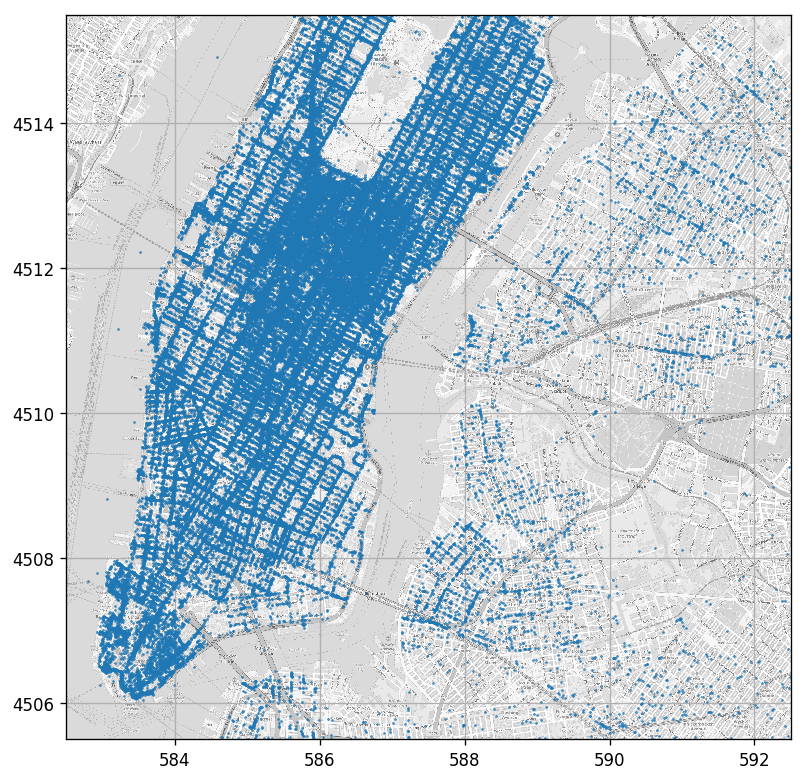

<!-- .slide: class="center" -->

<h1 class="workshop-title">Workshop 07<br>Linear Regression</h1>

---new slide---

## 🚖 Dataset: NYC Taxi - Again

We will go back to the NYC dataset once again

Number of rows in the dataset: $N=100000$

<div>
<table border="1" class="dataframe">
  <thead>
    <tr style="text-align: right;">
      <th></th>
      <th>passenger_count</th>
      <th>trip_distance</th>
      <th>payment_type</th>
      <th>fare_amount</th>
      <th>tip_amount</th>
      <th>pickup_easting</th>
      <th>pickup_northing</th>
      <th>dropoff_easting</th>
      <th>dropoff_northing</th>
      <th>duration</th>
      <th>day_of_week</th>
      <th>day_of_month</th>
      <th>time_of_day</th>
    </tr>
  </thead>
  <tbody>
    <tr>
      <th>0</th>
      <td>2</td>
      <td>2.768065</td>
      <td>2</td>
      <td>9.5</td>
      <td>0.00</td>
      <td>586.996941</td>
      <td>4512.979705</td>
      <td>588.155118</td>
      <td>4515.180889</td>
      <td>11.516667</td>
      <td>3</td>
      <td>13</td>
      <td>12.801944</td>
    </tr>
    <tr>
      <th>1</th>
      <td>1</td>
      <td>3.218680</td>
      <td>2</td>
      <td>10.0</td>
      <td>0.00</td>
      <td>587.151523</td>
      <td>4512.923924</td>
      <td>584.850489</td>
      <td>4512.632082</td>
      <td>12.666667</td>
      <td>6</td>
      <td>16</td>
      <td>20.961389</td>
    </tr>
    <tr>
      <th>2</th>
      <td>1</td>
      <td>2.574944</td>
      <td>1</td>
      <td>7.0</td>
      <td>2.49</td>
      <td>587.005357</td>
      <td>4513.359700</td>
      <td>585.434188</td>
      <td>4513.174964</td>
      <td>5.516667</td>
      <td>0</td>
      <td>31</td>
      <td>20.412778</td>
    </tr>
    <tr>
      <th>3</th>
      <td>1</td>
      <td>0.965604</td>
      <td>1</td>
      <td>7.5</td>
      <td>1.65</td>
      <td>586.648975</td>
      <td>4511.729212</td>
      <td>586.671530</td>
      <td>4512.554065</td>
      <td>9.883333</td>
      <td>1</td>
      <td>25</td>
      <td>13.031389</td>
    </tr>
    <tr>
      <th>4</th>
      <td>1</td>
      <td>2.462290</td>
      <td>1</td>
      <td>7.5</td>
      <td>1.66</td>
      <td>586.967178</td>
      <td>4511.894301</td>
      <td>585.262474</td>
      <td>4511.755477</td>
      <td>8.683333</td>
      <td>2</td>
      <td>5</td>
      <td>7.703333</td>
    </tr>
    <tr>
      <th>5</th>
      <td>5</td>
      <td>1.561060</td>
      <td>1</td>
      <td>7.5</td>
      <td>2.20</td>
      <td>585.926415</td>
      <td>4512.880385</td>
      <td>585.168973</td>
      <td>4511.540103</td>
      <td>9.433333</td>
      <td>3</td>
      <td>20</td>
      <td>20.667222</td>
    </tr>
    <tr>
      <th>6</th>
      <td>1</td>
      <td>2.574944</td>
      <td>1</td>
      <td>8.0</td>
      <td>1.00</td>
      <td>586.731409</td>
      <td>4515.084445</td>
      <td>588.710175</td>
      <td>4514.209184</td>
      <td>7.950000</td>
      <td>5</td>
      <td>8</td>
      <td>23.841944</td>
    </tr>
    <tr>
      <th>7</th>
      <td>1</td>
      <td>0.804670</td>
      <td>2</td>
      <td>5.0</td>
      <td>0.00</td>
      <td>585.344614</td>
      <td>4509.712541</td>
      <td>585.843967</td>
      <td>4509.545089</td>
      <td>4.950000</td>
      <td>5</td>
      <td>29</td>
      <td>15.831389</td>
    </tr>
    <tr>
      <th>8</th>
      <td>1</td>
      <td>3.653202</td>
      <td>1</td>
      <td>10.0</td>
      <td>1.10</td>
      <td>585.422062</td>
      <td>4509.477536</td>
      <td>583.671081</td>
      <td>4507.735573</td>
      <td>11.066667</td>
      <td>5</td>
      <td>8</td>
      <td>2.098333</td>
    </tr>
    <tr>
      <th>9</th>
      <td>6</td>
      <td>1.625433</td>
      <td>1</td>
      <td>5.5</td>
      <td>1.36</td>
      <td>587.875433</td>
      <td>4514.931073</td>
      <td>587.701248</td>
      <td>4513.709691</td>
      <td>4.216667</td>
      <td>3</td>
      <td>13</td>
      <td>21.783056</td>
    </tr>
  </tbody>
</table>
</div>

---new slide---

## ❓️ Problem: Estimating the ride duration

<br>
<br>
<br>

We would like to estimate a ride duration based on the pickup and drop off location.

---new slide---

## 🔃 Workflow: Adding Features Selection

Adding a "preprocessing and features selection" stage:

<center>

</center>

---new slide---

## 🕵️ Data Inspection

<div>
<table border="1" class="dataframe">
  <thead>
    <tr style="text-align: right;">
      <th></th>
      <th>passenger_count</th>
      <th>trip_distance</th>
      <th>payment_type</th>
      <th>fare_amount</th>
      <th>tip_amount</th>
      <th>pickup_easting</th>
      <th>pickup_northing</th>
      <th>dropoff_easting</th>
      <th>dropoff_northing</th>
      <th>duration</th>
      <th>day_of_week</th>
      <th>day_of_month</th>
      <th>time_of_day</th>
    </tr>
  </thead>
  <tbody>
    <tr>
      <th>0</th>
      <td>2</td>
      <td>2.768065</td>
      <td>2</td>
      <td>9.5</td>
      <td>0.00</td>
      <td>586.996941</td>
      <td>4512.979705</td>
      <td>588.155118</td>
      <td>4515.180889</td>
      <td>11.516667</td>
      <td>3</td>
      <td>13</td>
      <td>12.801944</td>
    </tr>
    <tr>
      <th>1</th>
      <td>1</td>
      <td>3.218680</td>
      <td>2</td>
      <td>10.0</td>
      <td>0.00</td>
      <td>587.151523</td>
      <td>4512.923924</td>
      <td>584.850489</td>
      <td>4512.632082</td>
      <td>12.666667</td>
      <td>6</td>
      <td>16</td>
      <td>20.961389</td>
    </tr>
  </tbody>
</table>
</div>

<br>

### The Data Fields and Types
In this workshop we will be looking at the following two columns:

- **pickup_easting** - The horizontal coordinate in Km.

- **pickup_northing** - The vertical coordinate in Km.

- **dropoff_easting** - The horizontal coordinate in Km.

- **dropoff_northing** - The vertical coordinate in Km.

- **duration** - The ride duration in minutes.

---new slide---

### Plotting Drop Off  Points

<center><div style="display:inline-block;background-color:rgba(255, 255, 255, 0.7); box-shadow: 0 0 5px 10px rgba(255, 255, 255, 0.7)">

</div></center>

---new slide---

## 📜 Problem Definition

### The underlying process

- Random passenger with a pickup and drop off location. $p\left(x\right)$.

<br>

- The duration conditioned by the pickup and drop off locations.  $p\left(y|x\right)$.

<br>

### The task and goal

A regression problem:

Find a prediction function for the ride duration based on the pickup and drop off locations.

---new slide---

## 📜 Problem Definition - Cont.

<br>

### Evaluation method: Root Mean Squared Error (RMSE)

<br>

We shall use the RMSE risk function.

`$$
R\left\{h, \left\{\boldsymbol{x},y\right\}\right\}=\sqrt{\frac{1}{N}\sum_i \left(h\left(\boldsymbol{x}_i\right)- y_i\right)^2}
$$`

---new slide---

### 📚 Splitting the dataset

```python
n_samples = len(dataset)

## Generate a random generator with a fixed seed
rand_gen = np.random.RandomState(0)

## Generating a vector of indices
indices = np.arange(n_samples)

## Shuffle the indices
rand_gen.shuffle(indices)

## Split the indices into 60% train / 20% validation / 20% test
n_samples_train = int(n_samples * 0.6)
n_samples_validation = int(n_samples * 0.2)
n_samples_test = n_samples - n_samples_train

train_indices = indices[:n_samples_train]
validation_indices = indices[n_samples_train:(n_samples_train + n_samples_validation)]
test_indices = indices[(n_samples_train + n_samples_validation):]

train_set = dataset.iloc[train_indices]
validation_set = dataset.iloc[validation_indices]
test_set = dataset.iloc[test_indices]
```

---new slide---

## 💡 Model & Learning Method Suggestion : Linear Least Squares

<br>

- A linear model of the form:

`$$
h\left(\boldsymbol{x};\boldsymbol{\theta}\right) = \theta_0\phi_0\left(\boldsymbol{x}\right) + \theta_1\phi_1\left(\boldsymbol{x}\right) + \ldots+\theta_n\phi_n\left(\boldsymbol{x}\right)
$$`

<br>

Where:
- `$\left\{\theta_i\right\}$` - The model's parameters.
- `$\left\{\phi_i\left(\boldsymbol{x}\right)\right\}$` - Feature functions.

---new slide---

## Matrix notation

- `$\boldsymbol{\theta}$` - The vector of parameters `$\left[\theta_0, \theta_1, \ldots, \theta_n\right]^T$`.

- `$\boldsymbol{\phi\left(\boldsymbol{x}\right)}$` - The vector of features `$\left[\phi_0\left(\boldsymbol{x}\right), \phi_1\left(\boldsymbol{x}\right), \ldots, \phi_n\left(\boldsymbol{x}\right)\right]^T$`.

- `$\boldsymbol{y}$` - The vector all labels in the dataset `$\left[y_0, y_1, \ldots, y_{N-1}\right]^T$`.

- `$\Phi$` - The matrix of all features of samples in the dataset `$\left[\boldsymbol{\phi}\left(\boldsymbol{x}_0\right), \boldsymbol{\phi}\left(\boldsymbol{x}_1\right), \ldots, \boldsymbol{\phi}\left(\boldsymbol{x}_{N-1}\right)\right]^T$`.

<br>

Optmization problem:

`$$
\boldsymbol{\theta}^* 
= \underset{\boldsymbol{\theta}}{\arg\min}\ \left\lVert\Phi\boldsymbol{\theta}-\boldsymbol{y}\right\rVert_2
$$`

---new slide---

## Matrix notation - Cont.

<br>

Optmization problem:

`$$
\boldsymbol{\theta}^* 
= \underset{\boldsymbol{\theta}}{\arg\min}\ \left\lVert\Phi\boldsymbol{\theta}-\boldsymbol{y}\right\rVert_2
$$`

<br>

Solution:

$$
\boldsymbol{\theta}^*=\left(\Phi^T\Phi\right)^{-1}\Phi\boldsymbol{y}
$$

---new slide---

## 📑 Features Selection - 1st Attempt

<br>

- Naive selection of features: the measurements.

  - Probably wont produce good results.

- The ride duration depends mainly on the distance between the two locations.

- A single feature which is the distance of the between the two locations:

`$$
h\left(\boldsymbol{x};\boldsymbol{\theta}\right) = \theta_0\sqrt{\left(x_\text{drop off}-x_\text{pick up}\right)^2 + \left(y_\text{drop off}-y_\text{pick up}\right)^2}
$$`

---new slide---

## ⚙️ Learning

<br>
<br>

### ✍️ Exercise 7.1

<br>

Find the optimal model parameter using linear least squares.

<br>

Use [np.linalg.pinv](https://docs.scipy.org/doc/numpy/reference/generated/numpy.linalg.pinv.html) to calculate the Moore-Penrose pseudo inverse $\left(A^TA\right)^{-1}A^T$

---new slide---

#### Solution 7.1

```python
## Deifne the feature extraction function
def extract_features(dataset):
    x_pickup = dataset['pickup_easting'].values
    y_pickup = dataset['pickup_northing'].values
    x_dropoff = dataset['dropoff_easting'].values
    y_dropoff = dataset['dropoff_northing'].values

    dist = ((x_dropoff - x_pickup) ** 2 + (y_dropoff - y_pickup) ** 2) ** 0.5

    phi = np.array([dist]).T

    return phi

## Calculate the feautres matrix for the train set
phi_train = extract_features(train_set)
## Calculate the model's parameters theta
theta = np.linalg.pinv(phi_train) @ y_train

print('Theta is equal to: {}'.format(theta))
```

<br>

Theta is equal to: [4.30908784]

---new slide---

#### Solution 7.1 - Cont.

```python
prediction_train = phi_train @ theta
loss_train = (prediction_train - y_train) ** 2
risk_train = loss_train.mean() ** 0.5

print('The risk on the train set is: {:.2f} min'.format(risk_train))
```

<br>

The risk on the train set is: 5.71 min

---new slide---

#### Solution 7.1 - Cont.

For one feature we can plot the linear regression problem on in a 2D plot

<center><div style="display:inline-block;background-color:rgba(255, 255, 255, 0.7); box-shadow: 0 0 5px 10px rgba(255, 255, 255, 0.7)">

</div></center>

---new slide---

## ⏱️ Performance evaluation

Let us calculate the risk on the test set


```python
phi_test = extract_features(test_set)

prediction_test = phi_test @ theta
loss_test = (prediction_test - y_test) ** 2
risk_test = loss_test.mean() ** 0.5

print('The risk on the test set is: {:.2f} min'.format(risk_test))
```

<br>

The risk on the test set is: 5.72 min

---new slide---

## 📑 Features Selection - Adding Pickup Location

- Let us add some more features.

- Different areas have different traffic loads.

- Add a second order polynomial of the pickup location to our prediction function:

`$$
h\left(\boldsymbol{x}\right)= \theta_0\sqrt{\left(x_\text{drop off}-x_\text{pickup}\right)^2 + \left(y_\text{drop off}-y_\text{pickup}\right)^2} \\ + \theta_1 + \theta_2 x_\text{pickup}  + \theta_3  y_\text{pickup} \\ + \theta_4 x_\text{pickup}y_\text{pickup} + \theta_5 x_\text{pickup}^2 + \theta_6 y_\text{pickup}^2
$$`

---new slide---

## ⚙️ Learning

### ✍️ Exercise 7.2

<br>

Repeat the learning process using the new model.

Now use [np.linalg.lstsq](https://docs.scipy.org/doc/numpy/reference/generated/numpy.linalg.lstsq.html) instead of np.linalg.pinv to solve $Ax=b$.

<br>

#### Numeric issues:

- Inverses of matrices can become highly inefficient and unstable.

- np.linalg.lstsq solves least squares without calculating the inverse directly.

---new slide---

#### Solution 7.2

```python
def extract_features(dataset):
    x_pickup = dataset['pickup_easting'].values
    y_pickup = dataset['pickup_northing'].values
    x_dropoff = dataset['dropoff_easting'].values
    y_dropoff = dataset['dropoff_northing'].values

    dist = ((x_dropoff - x_pickup) ** 2 + (y_dropoff - y_pickup) ** 2) ** 0.5

    phi = np.array([
        dist,
        np.ones_like(dist),
        x_pickup,
        y_pickup,
        x_pickup * y_pickup,
        x_pickup ** 2,
        y_pickup ** 2,
        ]).T

    return phi

phi_train = extract_features(train_set)
theta, _, _, _ = np.linalg.lstsq(phi_train, y_train, rcond=-1) 
```

---new slide---

#### Solution 7.2 - Cont.

```python
prediction_train = phi_train @ theta
loss_train = (prediction_train - y_train) ** 2
risk_train = loss_train.mean() ** 0.5

print('The risk on the train set is: {:.2f} min'.format(risk_train))

phi_test = extract_features(test_set)

prediction_test = phi_test @ theta
loss_test = (prediction_test - y_test) ** 2
risk_test = loss_test.mean() ** 0.5

print('The risk on the test set is: {:.2f} min'.format(risk_test))
```

<br>

The risk on the train set is: 5.13 min

The risk on the test set is: 5.16 min

---new slide---

#### Solution 7.2 - Cont. 2

<br>

From here on we will use [sklearn.linear_model.LinearRegression](https://scikit-learn.org/stable/modules/generated/sklearn.linear_model.LinearRegression.html) to perform linear regression.

---new slide---

## 📑 Features Selection - Higher order

Lets us add higher orders of the pickup location.

<br>

## ⚙️ Learning

<br>

### ✍️ Exercise 7.3

- Add higher orders of the pickup locations.

- Run up to the 20th power of the polynomial.

- Plot the train risk and the validation risk vs. the model's order.

---new slide---

### Solution 7.3

```python
from sklearn.linear_model import LinearRegression

## Deifne the feature extraction function
def extract_features(dataset, n_powers):

    x_center = 586
    y_center = 4510

    x_pickup = dataset['pickup_easting'].values - x_center
    y_pickup = dataset['pickup_northing'].values - y_center
    x_dropoff = dataset['dropoff_easting'].values - x_center
    y_dropoff = dataset['dropoff_northing'].values - y_center

    dist = ((x_dropoff - x_pickup) ** 2 + (y_dropoff - y_pickup) ** 2) ** 0.5

    ## Create all pairs of power combinations using meshgrid
    powers1, powers2 = np.meshgrid(np.arange(n_powers + 1), np.arange(n_powers + 1))
    ## Flatten the martices of powers into a 2 by N array
    powers = np.stack((powers1.flatten(), powers2.flatten()), axis=0)
    ## Keep only powers which are smaller then n_power
    powers = powers[:, powers.sum(axis=0) <= n_powers]

    phi = np.concatenate((
        dist[:, None],
        x_pickup[:,None] ** powers[0] * y_pickup[:,None] ** powers[1],
        ), axis=1)

    return phi
```

---new slide---

### Solution 7.3 - Cont.

```python
## Define the grid of polinomian powers to run over
powers_grid = np.arange(21)

# Initialize lists to store the calculated risks
risk_array_validataion = []

## Define the regressor
reg = LinearRegression(fit_intercept=False, normalize=True)

## Run over the polynomial powers
for n_powers in powers_grid:
    ## Train
    phi_train = extract_features(train_set, n_powers)
    reg.fit(phi_train, y_train)

    ## Validation
    phi_validation = extract_features(validation_set, n_powers)
    prediction_validataion = reg.predict(phi_validation)
    loss_validataion = (prediction_validataion - y_validation) ** 2
    risk_validataion = loss_validataion.mean() ** 0.5

    risk_array_validataion.append(risk_validataion)
```

---new slide---

### Solution 7.3 - Cont.

```python
## Test results
optimal_power = powers_grid[np.argmin(risk_array_validataion)]

phi_train = extract_features(train_set, optimal_power)
reg.fit(phi_train, y_train)

phi_test = extract_features(test_set, optimal_power)
prediction_test = reg.predict(phi_test)
loss_test = (prediction_test - y_test) ** 2
risk_test = loss_test.mean() ** 0.5

print('The optimal power is {}'.format(optimal_power))
print('The test risk is {:.3f} [min]'.format(risk_test))
```

The optimal power is 10.

The test risk is 5.152 min.

---new slide---

### Solution 7.3 - Cont. 2

<center><div style="display:inline-block;background-color:rgba(255, 255, 255, 0.7); box-shadow: 0 0 5px 10px rgba(255, 255, 255, 0.7)">

</div></center>

- The train risk keeps decreasing.

- The test risk starts to increase due to overfitting.

- We will add regularization terms to reduce the the overfit.

---new slide---

### 🔵 Tikhonov Regularization: $L2$ Penalty On the Models Parameters.

$$
\lambda\left\lVert\boldsymbol{\theta}\right\rVert_2^2
$$

- $\lambda$ controls how much affect the regularization has.
- Motivates the solution to keep the parameters small.

<br>

#### Ridge Regression:

Linear regression +  Tikhonov Regularization:

$$
\boldsymbol{\theta}^*
= \underset{\boldsymbol{\theta}}{\arg\min}\ \left\lVert\Phi\boldsymbol{\theta}-\boldsymbol{y}\right\rVert_2^2 +\lambda\left\lVert\boldsymbol{\theta}\right\rVert_2^2
$$

Has a closed form solution which is given by:

$$
\boldsymbol{\theta}=\left(\Phi^T\Phi+\lambda I\right)^{-1}\Phi\boldsymbol{y}
$$

---new slide---

### 🔵 Tikhonov Regularization: $L2$ Penalty On the Models Parameters - Cont.

<br>

#### General From

The more general form:

$$
\boldsymbol{\theta}^*
= \underset{\boldsymbol{\theta}}{\arg\min}\ \left\lVert\Phi\boldsymbol{\theta}-\boldsymbol{y}\right\rVert_2^2 +\left(\boldsymbol{\theta}^TR\boldsymbol{\theta}\right)
$$

The solution for this problem is:

$$
\boldsymbol{\theta}=\left(\Phi^T\Phi+R\right)^{-1}\Phi\boldsymbol{y}
$$

---new slide---

### 🔷 $L1$ Penalty On the Models Parameters.

$$
\lambda\left\lVert\boldsymbol{\theta}\right\rVert_1
$$

- Motivates the solution to keep only the parameters which help minimize the objective the most.
- Tends to create a sparse solution.

<br>

#### Least Absolute Shrinkage and Selection Operator (LASSO)

A linear regression + $L1$ Regularization.

$$
\boldsymbol{\theta}^* 
= \underset{\boldsymbol{\theta}}{\arg\min}\ \left\lVert\Phi\boldsymbol{\theta}-\boldsymbol{y}\right\rVert_2^2 +\lambda\left\lVert\boldsymbol{\theta}\right\rVert_1
$$

No closed form solution. Solved by using numerical tools.

---new slide---

## ⚙️ Learning

<br>

### ✍️ Exercise 7.4-1

- Repeat the last question using Ridge regression.

- Use $10^{-2}$ for the regularization parameter.

<!--
2. Repeat the last question with the LASSO model. Use $10^{-5}$ for the regularization parameter.
[sklearn.linear_model.Lasso](https://scikit-learn.org/stable/modules/generated/sklearn.linear_model.Lasso.html).
-->

<br>

Use [sklearn.linear_model.Ridge](https://scikit-learn.org/stable/modules/generated/sklearn.linear_model.Ridge.html)

---new slide---

#### Solution 7.4-1

```python
from sklearn.linear_model import Ridge

# Initialize lists to store the calculated risks
risk_array_validataion = []

## Define the regressor
reg = Ridge(alpha=1e-2, fit_intercept=True, normalize=True, max_iter=1e4)

## Run over the polynomial powers
for n_powers in powers_grid:
    ## Train
    phi_train = extract_features(train_set, n_powers)
    reg.fit(phi_train, y_train)

    ## Validataion
    phi_validation = extract_features(validation_set, n_powers)
    prediction_validataion = reg.predict(phi_validation)
    loss_validataion = (prediction_validataion - y_validation) ** 2
    risk_validataion = loss_validataion.mean() ** 0.5

    risk_array_validataion.append(risk_validataion)
```

---new slide---

#### Solution 7.4-1 - Cont.

```python
## Test results
optimal_power = powers_grid[np.argmin(risk_array_validataion)]

phi_train = extract_features(train_set, optimal_power)
reg.fit(phi_train, y_train)

phi_test = extract_features(test_set, optimal_power)
prediction_test = reg.predict(phi_test)
loss_test = (prediction_test - y_test) ** 2
risk_test = loss_test.mean() ** 0.5

print('The optimal power is {}'.format(optimal_power))
print('The test risk of the optimal power is {:.3f}'.format(risk_test))
```

<br>
The optimal power is 8

The test risk of the optimal power is 5.145

---new slide---

#### Solution 7.4-1 - Cont. 2

<center><div style="display:inline-block;background-color:rgba(255, 255, 255, 0.7); box-shadow: 0 0 5px 10px rgba(255, 255, 255, 0.7)">

</div></center>

---new slide---

### ✍️ Exercise 7.4-2

- Repeat the last question using LASSO regression.

- Use $10^{-5}$ for the regularization parameter.

<br>

Use [sklearn.linear_model.Lasso](https://scikit-learn.org/stable/modules/generated/sklearn.linear_model.Lasso.html).

---new slide---

#### Solution 7.4-2

```python
from sklearn.linear_model import Lasso

powers_grid = np.arange(18)
risk_array_validataion = []

## Define the regressor
reg = Lasso(alpha=1e-5, fit_intercept=True, normalize=True, max_iter=1e4)

## Run over the polynomial powers
for n_powers in powers_grid:
    ## Train
    phi_train = extract_features(train_set, n_powers)
    reg.fit(phi_train, y_train)

    ## Validataion
    phi_validation = extract_features(validation_set, n_powers)
    prediction_validataion = reg.predict(phi_validation)
    loss_validataion = (prediction_validataion - y_validation) ** 2
    risk_validataion = loss_validataion.mean() ** 0.5
```

---new slide---

#### Solution 7.4-2 - Cont.

```python
## Optimal results
optimal_power = powers_grid[np.argmin(risk_array_validataion)]

phi_train = extract_features(train_set, optimal_power)
reg.fit(phi_train, y_train)

phi_test = extract_features(test_set, optimal_power)
prediction_test = reg.predict(phi_test)
loss_test = (prediction_test - y_test) ** 2
risk_test = loss_test.mean() ** 0.5

print('The optimal power is {}'.format(optimal_power))
print('The test risk of the optimal power is {:.3f}'.format(risk_test))
```

The optimal power is 17

The test risk of the optimal power is 5.143

---new slide---

#### Solution 7.4-2 - Cont. 2

<center><div style="display:inline-block;background-color:rgba(255, 255, 255, 0.7); box-shadow: 0 0 5px 10px rgba(255, 255, 255, 0.7)">

</div></center>

- Indeed as expected, the regularization helps in reducing the overfit.

- Regularization does not prevent overfit, but simply reduces it.

- If we will continue the figure the validation are expected to go up as well.

---new slide---

#### Solution 7.4-2 - Cont. 3

##### The learned parameters of LASSO

Number of non zero parameters: 26 / 172

<center><div style="display:inline-block;background-color:rgba(255, 255, 255, 0.7); box-shadow: 0 0 5px 10px rgba(255, 255, 255, 0.7)">

</div></center>

As expected LASSO have selected a sparse set of parameters.

---new slide---

## 🏢 A Simple Example for Why L1 Creates Sparsity

<br>

- Some big data company which wants to hire contractors to collect 1M samples.
- 3 contractors:

  - Worker 1 collects 100 samples per hour.
  - Worker 2 collects 99 samples per hour.
  - Worker 3 collects 101 samples per hour.

---new slide---

## 🏢 A Simple Example - Cont

<br>

### The $L2$ case

The payment is proportional to the squared number of hours:

$$
\alpha \cdot \text{number_of_hours}^2
$$

<br>

More or less the same efficiency -> Spread the work more or less equally between them.

---new slide---

## 🏢 A Simple Example - Cont 2

<br>

### The $L1$ case

The payment is linear in the number of hours: 
$$
\alpha \cdot \text{number_of_hours}
$$

<br>

-> The company would prefer to hire only the best worker (#3).

---new slide---

## 🏢 A Simple Example - Cont 3

<br>

### The Analogy to Linear Regression

The analogy to our case is as follow:

- The number of collected samples <=> The objecting we are trying to optimize.

- The different workers <=> The different features we are using.

- The payment <~> regularization term.

---new slide---

## 🗺️ Visualization of The Learned Location Based Correction

The extra learned term of the duration as a function of the pickup location. 

This is, the traffic in the city.

<center><div style="display:inline-block;background-color:rgba(255, 255, 255, 0.7); box-shadow: 0 0 5px 10px rgba(255, 255, 255, 0.7)">

</div></center>