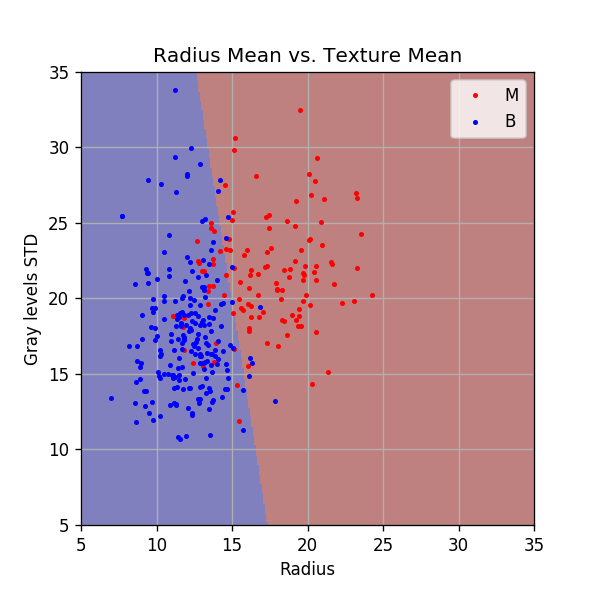

<!-- .slide: class="center" -->

<h1 class="workshop-title">Workshop 08<br>Linear Logistic Regression</h1>

<!--
## Logistic Regression

The logistic regression method tries to solve a classification problem following a discriminative approach. It seeks to estimate the conditional probability of the label given the measurements: $p\left(y|\boldsymbol{x}\right)$.

The logic regression algorithm tries to estimates the conditional distribution using the following model:

$$
p\left(y=k|\boldsymbol{x}\right)=\frac{e^{f_k\left(\boldsymbol{x}\right)}}{\sum_\tilde{k}e^{f_\tilde{k}\left(\boldsymbol{x}\right)}}
$$

Where $f_k\left(\boldsymbol{x}\right),k\in\left\{0,1,\ldots,K-1\right\}$ are $K$ pre-define functions which correspond to the $K$ possible classes which the label $y$ can take. 

Usually, The functions $f_k$ are selected to be a single parametric function $f\left(\boldsymbol{x}\ ;\boldsymbol{\theta}_k\right)$ with $K$ different sets of parameters $\boldsymbol{\theta}_k$. I.e., the following model is used:

$$
p\left(y=k|\boldsymbol{x}\right)=\frac{e^{f\left(\boldsymbol{x}\ ;\boldsymbol{\theta}_k\right)}}{\sum_\tilde{k}e^{f\left(\boldsymbol{x}\ ;\boldsymbol{\theta}_\tilde{k}\right)}}
$$

Because this model is only defined by the ratios between the $f\left(\boldsymbol{x}\ ;\boldsymbol{\theta}_k\right)$'s it has a large degree of freedom in selecting the parameters $\boldsymbol{\theta}_k$. This degree of freedom can be removed by setting $\boldsymbol{\theta}_0$ to some values such that $f\left(\boldsymbol{x}\ ;\boldsymbol{\theta}_0\right)=0$. We are then left to estimate only $K-1$ sets of parameters.

These model's parameters are usually estimated using MLE.

### The binary case

In the case of two classes the model becomes:

$$
p\left(y=0|\boldsymbol{x}\right)=\frac{e^{f\left(\boldsymbol{x}\ ;\boldsymbol{\theta}_0\right)}}{e^{f\left(\boldsymbol{x}\ ;\boldsymbol{\theta}_0\right)}+e^{f\left(\boldsymbol{x}\ ;\boldsymbol{\theta}_1\right)}}=\frac{1}{1+e^{f\left(\boldsymbol{x}\ ;\boldsymbol{\theta}_1\right)}}
$$

and

$$
p\left(y=1|\boldsymbol{x}\right)=\frac{e^{f\left(\boldsymbol{x}\ ;\boldsymbol{\theta}_1\right)}}{e^{f\left(\boldsymbol{x}\ ;\boldsymbol{\theta}_0\right)}+e^{f\left(\boldsymbol{x}\ ;\boldsymbol{\theta}_1\right)}}=\frac{1}{1+e^{-f\left(\boldsymbol{x}\ ;\boldsymbol{\theta}_1\right)}}
$$

The function:

$$
g\left(x\right)=\frac{1}{1+e^{-x}}
$$

Is called the **logistic function** which gives this method its name. By using the logistic function, we can write our model as:

$$
p\left(y=0|\boldsymbol{x}\right)=g\left(-f\left(\boldsymbol{x}\ ;\boldsymbol{\theta}_1\right)\right)
$$

$$
p\left(y=1|\boldsymbol{x}\right)=g\left(f\left(\boldsymbol{x}\ ;\boldsymbol{\theta}_1\right)\right)
$$

## Linear Logistic Regression

In the case where $f$ is selected to be a linear function of $\boldsymbol{x}$:

$$
f\left(\boldsymbol{x}\ ;\boldsymbol{\theta}_k\right)=\boldsymbol{\theta}_k^T\boldsymbol{x}
$$

The model is called linear logistic regression.

In order to add a bias term to the linear function we can add a 1 to the vector of measurements $\boldsymbol{x}$, i.e. $\boldsymbol{x}=\left(x_0,x_1,\ldots,x_M\right)^T\rightarrow\left(x_0,x_1,\ldots,x_M,1\right)^T$

### Relation to LDA

It is interesting to note that it can be shown that the model we get in the linear case for $p\left(y|\boldsymbol{x}\right)$, has the same form of the model which results for $p\left(y|\boldsymbol{x}\right)$ in LDA. I.e., the assumption that $p\left(\boldsymbol{x}|y=k\right)$ has a multivariate normal distribution with a covariance matrix which does not depend on $k$ leads to a model with is a special case of the linear logistic regression model.

## Gradient Descent

The family of gradient descent algorithms tries to solve an $\arg\min$ optimization problem of the form:

$$
\boldsymbol{\theta}^*=\underset{\boldsymbol{\theta}}{\arg\min}\ h\left(\boldsymbol{\theta}\right)
$$

They do so by starting from some random point $\boldsymbol{\theta}^{\left(0\right)}$, and then following the direction of the gradient in order to converge to some local minimum.

In it's most basic form the algorithm is implemented as follow:

1. Start from a random point $\boldsymbol{\theta}^{\left(0\right)}$
2. In each iteration update $\boldsymbol{\theta}$ according to:
$$
\boldsymbol{\theta}^{\left(k+1\right)}=\boldsymbol{\theta}^{\left(k\right)} - \alpha\nabla_\theta h\left(\boldsymbol{\theta^{\left(k\right)}}\right)
$$
Where $\alpha$ is some pre-defined constant which controls the updates steps size. This parameter is called the learning rate.

3. Continue until the updates result in a minor change to $f\left(\boldsymbol{\theta^{\left(k\right)}}\right)$, i.e., when:
$$
\left|h\left(\boldsymbol{\theta^{\left(k+1\right)}}\right) - h\left(\boldsymbol{\theta^{\left(k\right)}}\right)\right| < \varepsilon
$$
Where $\varepsilon$ is some pre-defined small constant which is usually referred to as the tolerance.

### Some Known Issues 

In most cases, this algorithm, in its basic form, is not very useful. This is mainly due to the problem of selecting an appropriate learning rate $\alpha$, and due to its slow convergence. As it turns out, the task of selecting the learning rate is not a simple task, a learning rate which is too large will prevent the algorithm from converging, while a learning rate which is too small will result in a very slow convergence, even up to the point where the algorithm becomes impractical to use.

In addition, in many cases, even when using the optimal learning rate, the converges can still be very slow. This is especially common for function in high dimension.

Luckily a few small improvements to the algorithm can significantly reduce these problems. Some of the commonly used methods improve the basic algorithm by:

1. Adding momentum.
2. Using adaptive learning rates.
3. Adding stochasticness to the algorithm.

We will not elaborate much about this subject in this course, but the two following blogs give a great overview of the subject:

- [An overview of gradient descent optimization algorithms](http://ruder.io/optimizing-gradient-descent/)
- [Why Momentum Really Works](https://distill.pub/2017/momentum/)
-->

---new slide---

## 🦠 Dataset: Breast Cancer Wisconsin

We will return to the **Breast Cancer Wisconsin Diagnostic** dataset.

<div>
<table border="1" class="dataframe">
  <thead>
    <tr style="text-align: right;">
      <th></th>
      <th>id</th>
      <th>diagnosis</th>
      <th>radius_mean</th>
      <th>texture_mean</th>
      <th>perimeter_mean</th>
      <th>area_mean</th>
      <th>smoothness_mean</th>
      <th>compactness_mean</th>
      <th>concavity_mean</th>
      <th>concave points_mean</th>
      <th>...</th>
      <th>radius_worst</th>
      <th>texture_worst</th>
      <th>perimeter_worst</th>
      <th>area_worst</th>
      <th>smoothness_worst</th>
      <th>compactness_worst</th>
      <th>concavity_worst</th>
      <th>concave points_worst</th>
      <th>symmetry_worst</th>
      <th>fractal_dimension_worst</th>
    </tr>
  </thead>
  <tbody>
    <tr>
      <th>0</th>
      <td>842302</td>
      <td>M</td>
      <td>17.99</td>
      <td>10.38</td>
      <td>122.80</td>
      <td>1001.0</td>
      <td>0.11840</td>
      <td>0.27760</td>
      <td>0.30010</td>
      <td>0.14710</td>
      <td>...</td>
      <td>25.38</td>
      <td>17.33</td>
      <td>184.60</td>
      <td>2019.0</td>
      <td>0.1622</td>
      <td>0.6656</td>
      <td>0.7119</td>
      <td>0.2654</td>
      <td>0.4601</td>
      <td>0.11890</td>
    </tr>
    <tr>
      <th>1</th>
      <td>842517</td>
      <td>M</td>
      <td>20.57</td>
      <td>17.77</td>
      <td>132.90</td>
      <td>1326.0</td>
      <td>0.08474</td>
      <td>0.07864</td>
      <td>0.08690</td>
      <td>0.07017</td>
      <td>...</td>
      <td>24.99</td>
      <td>23.41</td>
      <td>158.80</td>
      <td>1956.0</td>
      <td>0.1238</td>
      <td>0.1866</td>
      <td>0.2416</td>
      <td>0.1860</td>
      <td>0.2750</td>
      <td>0.08902</td>
    </tr>
    <tr>
      <th>2</th>
      <td>84300903</td>
      <td>M</td>
      <td>19.69</td>
      <td>21.25</td>
      <td>130.00</td>
      <td>1203.0</td>
      <td>0.10960</td>
      <td>0.15990</td>
      <td>0.19740</td>
      <td>0.12790</td>
      <td>...</td>
      <td>23.57</td>
      <td>25.53</td>
      <td>152.50</td>
      <td>1709.0</td>
      <td>0.1444</td>
      <td>0.4245</td>
      <td>0.4504</td>
      <td>0.2430</td>
      <td>0.3613</td>
      <td>0.08758</td>
    </tr>
    <tr>
      <th>3</th>
      <td>84348301</td>
      <td>M</td>
      <td>11.42</td>
      <td>20.38</td>
      <td>77.58</td>
      <td>386.1</td>
      <td>0.14250</td>
      <td>0.28390</td>
      <td>0.24140</td>
      <td>0.10520</td>
      <td>...</td>
      <td>14.91</td>
      <td>26.50</td>
      <td>98.87</td>
      <td>567.7</td>
      <td>0.2098</td>
      <td>0.8663</td>
      <td>0.6869</td>
      <td>0.2575</td>
      <td>0.6638</td>
      <td>0.17300</td>
    </tr>
    <tr>
      <th>4</th>
      <td>84358402</td>
      <td>M</td>
      <td>20.29</td>
      <td>14.34</td>
      <td>135.10</td>
      <td>1297.0</td>
      <td>0.10030</td>
      <td>0.13280</td>
      <td>0.19800</td>
      <td>0.10430</td>
      <td>...</td>
      <td>22.54</td>
      <td>16.67</td>
      <td>152.20</td>
      <td>1575.0</td>
      <td>0.1374</td>
      <td>0.2050</td>
      <td>0.4000</td>
      <td>0.1625</td>
      <td>0.2364</td>
      <td>0.07678</td>
    </tr>
    <tr>
      <th>5</th>
      <td>843786</td>
      <td>M</td>
      <td>12.45</td>
      <td>15.70</td>
      <td>82.57</td>
      <td>477.1</td>
      <td>0.12780</td>
      <td>0.17000</td>
      <td>0.15780</td>
      <td>0.08089</td>
      <td>...</td>
      <td>15.47</td>
      <td>23.75</td>
      <td>103.40</td>
      <td>741.6</td>
      <td>0.1791</td>
      <td>0.5249</td>
      <td>0.5355</td>
      <td>0.1741</td>
      <td>0.3985</td>
      <td>0.12440</td>
    </tr>
    <tr>
      <th>6</th>
      <td>844359</td>
      <td>M</td>
      <td>18.25</td>
      <td>19.98</td>
      <td>119.60</td>
      <td>1040.0</td>
      <td>0.09463</td>
      <td>0.10900</td>
      <td>0.11270</td>
      <td>0.07400</td>
      <td>...</td>
      <td>22.88</td>
      <td>27.66</td>
      <td>153.20</td>
      <td>1606.0</td>
      <td>0.1442</td>
      <td>0.2576</td>
      <td>0.3784</td>
      <td>0.1932</td>
      <td>0.3063</td>
      <td>0.08368</td>
    </tr>
    <tr>
      <th>7</th>
      <td>84458202</td>
      <td>M</td>
      <td>13.71</td>
      <td>20.83</td>
      <td>90.20</td>
      <td>577.9</td>
      <td>0.11890</td>
      <td>0.16450</td>
      <td>0.09366</td>
      <td>0.05985</td>
      <td>...</td>
      <td>17.06</td>
      <td>28.14</td>
      <td>110.60</td>
      <td>897.0</td>
      <td>0.1654</td>
      <td>0.3682</td>
      <td>0.2678</td>
      <td>0.1556</td>
      <td>0.3196</td>
      <td>0.11510</td>
    </tr>
    <tr>
      <th>8</th>
      <td>844981</td>
      <td>M</td>
      <td>13.00</td>
      <td>21.82</td>
      <td>87.50</td>
      <td>519.8</td>
      <td>0.12730</td>
      <td>0.19320</td>
      <td>0.18590</td>
      <td>0.09353</td>
      <td>...</td>
      <td>15.49</td>
      <td>30.73</td>
      <td>106.20</td>
      <td>739.3</td>
      <td>0.1703</td>
      <td>0.5401</td>
      <td>0.5390</td>
      <td>0.2060</td>
      <td>0.4378</td>
      <td>0.10720</td>
    </tr>
    <tr>
      <th>9</th>
      <td>84501001</td>
      <td>M</td>
      <td>12.46</td>
      <td>24.04</td>
      <td>83.97</td>
      <td>475.9</td>
      <td>0.11860</td>
      <td>0.23960</td>
      <td>0.22730</td>
      <td>0.08543</td>
      <td>...</td>
      <td>15.09</td>
      <td>40.68</td>
      <td>97.65</td>
      <td>711.4</td>
      <td>0.1853</td>
      <td>1.0580</td>
      <td>1.1050</td>
      <td>0.2210</td>
      <td>0.4366</td>
      <td>0.20750</td>
    </tr>
  </tbody>
</table>
<p>32 columns</p>
</div>

Number of rows in the dataset: `$N=569$`

---new slide---

## ❓️ Problem: Predict the Correct Diagnostic

<br>
<br>
<br>

Prediction of whether a tissue is malignant (cancerous) or benign (non-cancerous) based on the features extracted from the tissue's microscope image.

---new slide---

## Solution with 1-NN:

<center><div style="display:inline-block;background-color:rgba(255, 255, 255, 0.7); box-shadow: 0 0 5px 10px rgba(255, 255, 255, 0.7)">

</div></center>

---new slide---

## Solution with LDA️:

<center><div style="display:inline-block;background-color:rgba(255, 255, 255, 0.7); box-shadow: 0 0 5px 10px rgba(255, 255, 255, 0.7)">

</div></center>

---new slide---

## Test risk ressults:

<br>
<br>

- 1-NN: 0.14

- K-NN: 0.079

- LDA: 0.096

- QDA: 0.088

---new slide---

## 🔃 The Workflow

<center>

</center>

---new slide---

## 📜 Problem Definition - Same as before, written differently

For the following given random system:
- Random sample: $\omega$ - A sampled tissue drawn from some unknown distribution.

- Random variables:
  - $x_0=X_0\left(\omega\right)$: The average radius.
  - $x_1=X_1\left(\omega\right)$: The average standard deviation of gray-scale values.
  - $y=Y\left(\omega\right)$: 1 - cancerous (malignant) or 0 - not cancerous (benign).

<br>

Find a binary discrimination function:

`$$
h^*=\underset{h}{\arg\min}\ E\left[I\left\{h\left(\boldsymbol{x}\right)\neq y\right\}\right]
$$`

---new slide---

## 💡 Model & Learning Method Suggestion: Linear Logistic Regression

<br>

- We will use the **linear logistic regression** algorithm for generating our discrimination function.

<br>

- We will use a **basic gradient descent** algorithm to find the parameters $\boldsymbol{\theta}$.

<br>

- The **hyper-parameters** are the **gradient descent parameters**.

---new slide---

## ⚙️ Learning

### The MLE optimization problem

<br>

Estimate $p\left(y|\boldsymbol{x};\boldsymbol{\theta}\right)$ using the following model:

`$$
p\left(y=1|\boldsymbol{x};\boldsymbol{\theta}\right)=1-p\left(y=0|\boldsymbol{x};\boldsymbol{\theta}\right)=g\left(\boldsymbol{\theta}^T \boldsymbol{x}\right)=\frac{1}{1+e^{-\boldsymbol{\theta}^T \boldsymbol{x}}}
$$`

<br>

$g\left(x\right)=\frac{1}{1-e^{-x}}$ is the logistic function.

---new slide---

### The MLE optimization problem - Cont.

<br>

Therefore we need to solve the following MLE problem:

<br>

`$$
\begin{align*}
\boldsymbol{\theta}^*
& = \underset{\boldsymbol{\theta}}{\arg\max}\ \mathcal{L}\left(\boldsymbol{\theta};\left\{\boldsymbol{x}_i,y_i\right\}\right) \\
& = \underset{\boldsymbol{\theta}}{\arg\min}\underbrace{-\frac{1}{N}\sum_i\log\left(g\left(\boldsymbol{\theta}^T \boldsymbol{x}\right)\right)y_i + \log\left(1-g\left(\boldsymbol{\theta}^T \boldsymbol{x}\right)\right)\left(1-y_i\right)}_{=h\left(\boldsymbol{\theta};\left\{\boldsymbol{x}_i,y_i\right\}\right)} \\
\end{align*}
$$`

<br>

- For convenience, we have added a normalization by the number of samples.

---new slide---

### Basic gradient descent

<br>

To solve this optimization problem, we shall implement a basic gradient descent solver:

1. Start from a random vector of parameters $\boldsymbol{\theta}^{\left(0\right)}$

2. In each iteration update $\boldsymbol{\theta}$ according to:
`$$
\boldsymbol{\theta}^{\left(k+1\right)}=\boldsymbol{\theta}^{\left(k\right)} - \alpha\nabla_\theta h\left(\boldsymbol{\theta^{\left(k\right)}}\right)
$$`

3. Stop when:
`$$
\left|h\left(\boldsymbol{\theta^{\left(k+1\right)}}\right) - h\left(\boldsymbol{\theta^{\left(k\right)}}\right)\right| < \varepsilon
$$`

---new slide---

### Basic gradient descent - Cont.

Using the following properties:

- $\frac{d}{dx}g\left(x\right)=g\left(x\right)\left(1-g\left(x\right)\right)$

- $\frac{d}{dx}\log\left(g\left(x\right)\right)=1-g\left(x\right)$

- $\frac{d}{dx}\log\left(1-g\left(x\right)\right)=-g\left(x\right)$

- $\nabla_\theta f\left(\boldsymbol{\theta}^T \boldsymbol{x}\right)=f'\left(\boldsymbol{\theta}^T \boldsymbol{x}\right)\boldsymbol{x}$

We get that:

`$$
\begin{align*}
\nabla_\theta h\left(\boldsymbol{\theta}\right)
& = -\frac{1}{N}\sum_i\left(\left(1-g\left(\boldsymbol{\theta}^T \boldsymbol{x}\right)\right)y_i - g\left(\boldsymbol{\theta}^T \boldsymbol{x}\right)\left(1-y_i\right)\right)\boldsymbol{x}_i \\
& = \frac{1}{N}\sum_i\left(g\left(\boldsymbol{\theta}^T \boldsymbol{x}\right)-y_i\right)\boldsymbol{x}_i
\end{align*}
$$`

---new slide---

### Early stop as a regularization

<br>
<br>

**A common practice when using gradient descent**: Test the stop criteria on a validation set to prevents overfit.

<br>
<br>

---new slide---

### Some Known Issues

<br>

The basic gradient descent is not very useful. Mainly due to the problem of selecting an appropriate learning rate $\alpha$.

- A learning rate which is too large will prevent the algorithm from converging.

- A learning rate which is too small will result in a very slow convergence.

- In many cases, even with the optimal learning rate the convergence can still be very slow.

---new slide---

### Some Known Issues - Cont

#### Ways to improve the algorithm:

1. Adding momentum.

2. Using adaptive learning rates.

3. Adding stochasticness to the algorithm.

<br>

#### Link to some good overview of the problem and solutions:

- <a href='http://ruder.io/optimizing-gradient-descent/' target='_blank'>An overview of gradient descent optimization algorithms</a>

- <a href='https://distill.pub/2017/momentum/' target='_blank'>Why Momentum Really Works</a>

---new slide---

### Some Known Issues - Cont 2

<p><iframe src="https://distill.pub/2017/momentum/" width="100%" height="800px"></iframe></p>

---new slide---

### Implementation

```python
## Prepare the data
## ================

## Define x & y for the train set
x_train = train_set[['radius_mean', 'texture_mean']].values
y_train = train_set['diagnosis'].values == 'M'

## Define x & y for the validation set
x_val = validation_set[['radius_mean', 'texture_mean']].values
y_val = validation_set['diagnosis'].values == 'M'

## Define x & y for the test set
x_test = test_set[['radius_mean', 'texture_mean']].values
y_test = test_set['diagnosis'].values == 'M'

## Define x_tilde which is the augmented x with the additional 1 at the end
x_tilde_train = np.concatenate((x_train, np.ones((n_samples_train, 1))), axis=1)
x_tilde_val = np.concatenate((x_val, np.ones((n_samples_validation, 1))), axis=1)
x_tilde_test = np.concatenate((x_test, np.ones((n_samples_test, 1))), axis=1)
```

---new slide---

### Implementation - Cont.

```python
## The objective function
## ======================
## Define the logistice function
def g(x):
    return 1 / (1 + np.exp(-x))

## Define the objective function
def h(theta, x_tilde, y):
    dot_product = x_tilde @ theta
    return -(np.log(g(dot_product)) * y + np.log(1 - g(dot_product)) * (1- y)).mean()

## Define the gradient of h
def grad_h(theta, x_tilde, y):
    dot_product = x_tilde @ theta
    return ((g(dot_product) - y_train)[:, None] * x_tilde).mean(axis=0)

```

---new slide---

### Implementation - Cont. 2

```python
## The gradient decent algorithm
## =============================
def basic_gradient_decent(h, grad_h, alpha, tol, max_iter, x_train, y_train, x_val, y_val):
    ## Initialize theta
    theta = np.zeros(x_tilde_train.shape[1])

    ## Calucalte the initial objective
    last_objective = h(theta, x_tilde_val, y_val)

    ## Perforing the update steps
    while True:
        ## Update theta
        theta -= alpha * grad_h(theta, x_tilde_train, y_train)

        ## Calculate the new objective
        objective = h(theta, x_tilde_val, y_val)

        ## Check the stop criteria
        if np.abs(objective - last_objective) < tol:
            break
        last_objective = objective

    return theta
```

---new slide---

### Selecting the learning rate

<br>

To select the learning rate we shall run the algorithm for only 1000 steps with: $\alpha=10^{-1},10^{-2},10^{-3}$:

<br>

```python
## Running over the learning rates alpha
tol = 1e-6
max_iter = 1000

for alpha in (1e-1, 1e-2, 1e-3):
    basic_gradient_decent(f, grad_f, alpha, tol, max_iter, x_train, y_train, x_val, y_val)
```

---new slide---

### Selecting the learning rate - Cont

<center><div style="display:inline-block;background-color:rgba(255, 255, 255, 0.7); box-shadow: 0 0 5px 10px rgba(255, 255, 255, 0.7)">

</div></center>

---new slide---

### Selecting the learning rate - Cont 2

<center><div style="display:inline-block;background-color:rgba(255, 255, 255, 0.7); box-shadow: 0 0 5px 10px rgba(255, 255, 255, 0.7)">

</div></center>

---new slide---

### Selecting the learning rate - Cont 3

<center><div style="display:inline-block;background-color:rgba(255, 255, 255, 0.7); box-shadow: 0 0 5px 10px rgba(255, 255, 255, 0.7)">

</div></center>

---new slide---

### Selecting the learning rate - Cont 4

<br>

It seems as if:

<br>

- $\alpha=10^{-1}$ is too high. Theta keeps jumping from side to side, unable to enter that areawhere the objective is probably low.

<br>

- $\alpha=10^{-3}$ is too low. 10 times slower than $\alpha=10^{-2}$.

<br>

- $\alpha=10^{-2}$ seems to be ok. We can probably even use a slightly higher learning rate.

---new slide---

### Running with $\alpha=10^{-2}$

<br>

```python
tol = 1e-6
max_iter = 100000
alpha = 1e-2

theta = basic_gradient_decent(f, grad_f, alpha, tol, max_iter, x_train, y_train, x_val, y_val)

## Evaluate the risk on the train set
train_prediction = x_tilde_train @ theta > 0
train_risk = (train_prediction != y_train).mean()

print_math('The train risk is: ${:.2}$'.format(train_risk))
```

<br>

The train risk is: $0.11$

---new slide---

### Running with $\alpha=10^{-2}$ - Cont.

<center><div style="display:inline-block;background-color:rgba(255, 255, 255, 0.7); box-shadow: 0 0 5px 10px rgba(255, 255, 255, 0.7)">

</div></center>

- It seems that the algorithm did not yet converge.

- We can lower the tolerance to prevent the algorithm from stopping after 46882 iterations.

- This will result in longer training time.

---new slide---

### Plotting the discrimination rule

<center><div style="display:inline-block;background-color:rgba(255, 255, 255, 0.7); box-shadow: 0 0 5px 10px rgba(255, 255, 255, 0.7)">

</div></center>

---new slide---

## ⏱️ Performance evaluation

<br>

```python
## Evaluate the risk on the test set
test_prediction = x_tilde_test @ theta  > 0
test_risk = (test_prediction != y_test).mean()

print_math('The test risk is: ${:.2}$'.format(test_risk))
```

<br>

The test risk is: $0.096$

---new slide---

## Using scikit-learn - SGDClassifier

[sklearn.linear_model.SGDClassifier](https://scikit-learn.org/stable/modules/generated/sklearn.linear_model.SGDClassifier.html) implements:

linear logistic regression + Stochastic Gradient Descent (SGD) optimization.

<br>

A few notes regarding this class:

<br>

### Stochastic Gradient Descent (SGD)

- Only one sample is used in each update step.

- The samples are selected in each step randomly.

---new slide---

## Using scikit-learn - SGDClassifier - Cont.

<br>

### Selecting the loss function

- This class supports a range of linear models.

- They are selected using the **loss** argument.

- The linear logistic model can be selected be setting: **loss='log'**.

---new slide---

## Using scikit-learn - SGDClassifier - Cont. 2

<br>

### Regularization

- By default adds an $L2$ regularization term.

- Different regularization terms can be selected using the **penalty** argument.

- Use **penalty='none'** for no regularization.

---new slide---

## Using scikit-learn - SGDClassifier - Cont. 3

<br>

### Adaptive learning rates

- By default the learning rate changes over time.

- The manner in which the learning rate changes can be define using the **learning_rate** argument.

- For constant learning rate use **learning_rate='constant'**.

- For **learning_rate='constant'** $\alpha$, is defined by the argument **eta0**.

---new slide---

## Using scikit-learn - SGDClassifier - Cont. 4

```python
from sklearn.linear_model import SGDClassifier

tol = 1e-6
max_iter = 100000
alpha = 1e-3

## Create the classifier object
## eta0 here is the
clf = SGDClassifier(loss='log',
                    penalty='none',
                    max_iter=max_iter,
                    tol=tol,
                    learning_rate='constant',
                    eta0=alpha,
                    n_iter_no_change=100,
                    random_state=0)

## Train the classifier
clf.fit(x_train, y_train)
print('Number of iterations performed: {}'.format(clf.n_iter_))
```
Number of iterations performed: 1238

The train risk is: $0.11$

The test risk is: $0.096$

---new slide---

## Using scikit-learn - LogisticRegression

<br>

- For the case of linear logistic regression, there exist some more optimal optimization algorithms.

- [sklearn.linear_model.LogisticRegression](https://scikit-learn.org/stable/modules/generated/sklearn.linear_model.LogisticRegression.html) uses these algorithms.

- Like in the case of **SGDClassifier**, we will use **penalty='none'**.

- We will use an optimizer called **lbfgs** to solve the optimization problem.

---new slide---

## Using scikit-learn - LogisticRegression - Cont.

```python
from sklearn.linear_model import LogisticRegression

## Create the classifier object
clf = LogisticRegression(penalty='none', solver='lbfgs', random_state=0)

## Train the classifier
clf.fit(x_train, y_train)
```

The train risk is: $0.11$

The test risk is: $0.096$

Again, we got the same results as we got using our implementation (but much faster).

---new slide---

## Using more features

<br>

- So far we have used only the first two features.

- We would like to use all the available measured data.

- We will plot the training and validataion risk as a function of the number features.

---new slide---

## Using more features - Cont.

```python
features_names_list = ['radius_mean', 'texture_mean', 'perimeter_mean',
           'area_mean', 'smoothness_mean', 'compactness_mean', 'concavity_mean',
           'concave points_mean', 'symmetry_mean', 'fractal_dimension_mean',
           'radius_se', 'texture_se', 'perimeter_se', 'area_se', 'smoothness_se',
           'compactness_se', 'concavity_se', 'concave points_se', 'symmetry_se',
           'fractal_dimension_se', 'radius_worst', 'texture_worst',
           'perimeter_worst', 'area_worst', 'smoothness_worst',
           'compactness_worst', 'concavity_worst', 'concave points_worst',
           'symmetry_worst', 'fractal_dimension_worst']

n_features_grid = np.arange(2, 31)

## Create the classifier object
clf = LogisticRegression(penalty='none', solver='lbfgs', random_state=0, max_iter=10000)

## Loop over the number of features
for i, n_features in enumerate(n_features_grid):

    x_train = train_set[features_names_list[:n_features]].values
    x_val = validation_set[features_names_list[:n_features]].values

    ## Create and train the classifier object
    clf.fit(x_train, y_train)
```

---new slide---

## Using more features - Cont.

<center><div style="display:inline-block;background-color:rgba(255, 255, 255, 0.7); box-shadow: 0 0 5px 10px rgba(255, 255, 255, 0.7)">

</div></center>

<br>

The optimal test risk is: $0.026$

---new slide---

## Using more features - Cont. 2

<br>

- When increasing the number of features the models starts to overfit the data.

- One option is to only use the first 17 features, but this is obviously not optimal.

- Alternativly, we can partially reduce the overfitting by adding a regularization term.

- Specifically, adding an $L1$ regularization will encourage the optimization to use a sparse set of features.

---new slide---

## Using more features - Cont. 3

Distribution of coefficients:

<center><div style="display:inline-block;background-color:rgba(255, 255, 255, 0.7); box-shadow: 0 0 5px 10px rgba(255, 255, 255, 0.7)">

</div></center>

---new slide---

## Using more features - Cont. 4

<style>
.container{
    display: flex;
}
.col{
    flex: 1;
}
</style>

<div class="container">
    <div class="col">
      <pre>
        0) radius_mean: 3.3%
        1) texture_mean: 0.0%
        2) perimeter_mean: 0.1%
        3) area_mean: 0.0%
        4) smoothness_mean: 7.6%
        5) compactness_mean: 7.0%
        6) concavity_mean: 4.6%
        7) concave points_mean: 7.7%
        8) symmetry_mean: 10.3%
        9) fractal_dimension_mean: 0.2%
        10) radius_se: 0.9%
        11) texture_se: 0.6%
        12) perimeter_se: 0.1%
        13) area_se: 0.1%
        14) smoothness_se: 1.3%
      </pre>
    </div>
    <div class="col">
      <pre>
        15) compactness_se: 8.4%
        16) concavity_se: 10.2%
        17) concave points_se: 0.6%
        18) symmetry_se: 2.8%
        19) fractal_dimension_se: 1.7%
        20) radius_worst: 1.1%
        21) texture_worst: 0.1%
        22) perimeter_worst: 0.0%
        23) area_worst: 0.0%
        24) smoothness_worst: 14.9%
        25) compactness_worst: 0.0%
        26) concavity_worst: 1.1%
        27) concave points_worst: 8.3%
        28) symmetry_worst: 4.6%
        29) fractal_dimension_worst: 2.3%
      </pre>
    </div>
  </div>
</div>

<br>

We can see that the coefficient speared all over the 30 features.

---new slide---

## $L1$ Regularization

Let us now fit the model using an $L1$ regularization:

```python

n_features_grid = np.arange(2, 31)
train_risk_array = np.zeros(len(n_features_grid))
val_risk_array = np.zeros(len(n_features_grid))

## Create the classifier object
clf = LogisticRegression(penalty='l1', C=500, solver='liblinear', random_state=0, max_iter=10000)

## Loop over the number of features
for i, n_features in enumerate(n_features_grid):

    x_train = train_set[features_names_list[:n_features]].values
    x_val = validation_set[features_names_list[:n_features]].values

    ## Create and train the classifier object
    clf.fit(x_train, y_train)
```

---new slide---

## $L1$ Regularization - Cont.

<center><div style="display:inline-block;background-color:rgba(255, 255, 255, 0.7); box-shadow: 0 0 5px 10px rgba(255, 255, 255, 0.7)">

</div></center>

<br>

The test risk is: $0.017$

The regularization has reduced the amount of overfitting and was able to improve the test risk.

---new slide---

## $L1$ Regularization - Cont. 2

Distribution of coefficients:

<center><div style="display:inline-block;background-color:rgba(255, 255, 255, 0.7); box-shadow: 0 0 5px 10px rgba(255, 255, 255, 0.7)">

</div></center>

---new slide---

## $L1$ Regularization - Cont. 3

<div class="container">
    <div class="col">
      <pre>
        0) radius_mean: 0.3%
        1) texture_mean: 0.1%
        2) perimeter_mean: 0.0%
        3) area_mean: 0.0%
        4) smoothness_mean: 13.3%
        5) compactness_mean: 9.9%
        6) concavity_mean: 0.0%
        7) concave points_mean: 21.4%
        8) symmetry_mean: 7.1%
        9) fractal_dimension_mean: 0.0%
        10) radius_se: 1.7%
        11) texture_se: 0.1%
        12) perimeter_se: 0.1%
        13) area_se: 0.0%
        14) smoothness_se: 0.0%
      </pre>
    </div>
    <div class="col">
      <pre>
        15) compactness_se: 0.0%
        16) concavity_se: 8.1%
        17) concave points_se: 20.6%
        18) symmetry_se: 4.3%
        19) fractal_dimension_se: 0.0%
        20) radius_worst: 0.1%
        21) texture_worst: 0.0%
        22) perimeter_worst: 0.0%
        23) area_worst: 0.0%
        24) smoothness_worst: 1.9%
        25) compactness_worst: 0.2%
        26) concavity_worst: 1.6%
        27) concave points_worst: 0.0%
        28) symmetry_worst: 2.9%
        29) fractal_dimension_worst: 6.4%
      </pre>
    </div>
  </div>
</div>

<br>

We can see here that adding an $L1$ regularization indeed result in a sparser result.