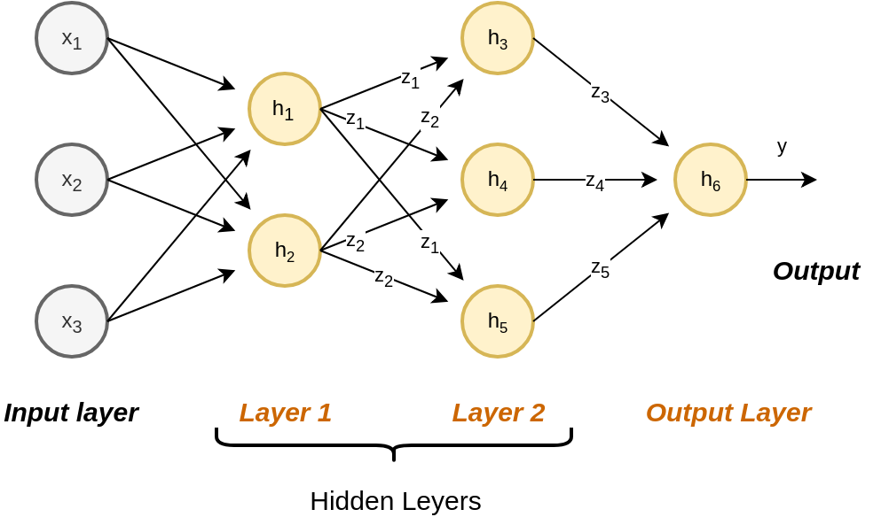
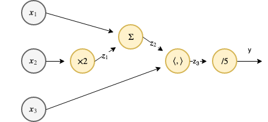
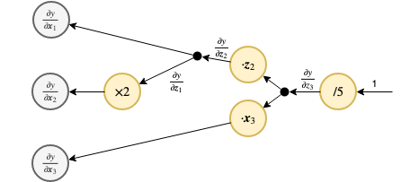

<!-- .slide: class="center" -->

<h1 class="workshop-title">Workshop 09<br>MLP & PyTorch</h1>

---new slide---

## Artificial Neural Networks (ANN)

- Inspired by biological neural networks.
- Composed of a network of simple units (neurons).

<center></center>

**Deep Neural Networks (DNN)**: The data passes through multiple hidden units.

---new slide---

## Artificial Neural Networks (ANN) - Cont.

Commonly, Neurons are selected to be a linear function followed by a non-linear function:

`$$
h\left(\boldsymbol{x}\ ;\boldsymbol{\theta},b\right)=\varphi\left(\boldsymbol{\theta}^T\boldsymbol{x}+b\right)
$$`

$\varphi$ is called the activation function.

<br>

Commonly used activation functions are:

- The logistic function / sigmoid: $\varphi\left(x\right)=\frac{1}{1+e^-x}$

- Hyperbolic tangent: $\varphi\left(x\right)=\tanh\left(x/2\right)$

- Rectifier function (ReLU): $\varphi\left(x\right)=\max\left(x,0\right)$

---new slide---

## Artificial Neural Networks (ANN) - Cont. 2

<br>

Two types of networks:

- **Feed-forward networks**: Data flow in a directed manner. No loops.

- **recurrent networks**: Contains cyclic paths. Outside the scope of this course.

<br>

- We will adjust the parameters of the network using the dataset.

- In a feed-forward network, we will usually do so using gradients descent (+ **back propagation**).  

---new slide---

## Multilayer Perceptron (MLP)

- The neurons are organized in layers (at one hidden layer).

- **Fully connected layers**: Each neuron is fed by **all** neurons in previous layer.

<center></center>

---new slide---

## Naming Differences

### **loss function**:

**Mathematically**: Any objective function which is to be minimized.

**In this course**: penalty for a single prediction: $l\left(\hat{y},y\right)$. **Risk/Cost functions** are the mean of the loss function.

**In deep learning**: The risk/cost functions or the optimization's objective function.

<br>

## Sigmoid

**Mathematically**: A range of S-shaped functions.

**In deep learning**: The logistic function.

---new slide---

## Deep Learning Frameworks

A partial list of some of popular frameworks:

- **[TensorFlow](https://www.tensorflow.org/)**: Backed by Google. Currently the most popular framework.

- **[PyTorch](https://pytorch.org/)**: Based on [Torch](http://torch.ch/). Backed by Facebook. Younger but rapidly gaining popularity. Is almost as popular as Tensorflow.

- **[Caffe](https://caffe.berkeleyvision.org/) & [Caffe2](https://caffe2.ai/)**: Has support for C, C++, Python, and Matlab. Developed at Berkeley, maintained by Facebook. Older and quite popular. Seems as if it's popularity is decreasing.

- **[Keras](https://keras.io/)**: Built in top of other frameworks. provide a more "human-friendly" interface. Higher level of abstraction.

- **[fast.ai](https://www.fast.ai/)**: Recently released. Built on top pf PyTorch. Designed to incorporate best practices. A lot of positive feedback.

- **[Matlab](https://www.mathworks.com/help/deeplearning/getting-started-with-deep-learning-toolbox.html)**: Recently published a deep learning toolbox.

<!--
## Google Trands

<a href="https://trends.google.com/trends/explore/TIMESERIES/1558609200?hl=en-US&tz=-180&date=today+5-y&geo=US&q=pytorch,%2Fg%2F11bwp1s2k3&sni=3" target="_blank">Link</a>

<div style="height:600px">
<script type="text/javascript" src="https://ssl.gstatic.com/trends_nrtr/1754_RC01/embed_loader.js"></script>
<script type="text/javascript">
 trends.embed.renderExploreWidget("TIMESERIES", {"comparisonItem":[{"keyword":"pytorch","geo":"US","time":"today 5-y"},{"keyword":"/g/11bwp1s2k3","geo":"US","time":"today 5-y"}],"category":0,"property":""}, {"exploreQuery":"date=today%205-y&geo=US&q=pytorch,%2Fg%2F11bwp1s2k3","guestPath":"https://trends.google.com:443/trends/embed/"});
</script>
</div>
-->

---new slide---

## GPUs

<br>

- Boosted the use of deep neural networks.

- Gradient descent with a large number of parameters and large datasets is very slow. GPUs can parallelize the process.

<br>

All of the described frameworks support the use of GPUs.

---new slide---

### PyTorch Tutorials

<br>

- This workshop only scratches the surface of PyTorch and.

- PyTorch has some great tutorial on his [website](https://pytorch.org/tutorials/beginner/blitz/autograd_tutorial.html).

- The "60 Minute Blitz" along with the "Learning PyTorch with Examples" provides a great starting point.

---new slide---

### Tensors

The basic PyTorch object is the tensor which are similar to NumPy arrays.

Let us calculate the following equation:

`$$
\boldsymbol{x}_1=\left(1,2\right)^T\\
\boldsymbol{x}_2=\left(3,4\right)^T\\
\boldsymbol{x}_3=\left(5,6\right)^T\\
y=\left(\boldsymbol{x}_1+2\boldsymbol{x}_2\right)^T\boldsymbol{x}_3/5
$$`

The following code imports the PyTorch package, defines the 3 tensors and calculates $y$:

---new slide---

### Tensors - Cont.

```python
import torch  ## importing PyTorch

## Defining the x's
x1 = torch.tensor([1.,2.])
x2 = torch.tensor([3.,4.])
x3 = torch.tensor([5.,6.])


## Calculating y
y = torch.matmul((x1 + 2*x2), x3) / 5

## Printing Everything
print('x1 = {}'.format(x1))
print('x2 = {}'.format(x2))
print('x3 = {}'.format(x2))
print('y = {}'.format(y))
```

x1 = tensor([1., 2.])

x2 = tensor([3., 4.])

x3 = tensor([3., 4.])

y = 19.0

---new slide---

### A Function as a Graph

`$$
y=\left(\boldsymbol{x}_1+2\boldsymbol{x}_2\right)^T\boldsymbol{x}_3/5
$$`

<center></center>

Here $\left<,\right>$ is a dot product between vectors.

---new slide---

The following code re-calculates $y$, using intermediate variables, $z_i$'s.

<center></center>

```python
z1 = x2 * 2
z2 = x1 + z1
z3 = torch.matmul(z2, x3)
y = z3 / 5

print('z1 = {}'.format(str(z1)))
print('z2 = {}'.format(str(z2)))
print('z3 = {}'.format(str(z3)))
```
z1 = tensor([6., 8.])

z2 = tensor([ 7., 10.])

z3 = tensor(95.)

---new slide---

### Autograd - The Forward Graph

<br>
<br>

PyTorch can automatically calculate the forward and backward graphs.

By setting the **requires_grad** flag of a tensor to true, we tell PyTorch to calculate the graph starting for this tensor.

---new slide---

### Autograd - The Forward Graph - Cont.

Again, this time with the requires_grad flags set to true.


```python
x1 = torch.tensor([1.,2.], requires_grad=True)
x2 = torch.tensor([3.,4.])
x3 = torch.tensor([5.,6.], requires_grad=True)

z1 = x2 * 2
z2 = x1 + z1
z3 = torch.matmul(z2, x3)
y = z3 / 5
```

<br>

x1 = tensor([1., 2.], requires_grad=True)<br>
x2 = tensor([3., 4.])<br>
x3 = tensor([5., 6.], requires_grad=True)<br>
z1 = tensor([6., 8.])<br>
z2 = tensor([ 7., 10.], grad_fn=`<AddBackward0>`)<br>
z3 = tensor(95., grad_fn=`<DotBackward>`)<br>
y = tensor(19., grad_fn=`<DivBackward0>`)<br>

---new slide---

### Autograd - The Forward Graph - Cont. 2

<br>

The tensor's variable **grad_fn** stores the node which has created this tensor. For example:

<br>

```python
print(y.grad_fn)
```

`<DivBackward0 object at 0x7ff03c4514e0>`

---new slide---

### Autograd - The Forward Graph - Cont. 3

<center></center>

We can further traverse the graph using the **next_function** property of **grad_fn**:

```python
print(y.grad_fn.next_functions)
```
((`<DotBackward object at 0x7ff03c4442e8>`, 0), (None, 0))

<br>

BTW

```python
print(y.grad_fn.next_functions[0][0] is z3.grad_fn)
```

True

---new slide---

### Autograd - The Forward Graph - Cont. 4

<center></center>

```python
print('y')
print('└ {}'.format(y.grad_fn))
print('  ├ {}'.format(y.grad_fn.next_functions[1][0]))
print('  └ {}'.format(y.grad_fn.next_functions[0][0]))
print('    ├ {}'.format(y.grad_fn.next_functions[0][0].next_functions[1][0]))
print('    └ {}'.format(y.grad_fn.next_functions[0][0].next_functions[0][0]))
print('      ├ {}'.format(y.grad_fn.next_functions[0][0].next_functions[0][0].next_functions[0][0]))
print('      └ {}'.format(y.grad_fn.next_functions[0][0].next_functions[0][0].next_functions[1][0]))
```

    y
    └ <DivBackward0 object at 0x7fefc4848c50>
      ├ None
      └ <DotBackward object at 0x7fefc4848c88>
        ├ <AccumulateGrad object at 0x7fefc4848cf8>
        └ <AddBackward0 object at 0x7fefc4848c88>
          ├ <AccumulateGrad object at 0x7fefc4848cc0>
          └ None

<!--
- *AccumulateGrad* is a source point.

- The path from $\boldsymbol{x}_2$ is missing because $\boldsymbol{x}_2$'s *requires_grad* is false.
-->

---new slide---

### Autograd - The Backward Graph

- PyTorch can calculate the backward graph.

- Done by calling the **backward** function on the output tensor.

- The backward graph is:

<center></center>

We will leave the subject of building this graph to the tutorials.

---new slide---

### Autograd - The Backward Graph - Cont.

```python
print('x_1 gradient before: {}'.format(x1.grad))
print('x_2 gradient before: {}'.format(x2.grad))
print('x_3 gradient before: {}'.format(x3.grad))

## Calcualte and evaluate the backward pass
y.backward()
print('')

print('x_1 gradient after: {}'.format(x1.grad))
print('x_2 gradient after: {}'.format(x2.grad))
print('x_3 gradient after: {}'.format(x3.grad))
```

x_1 gradient before: None<br>
x_2 gradient before: None<br>
x_3 gradient before: None<br>

x_1 gradient after: tensor([1.0000, 1.2000])<br>
x_2 gradient after: None<br>
x_3 gradient after: tensor([1.4000, 2.0000])<br>

---new slide---

### Gradient Descent

<br>

- We can now perform gradient descent on arbitrary functions.

- Let us try and use PyTorch to solve this simple optimization problem:

$$
x^*=\underset{x}{\arg\min}\ x^2
$$

- PyTorch has a large set of gradient descent solvers.

- A basic gradient descent optimization: **[torch.optim.SGD](https://pytorch.org/docs/stable/optim.html?highlight=sgd#torch.optim.SGD)**.

---new slide---

### Gradient Descent - Cont.

We will start with $x=1$, use a learning rate of $0.7$ and take 10 gradient steps:

```python
import torch.optim as optim  ## Import the optimization module of the package

x = torch.tensor(1, dtype=torch.float, requires_grad=True)  ## Inizitalize x
opt = optim.SGD([x], lr=0.7)  ## Initizalie the optimizer

for i in range(10):
    opt.zero_grad()  ## Clean up previous gradients
    y = x ** 2  ## Forward pass
    y.backward()  ## Backward pass

    print('Step {}:, x and it\'s gradient before the update step:   {:.2f}, {:.2f}'.format(i, float(x), float(x.grad)))
    opt.step()  ## Perform the update step
```
<div style="font-size:60%">
Step 0: x and it's gradient before the update step:   1.00, 2.00<br>
Step 1: x and it's gradient before the update step:   -0.40, -0.80<br>
Step 2: x and it's gradient before the update step:   0.16, 0.32<br>
Step 3: x and it's gradient before the update step:   -0.06, -0.13<br>
Step 4: x and it's gradient before the update step:   0.03, 0.05<br>
Step 5: x and it's gradient before the update step:   -0.01, -0.02<br>
Step 6: x and it's gradient before the update step:   0.00, 0.01<br>
Step 7: x and it's gradient before the update step:   -0.00, -0.00<br>
Step 8: x and it's gradient before the update step:   0.00, 0.00<br>
Step 9: x and it's gradient before the update step:   -0.00, -0.00<br>
</div>

---new slide---

## Using the GPU

<br>

Passing a tensor to the GPU dine by:


```python
x1 = torch.tensor(1.).cuda()
## or
x2 = torch.tensor(2.).to('cuda:0')  ## More usful when you have more then 1 gpu
## or
x3 = torch.tensor(3., device='cuda:0')

## This calculation will be perfomed on the GPU
y = x1 + x2 + x3

print('y={} is on: {}'.format(float(y), y.device))
```

<br>

y=6.0 is on: cuda:0

---new slide---

## Defining a Network Object

<br>

Let now look at a simple linear regression problem of fitting:

$$
\hat{y} = \theta_1\cdot x_1 + \theta_2\cdot x_2
$$

With an $L2$ loss function.

<br>

```python
## Generate the data
## =================
import numpy as np
rand_gen = np.random.RandomState(0)
x = rand_gen.rand(1000, 2)
y = x @ np.array([2, -1]) + rand_gen.randn(1000)
```


---new slide---

## Defining a Network Object - Cont.

- The more common way to use PyTorch is to define a network object.
- This is using the **torch.nn.Model** class, and implementing **__init__** and **forward**.

$$
\hat{y} = \theta_1\cdot x_1 + \theta_2\cdot x_2
$$

```python
## Define the network
## ==================
import torch.nn as nn

class LinReg(nn.Module):
    def __init__(self):
        ## The following line should appear in the beginning of the __init__ function.
        ## It is related to inheritance, and we will not elaborate on this here.
        super(LinReg, self).__init__()

        self.theta = nn.Parameter(data=torch.tensor([0., 0.]), requires_grad=True)

    def forward(self, x):
        y = torch.matmul(x, self.theta)
        return y
```

---new slide---

## Defining a Network Object - Cont. 2

```python
## Convert NumPy arrays to tensors on GPU
## ======================================
x = torch.tensor(x).float().cuda()
y = torch.tensor(y).float().cuda()

lin_reg = LinReg().cuda()

## Run the optimization
## ====================
opt = optim.SGD(lin_reg.parameters(), lr=1.)  ## Initizalie the optimizer

for i in range(10):
    opt.zero_grad()  ## Clean up previous gradients
    
    ## Forward pass
    y_hat = lin_reg(x)
    loss = torch.mean((y - y_hat) ** 2) ** 0.5
    ## Backward pass
    loss.backward()

    opt.step()  ## Perform the update step
```

---new slide---

## Building on Existing Modules

PyTorch comes with existing nodes such as:

- **[torch.nn.Linear](https://pytorch.org/docs/stable/nn.html#linear)**: Linear transformation.

- **[torch.nn.MSELoss](https://pytorch.org/docs/stable/nn.html#torch.nn.MSELoss)**: An MSE risk term.

Let us re-write our linear regression model and the optimization using the following two objects:

---new slide---

## Building on Existing Modules - Cont.

```python
class LinReg2(nn.Module):
    def __init__(self):
        super(LinReg2, self).__init__()
        self.linear = nn.Linear(2, 1)
        
    def forward(self, x):
        y = self.linear(x)
        return y.view(-1)  ## Reshape x to make it a 1D tensor (vector)

lin_reg = LinReg2().cuda()

## Run the optimization
## ====================
opt = optim.SGD(lin_reg.parameters(), lr=1.)  ## Initizalie the optimizer
loss_func = nn.MSELoss()

for i in range(10):
    opt.zero_grad()  ## Clean up previous gradients
    
    ## Forward pass
    y_hat = lin_reg(x)
    loss = loss_func(y_hat, y) ** 0.5
    ## Backward pass
    loss.backward()
    
    opt.step()  ## Perform the update step
```

---new slide---

## The Same Problem From last workshop

Let us go back now to the problem from last workshop and solve it using PyTorch.

### 🦠 Dataset:

Breast Cancer Wisconsin

### ❓️ Problem:

Predict the Correct Diagnostic

---new slide---

## 🕵️ Data Inspection

Number of rows in the dataset: $N=569$

<div>
<table border="1" class="dataframe">
  <thead>
    <tr style="text-align: right;">
      <th></th>
      <th>id</th>
      <th>diagnosis</th>
      <th>radius_mean</th>
      <th>texture_mean</th>
      <th>perimeter_mean</th>
      <th>area_mean</th>
      <th>smoothness_mean</th>
      <th>compactness_mean</th>
      <th>concavity_mean</th>
      <th>concave points_mean</th>
      <th>...</th>
      <th>radius_worst</th>
      <th>texture_worst</th>
      <th>perimeter_worst</th>
      <th>area_worst</th>
      <th>smoothness_worst</th>
      <th>compactness_worst</th>
      <th>concavity_worst</th>
      <th>concave points_worst</th>
      <th>symmetry_worst</th>
      <th>fractal_dimension_worst</th>
    </tr>
  </thead>
  <tbody>
    <tr>
      <th>0</th>
      <td>842302</td>
      <td>M</td>
      <td>17.99</td>
      <td>10.38</td>
      <td>122.80</td>
      <td>1001.0</td>
      <td>0.11840</td>
      <td>0.27760</td>
      <td>0.30010</td>
      <td>0.14710</td>
      <td>...</td>
      <td>25.38</td>
      <td>17.33</td>
      <td>184.60</td>
      <td>2019.0</td>
      <td>0.1622</td>
      <td>0.6656</td>
      <td>0.7119</td>
      <td>0.2654</td>
      <td>0.4601</td>
      <td>0.11890</td>
    </tr>
    <tr>
      <th>1</th>
      <td>842517</td>
      <td>M</td>
      <td>20.57</td>
      <td>17.77</td>
      <td>132.90</td>
      <td>1326.0</td>
      <td>0.08474</td>
      <td>0.07864</td>
      <td>0.08690</td>
      <td>0.07017</td>
      <td>...</td>
      <td>24.99</td>
      <td>23.41</td>
      <td>158.80</td>
      <td>1956.0</td>
      <td>0.1238</td>
      <td>0.1866</td>
      <td>0.2416</td>
      <td>0.1860</td>
      <td>0.2750</td>
      <td>0.08902</td>
    </tr>
    <tr>
      <th>2</th>
      <td>84300903</td>
      <td>M</td>
      <td>19.69</td>
      <td>21.25</td>
      <td>130.00</td>
      <td>1203.0</td>
      <td>0.10960</td>
      <td>0.15990</td>
      <td>0.19740</td>
      <td>0.12790</td>
      <td>...</td>
      <td>23.57</td>
      <td>25.53</td>
      <td>152.50</td>
      <td>1709.0</td>
      <td>0.1444</td>
      <td>0.4245</td>
      <td>0.4504</td>
      <td>0.2430</td>
      <td>0.3613</td>
      <td>0.08758</td>
    </tr>
    <tr>
      <th>3</th>
      <td>84348301</td>
      <td>M</td>
      <td>11.42</td>
      <td>20.38</td>
      <td>77.58</td>
      <td>386.1</td>
      <td>0.14250</td>
      <td>0.28390</td>
      <td>0.24140</td>
      <td>0.10520</td>
      <td>...</td>
      <td>14.91</td>
      <td>26.50</td>
      <td>98.87</td>
      <td>567.7</td>
      <td>0.2098</td>
      <td>0.8663</td>
      <td>0.6869</td>
      <td>0.2575</td>
      <td>0.6638</td>
      <td>0.17300</td>
    </tr>
    <tr>
      <th>4</th>
      <td>84358402</td>
      <td>M</td>
      <td>20.29</td>
      <td>14.34</td>
      <td>135.10</td>
      <td>1297.0</td>
      <td>0.10030</td>
      <td>0.13280</td>
      <td>0.19800</td>
      <td>0.10430</td>
      <td>...</td>
      <td>22.54</td>
      <td>16.67</td>
      <td>152.20</td>
      <td>1575.0</td>
      <td>0.1374</td>
      <td>0.2050</td>
      <td>0.4000</td>
      <td>0.1625</td>
      <td>0.2364</td>
      <td>0.07678</td>
    </tr>
    <tr>
      <th>5</th>
      <td>843786</td>
      <td>M</td>
      <td>12.45</td>
      <td>15.70</td>
      <td>82.57</td>
      <td>477.1</td>
      <td>0.12780</td>
      <td>0.17000</td>
      <td>0.15780</td>
      <td>0.08089</td>
      <td>...</td>
      <td>15.47</td>
      <td>23.75</td>
      <td>103.40</td>
      <td>741.6</td>
      <td>0.1791</td>
      <td>0.5249</td>
      <td>0.5355</td>
      <td>0.1741</td>
      <td>0.3985</td>
      <td>0.12440</td>
    </tr>
    <tr>
      <th>6</th>
      <td>844359</td>
      <td>M</td>
      <td>18.25</td>
      <td>19.98</td>
      <td>119.60</td>
      <td>1040.0</td>
      <td>0.09463</td>
      <td>0.10900</td>
      <td>0.11270</td>
      <td>0.07400</td>
      <td>...</td>
      <td>22.88</td>
      <td>27.66</td>
      <td>153.20</td>
      <td>1606.0</td>
      <td>0.1442</td>
      <td>0.2576</td>
      <td>0.3784</td>
      <td>0.1932</td>
      <td>0.3063</td>
      <td>0.08368</td>
    </tr>
    <tr>
      <th>7</th>
      <td>84458202</td>
      <td>M</td>
      <td>13.71</td>
      <td>20.83</td>
      <td>90.20</td>
      <td>577.9</td>
      <td>0.11890</td>
      <td>0.16450</td>
      <td>0.09366</td>
      <td>0.05985</td>
      <td>...</td>
      <td>17.06</td>
      <td>28.14</td>
      <td>110.60</td>
      <td>897.0</td>
      <td>0.1654</td>
      <td>0.3682</td>
      <td>0.2678</td>
      <td>0.1556</td>
      <td>0.3196</td>
      <td>0.11510</td>
    </tr>
    <tr>
      <th>8</th>
      <td>844981</td>
      <td>M</td>
      <td>13.00</td>
      <td>21.82</td>
      <td>87.50</td>
      <td>519.8</td>
      <td>0.12730</td>
      <td>0.19320</td>
      <td>0.18590</td>
      <td>0.09353</td>
      <td>...</td>
      <td>15.49</td>
      <td>30.73</td>
      <td>106.20</td>
      <td>739.3</td>
      <td>0.1703</td>
      <td>0.5401</td>
      <td>0.5390</td>
      <td>0.2060</td>
      <td>0.4378</td>
      <td>0.10720</td>
    </tr>
    <tr>
      <th>9</th>
      <td>84501001</td>
      <td>M</td>
      <td>12.46</td>
      <td>24.04</td>
      <td>83.97</td>
      <td>475.9</td>
      <td>0.11860</td>
      <td>0.23960</td>
      <td>0.22730</td>
      <td>0.08543</td>
      <td>...</td>
      <td>15.09</td>
      <td>40.68</td>
      <td>97.65</td>
      <td>711.4</td>
      <td>0.1853</td>
      <td>1.0580</td>
      <td>1.1050</td>
      <td>0.2210</td>
      <td>0.4366</td>
      <td>0.20750</td>
    </tr>
  </tbody>
</table>
<p>10 rows × 32 columns</p>
</div>

---new slide---

## 💡 Model & Learning Method Suggestion: Linear Logistic Regression with PyTorch

<br>

### Reminder:

We assume a model of the form:
$$
p\left(y=1|\boldsymbol{x};\boldsymbol{\theta}\right)=1-p\left(y=0|\boldsymbol{x};\boldsymbol{\theta}\right)=g\left(\boldsymbol{\theta}^T \boldsymbol{x}\right)=\frac{1}{1+e^{-\boldsymbol{\theta}^T \boldsymbol{x}}}
$$

---new slide---

## 💡 Model & Learning Method Suggestion - Cont.

And would like to select $\boldsymbol{\theta}$ according to:

`$$
\begin{align*}
\boldsymbol{\theta}^*
& = \underset{\boldsymbol{\theta}}{\arg\max}\ \mathcal{L}\left(\boldsymbol{\theta};\left\{\boldsymbol{x}_i,y_i\right\}\right) \\
& = \underset{\boldsymbol{\theta}}{\arg\min}\underbrace{-\frac{1}{N}\sum_i\log\left(g\left(\boldsymbol{\theta}^T \boldsymbol{x}\right)\right)y_i + \log\left(1-g\left(\boldsymbol{\theta}^T \boldsymbol{x}\right)\right)\left(1-y_i\right)}_{=h\left(\boldsymbol{\theta};\left\{\boldsymbol{x}_i,y_i\right\}\right)} \\
\end{align*}
$$`

We will use gradient descent decent for that, where our gradient step will be:

$$
\boldsymbol{\theta}^{\left(k+1\right)}=\boldsymbol{\theta}^{\left(k\right)} - \alpha\nabla_\theta h\left(\boldsymbol{\theta^{\left(k\right)}}\right)
$$

---new slide---

## PyTorch's functions

<br>
We shall use the additional PyTorch's functions

- **[torch.nn.Sigmoid](https://pytorch.org/docs/stable/nn.html#sigmoid)**: A logistic regression function.

- **[torch.nn.BCELoss](https://pytorch.org/docs/stable/nn.html#bceloss)**: The Binary Cross Entropy Loss, which is the objective function which we are trying to minimize. It is defined as:
`$$
l\left(\left\{y_i, p_i\right\}\right)=-\frac{1}{N}\sum_i\log\left(p_i\right)y_i + \log\left(1-p_i\right)\left(1-y_i\right)
$$`

---new slide---

## Implementation

```python
## Prepare the data
## ================

## Define x & y for the train set
x_train = torch.tensor(train_set[['radius_mean', 'texture_mean']].values,
                       dtype=torch.float).cuda()
y_train = torch.tensor((train_set['diagnosis'].values == 'M').astype(int),
                       dtype=torch.int).cuda()

## Define x & y for the validation set
x_val = torch.tensor(validation_set[['radius_mean', 'texture_mean']].values,
                     dtype=torch.float).cuda()
y_val = torch.tensor((validation_set['diagnosis'].values == 'M').astype(int),
                     dtype=torch.int).cuda()

## Define x & y for the test set
x_test = torch.tensor(test_set[['radius_mean', 'texture_mean']].values,
                      dtype=torch.float).cuda()
y_test = torch.tensor((test_set['diagnosis'].values == 'M').astype(int),
                      dtype=torch.int).cuda()
```

---new slide---

## Implementation - Cont.

```python
## Defining the network
## ====================
class Net(nn.Module):
    def __init__(self, n_features):
        super(Net, self).__init__()

        self.linear = nn.Linear(n_features, 1)  ## A linear model with input of n_features and output of 1. 
        self.sigmoid = nn.Sigmoid()  ## A sigmoid function

    def forward(self, x):
        x = self.linear(x)
        x = self.sigmoid(x)

        x = x.view(-1)  ## Reshape x to make it a 1D tensor (vector)
        return x
```

---new slide---

## Implementation - Cont. 2

```python
## The gradient decent algorithm
## =============================
def basic_gradient_decent(net, alpha, tol, max_iter, x_train, y_train, x_val, y_val, store_every=1):
    ## Set the loss function
    loss_func = nn.BCELoss()

    ## Initialize the optimizer
    opt = optim.SGD(net.parameters(), lr=alpha)

    ## Performing the update steps
    while True:
        opt.zero_grad()
        prob = net(x_train)
        objective = loss_func(prob, y_train.float())  ## Forward pass
        objective.backward()  ## Backward pass
        opt.step()  ## Perform the update step

    return net
```

---new slide---

## Implementation - Cont. 3

```python
## Optimization parameters
## =======================
tol = 1e-7
max_iter = 100000
alpha = 1e-2

net = Net(x_train.shape[1]).cuda()
net = basic_gradient_decent(net, alpha, tol, max_iter, x_train, y_train, x_val, y_val, store_every=1000)

## Evaluate the risk on the test set
test_prediction = net(x_test) > 0.5
test_risk = (test_prediction.int() != y_test).float().mean()

print_math('The test risk is: ${:.2}$'.format(test_risk))
```

The test risk is: $0.096$

<center><div style="display:inline-block;background-color:rgba(255, 255, 255, 0.7); box-shadow: 0 0 5px 10px rgba(255, 255, 255, 0.7)">

</div></center>

---new slide---

## Implementation - Cont. 4

<center><div style="display:inline-block;background-color:rgba(255, 255, 255, 0.7); box-shadow: 0 0 5px 10px rgba(255, 255, 255, 0.7)">

</div></center>

---new slide---

## MLP

- To make our network an MLP, we need to add at least one more layer.
- Let us add a hidden layer of 2 neurons.

```python
class NetMLP(nn.Module):
    def __init__(self, n_features, n_units_in_hidden=2):
        super(NetMLP, self).__init__()

        self.linear1 = nn.Linear(n_features, n_units_in_hidden)  ## input: n_features, output: n_units_in_hidden
        self.linear2 = nn.Linear(n_units_in_hidden, 1)  ## input: n_units_in_hidden, output: 1
        self.sigmoid = nn.Sigmoid()  ## A sigmoid function

        ## Randomly initializing the parameters
        torch.random.manual_seed(0)
        torch.nn.init.normal_(self.linear1.weight)
        torch.nn.init.normal_(self.linear2.weight)

    def forward(self, x):
        x = self.linear1(x)
        x = self.sigmoid(x)
        x = self.linear2(x)
        x = self.sigmoid(x)

        x = x.view(-1)  ## Reshape x to make it a 1D tensor (vector)
        return x
```

---new slide---

## MLP - Cont.

- We will remove the stop criteria for now, in order to see the systems behavior.

```python
## Optimization parameters
## =======================
tol = 0 # 1e-7
max_iter = 300000
alpha = 1e-2

net = NetMLP(x_train.shape[1]).cuda()
net = basic_gradient_decent(net, alpha, tol, max_iter, x_train, y_train, x_val, y_val, store_every=1)

## Evaluate the risk on the test set
test_prediction = net(x_test) > 0.5
test_risk = (test_prediction.int() != y_test).float().mean()

print_math('The test risk is: ${:.2}$'.format(test_risk))
```

The test risk is: $0.07$

---new slide---

## MLP - Cont. 2

<center><div style="display:inline-block;background-color:rgba(255, 255, 255, 0.7); box-shadow: 0 0 5px 10px rgba(255, 255, 255, 0.7)">

</div></center>

---new slide---

### Plotting the discrimination rule

<center><div style="display:inline-block;background-color:rgba(255, 255, 255, 0.7); box-shadow: 0 0 5px 10px rgba(255, 255, 255, 0.7)">

</div></center>

---new slide---

## Important but not covered

<br>

- **[Parameters initilization]()**

- **[Datasets and DataLoader](https://pytorch.org/tutorials/beginner/data_loading_tutorial.html)**

- **[torch.nn.Sequential](https://pytorch.org/docs/stable/nn.html#torch.nn.Sequential)**

- **[torchvision](https://pytorch.org/docs/stable/torchvision/index.html)**

- **[Learning rate scheduling](https://pytorch.org/docs/stable/optim.html#how-to-adjust-learning-rate)**

---new slide---

## Additional Note about Monitoring: TensorBoard and TensorBoardX

<br>

- When working with long learning stages we need to monitor the learning process.

- A commonly used tools is TensorFlow's built-in dashboard, **[TensorBaord](https://www.tensorflow.org/tensorboard)**.

- Designed to work with TensorFlow.

- **[tensorboardX](https://github.com/lanpa/tensorboardX)** enables using TensorBorad from any python code.