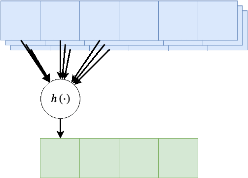

<!-- .slide: class="center" -->

<h1 class="workshop-title">Workshop 10<br>CNN</h1>

---new slide---

## Convolutional Neural Networks (CNN)

<br>

<div style="display:grid;grid-template-areas:'col1 col2';grid-gap: 30px;">
<div style="grid-area:col1;" markdown="1">

Motivation:

<br>
<br>

<ul>
<li>MLP model is insensitive to ordering.</li>
<br>
<li>It comes at the price of a very high number of parameters.</li>
<br>
<li>When the data has some spatial structure, we would like to take advantage of it.</li>
<br>
<li>Convolutional Neural Networks use spatial aware layers.</li>
<br>
</ul>

</div>

<div style="grid-area: col2;" markdown=1>

<center><div style="display:inline-block;background-color:rgba(255, 255, 255, 0.7); box-shadow: 0 0 5px 10px rgba(255, 255, 255, 0.7)">

</div></center>
</div>

</div>


Motivation:

- MLP model is insensitive to ordering.

- It comes at the price of a very high number of parameters.

- When the data has some spatial structure, we would like to take advantage of it.

- Convolutional Neural Networks use spatial aware layers.

---new slide---

## 1D Convolutional Layer

<div style="display:grid;grid-template-areas:'col1 col2';grid-gap: 30px;">
<div style="grid-area:col1;" markdown="1">

<br>
Performs a cross-correlation operation:

$$
\boldsymbol{y}\left[n\right]=\sum_{m=0}^{K-1} \boldsymbol{x}\left[n+m\right]\boldsymbol{w}\left[m\right]
$$

<br>

<ul>
<li> $\boldsymbol{w}$ is known as the **convolution kernel** / weights </li>
<li> It is usually a short vector ($K\leq7$).</li>
</ul>

</div>

<div style="grid-area: col2;" markdown=1>

<center><div style="display:inline-block;background-color:rgba(255, 255, 255, 0.7); box-shadow: 0 0 5px 10px rgba(255, 255, 255, 0.7)">

</div></center>
</div>

</div>

---new slide---

## 1D Convolutional Layer - Cont.

<div style="display:grid;grid-template-areas:'col1 col2';grid-gap: 30px;">
<div style="grid-area:col1;" markdown="1">

<br>

Resembles the fully connected layer, except that:

<br>
<br>

<ol>
<li>Connection only within a finite range.</li>
<li>Outputs are generated using the same weights.</li>
</ol>

<br>
<br>

Related to the following properties:

<br>
<br>

<ul>
<li>Relation between close by points close is more significant.</li>
<li>Small local areas in different regions share common properties.</li>
</ul>

</div>

<div style="grid-area: col2;" markdown=1>

<center><div style="display:inline-block;background-color:rgba(255, 255, 255, 0.7); box-shadow: 0 0 5px 10px rgba(255, 255, 255, 0.7)">

</div></center>
</div>

</div>

<center>
**The Number of parameters was reduced**
<center>

---new slide---

## 1D Convolutional Layer - Cont. 2

A more common way to plot the convolutional layer is as follow:

<center></center>

$h$ will usually contain an additional offset (bias) term $b$

$$
h\left(\boldsymbol{z}\right) = w_1z_1+w_2z_3+w_4z_5 + b =\boldsymbol{w}^T\boldsymbol{z} + b
$$

---new slide---

## Activation (Non-Linear) Layers

A convolutional will be usually followed by an (a non-linear) activation function

In CNNs this is Commonly a ReLU (Rectified Linear Unit):

$$
\varphi\left(x\right)=\max\left(x,0\right)
$$

<br>

<center><div style="display:inline-block;background-color:rgba(255, 255, 255, 0.7); box-shadow: 0 0 5px 10px rgba(255, 255, 255, 0.7)">

</div></center>

---new slide---

## Activation (Non-Linear) Layers - Cont.

<br>

<center><div style="display:inline-block;background-color:rgba(255, 255, 255, 0.7); box-shadow: 0 0 5px 10px rgba(255, 255, 255, 0.7)">

</div></center>

---new slide---

## Multiple Channels Input

When we have multiple values which correspond to a single spatial location.
- Stereo or a multi-channel audio recording
- Colored imaged
- Previous layers ...
- Etc.

<center></center>

---new slide---

## Multiple Channels Output

We want to use more than one $h$ function -> multiple output channel.

<center></center>

Each output layer has its own unique weights.

The number of parameters: `$\underbrace{C_\text{in}\times C_\text{out}\times K}_\text{the weights}+\underbrace{C_\text{out}}_\text{the bias}$`

---new slide---

## Convolutional Layers' Hyper-parameters

<br>

In addition to the **size of the kernel** and the **number of output channels** we will defein 3 more hyper parameters

---new slide---

### Padding

Add zeros at the edges of the input.

An example of padding=1:

<center></center>

---new slide---

### Stride

Only use each $s$-th output.

An example of stride = 2:

<center></center>

---new slide---

### Dilation

Dilute the input of $h$.

An example of dilation=2:

<center></center>

---new slide---

## Max Pooling

- CNNs also use layers which reduce the spatial size of the data.

- One such layer is the **max pooling layer**.

- Operates in a similar manner to the convolutional layer, but uses a $\text{max}$ function.

A max-pooling layer with size=2 and stride=2:

<center></center>

Note that this layer does not have any parameters.

---new slide---

## 2D Convolutional Layer

<br>

In cases where data is arranged in a 2D array we would want to replace the 1D cross-correlation with a 2D cross-correlation.

<br>

$h$ will now receive a 2D input from each channel and will run over the two dimensions of the input.

---new slide---

## 2D Convolutional Layer

A few examples of some 2D convolutional layers:

<table style="width:100%; table-layout:fixed;font-size:18px">
  <tr>
    <td><center>kernel size=3<br>padding=0<br>stride=1<br>dilation=1</center></td>
    <td><center>kernel size=4<br>padding=2<br>stride=1<br>dilation=1</center></td>
    <td><center>kernel size=3<br>padding=1<br>stride=1<br>dilation=1<br>(Half padding)</center></td>
    <td><center>kernel size=3<br>padding=2<br>stride=1<br>dilation=1<br>(Full padding)</center></td>
  </tr>
  <tr>
    <td><center></center></td>
    <td><center></center></td>
    <td><center></center></td>
    <td><center></center></td>
  </tr>
  <tr>
    <td><center>kernel size=3<br>padding=0<br>stride=2<br>dilation=1</center></td>
    <td><center>kernel size=3<br>padding=1<br>stride=2<br>dilation=1</center></td>
    <td><center>kernel size=3<br>padding=1<br>stride=2<br>dilation=1</center></td>
    <td><center>kernel size=3<br>padding=0<br>stride=1<br>dilation=2</center></td>
  </tr>
  <tr>
    <td><center></center></td>
    <td><center></center></td>
    <td><center></center></td>
    <td><center></center></td>
  </tr>
</table>

Images were taken from: [Vincent Dumoulin, Francesco Visin](https://arxiv.org/abs/1603.07285)

---new slide---

## LeNet-5

<br>

<center></center>

<br>

- Designed by Yann LeCun in 1989 for hand-written digits recognition

- One of the first CNN to show the benefits of using convolutional layers.

- In this workshop we implement and train will this network

---new slide---

### The architecture

<center></center>

<br>

Input: A 32x32 image

Output: A probability vector of the 10 digits

---new slide---

### The architecture - Cont.

<center></center>

- C1: Convolutional layer + ReLU activation: kernel size=5x5, output channels=6.

- S2: Max pooling layer: size=2x2, stride=2

- C3: Convolutional layer + ReLU activation: kernel size=5x5, output channels=16.

- S4: Max pooling layer: size=2x2, stride=2
- C5: Convolutional layer + ReLU activation: kernel size=5x5, output channels=120. (this is, in fact, a fully connected layer)

- F6: Fully connected layer + ReLU: output vector length= 84

- Output layer: Fully connected layer: output vector length=10

---new slide---

# Dataset: MNIST

<center><div style="display:inline-block;background-color:rgba(255, 255, 255, 0.7); box-shadow: 0 0 5px 10px rgba(255, 255, 255, 0.7)">

</div></center>

---new slide---

## 🕵️ Data Inspection

### Downloading and Loading the Dataset

The data can be easily downloaded and loaded using the *torchvision* command [torchvision.datasets.MNIST](https://pytorch.org/docs/stable/torchvision/datasets.html#mnist)

```python
# MNIST dataset
dataset_train = torchvision.datasets.MNIST(root='./data/mnist',
                                           train=True, 
                                           transform=transforms.ToTensor(),
                                           download=True)

dataset_test = torchvision.datasets.MNIST(root='./data/mnist',
                                          train=False, 
                                          transform=transforms.ToTensor())
```

---new slide---

## 🕵️ Data Inspection - Cont.

### The Dataset Properties


```python
fig, ax_array = plt.subplots(4, 5, figsize=(5, 5))
for i, ax in enumerate(ax_array.flat):
    img, label = dataset_train[i]
    ax.imshow(img[0].numpy(), cmap='gray')
    ax.set_title('{}'.format(label))
    ax.set_yticks([])
    ax.set_xticks([])

print_math('Number of rows in the train dataset: $N={}$'.format(len(dataset_train)))
print_math('Number of rows in the test dataset: $N={}$'.format(len(dataset_test)))

print_math('Image size: {}x{}'.format(img.shape[1], img.shape[2]))
print_math('Pixel''s value range: [{}, {}]'.format(img.min(), img.max()))
```

Number of rows in the train dataset: $N=60000$

Number of rows in the test dataset: $N=10000$

Image size: 28x28

Pixels value range: [0.0, 1.0]

---new slide---

## 📜 Problem Definition

<br>

For the following given random system:

- Random sample: $\omega$ - A given handwritten digit.
- Random variables:
  - $x=X\left(\omega\right)$: An 28x28 image of the digit.
  - $y=Y\left(\omega\right)$: The digit's value: \[0-9\].

Find a binary discrimination function $\hat{y}=h^*\left(\boldsymbol{x}\right)$ which minimizes the misclassification rate:

`$$
h^*=\underset{h}{\arg\min}\ E\left[I\left\{h\left(\boldsymbol{x}\right)\neq y\right\}\right]
$$`

---new slide---

## 💡 Model & Learning Method:
## CNN: LeNet-5 + Mini-Batch SGD

<br>

### Parameters:

- The weights and biases of the convolutional and fully connected layers.

<br>

### Hyper-parameters

- The network's architecture - fixed.
- The stochastic gradient descent parameters:
  - The learning rate.
  - The Batch size - use 64 samples.
  - The maximal number of epochs - depends on running duration.

---new slide---

### Implementation

```python
class LeNet5(torch.nn.Module):

    def __init__(self):   
        super(LeNet5, self).__init__()

        ## C1
        self.conv1 = torch.nn.Conv2d(in_channels=1, out_channels=6, kernel_size=5, padding=2)
        self.relu1 = torch.nn.ReLU()  
        ## S2
        self.max_pool2 = torch.nn.MaxPool2d(kernel_size=2, stride=2)
        ## C3
        self.conv3 = torch.nn.Conv2d(in_channels=6, out_channels=16, kernel_size=5)
        self.relu3 = torch.nn.ReLU()
        ## S4
        self.max_pool4 = torch.nn.MaxPool2d(kernel_size=2, stride=2)
        ## C5
        self.conv5 = torch.nn.Conv2d(in_channels=16, out_channels=120, kernel_size=5)
        self.relu5 = torch.nn.ReLU()
        ## F6
        self.fc6 = torch.nn.Linear(120, 84)
        self.relu6 = torch.nn.ReLU()
        ## Output
        self.fc_output = torch.nn.Linear(84, 10)
```

---new slide---

### Implementation - Cont.

```python
    def forward(self, x):
        ## C1: Convolutional layer + ReLU activation: kernel size=5x5, output channels=6.
        x = self.conv1(x)
        x = self.relu1(x)
        ## S2: Max pooling layer: size=2x2, stride=2
        x = self.max_pool2(x)
        ## C3: Convolutional layer + ReLU activation: kernel size=5x5, output channels=16.
        x = self.conv3(x)
        x = self.relu3(x)
        ## S4: Max pooling layer: size=2x2, stride=2
        x = self.max_pool4(x)
        ## C5: Convolutional layer + ReLU activation: kernel size=5x5, output channels=120.
        x = self.conv5(x)
        x = self.relu5(x)

        x = x.view(x.shape[0], x.shape[1]) ## Redefine x as a 1D vector

        ## F6: Fully connected layer + ReLU: output vector length= 84
        x = self.fc6(x)
        x = self.relu6(x)
        ## Output layer: Fully connected layer: output vector length=10
        x = self.fc_output(x)

        return x
```

---new slide---

## ⚙️ Learning

### Defining Data Loaders

Ww will use Torch's [DataLoader](https://pytorch.org/docs/stable/data.html#torch.utils.data.DataLoader) to sequentially load batches of data.

```python
batch_size = 64

dataloader_train2 = torch.utils.data.DataLoader(dataset=dataset_train,
                                                batch_size=batch_size,
                                                sampler=sampler_train2)

dataloader_validation = torch.utils.data.DataLoader(dataset=dataset_train,
                                                    batch_size=batch_size,
                                                    sampler=sampler_validation)

dataloader_test = torch.utils.data.DataLoader(dataset=dataset_test,
                                              batch_size=batch_size,
                                              )
```

---new slide---

### Defining the Training Function

<br>

```python
def train(net, alpha, n_epoch, dataloader_train):
    loss_func = loss_func = nn.CrossEntropyLoss()
    optimizer = torch.optim.SGD(net.parameters(), lr=alpha)

    for epoch in range(n_epoch):
        for batch_train, labels_train in dataloader_train:
            optimizer.zero_grad()
            y_hat = net(batch_train)
            loss = loss_func(y_hat, labels_train)
            loss.backward()
            optimizer.step()
```

---new slide---

## Selecting the Learning Rate

We will run the training process for 1 epoch with: $\alpha=10^{0},10^{-1},10^{-2}$.

In practice we will need to test more then 3 to fine-tune the learning rate.

<br>
<br>

```python

n_epoch = 1
alpha_list = [1e0, 1e-1, 1e-2]

## Iterate over the learning rates
for i_alpha, alpha in enumerate(alpha_list):
    net = LeNet5()
    loss_train_list, loss_validation_list, validation_steps = train(net, alpha, n_epoch,
                                                                    dataloader_train)
```
---new slide---

## Selecting the Learning Rate - Cont.

<center><div style="display:inline-block;background-color:rgba(255, 255, 255, 0.7); box-shadow: 0 0 5px 10px rgba(255, 255, 255, 0.7)">

</div></center>

- For $\alpha=10^{0}$ the system is not able to improve. 

- This can be the result of a learning rate which is too low or too high.

- For $\alpha=10^{-1}$ the loss does improve -> $\alpha=10^{0}$ is too high.

- $\alpha=10^{-1}$ is a much faster than $10^{-2}$.

- From among these learning rates it is best to pick $\alpha=10^0$.

---new slide---

## Training

We will run the training for 20 epochs using $\alpha=10^{-1}$.

<br>

```python
alpha = 1e-1
n_epoch = 20

net = LeNet5()
net = net.to(device_id)

loss_train_list, loss_validation_list, validation_steps = train(net, alpha, n_epoch,
                                                                dataloader_train2,
                                                                dataloader_validation,
                                                                device_id=device_id)
```
---new slide---

## Training - Cont.

<center><div style="display:inline-block;background-color:rgba(255, 255, 255, 0.7); box-shadow: 0 0 5px 10px rgba(255, 255, 255, 0.7)">

</div></center>

- It seems as if the validation loss has reached a plateau
- This might suggest that the system has reached a local minimum point, but we can never be sure.

---new slide---

## ⏱️ Performance evaluation

```python
## Evaluate the risk on the test set
with torch.no_grad():
    test_risk_tmp = []
    for batch_test, labels_test in dataloader_test:
        batch_test = batch_test.to(device_id)
        labels_test = labels_test.to(device_id)

        y_hat = net(batch_test)
        risk = (torch.argmax(y_hat, dim=1) != labels_test).sum()

        test_risk_tmp.append(float(risk.cpu()))

test_risk = np.sum(test_risk_tmp) / len(dataset_test)

print_math('The test risk is: ${:.2}$'.format(test_risk))
```

The test risk is: $0.0098$

We got a misclassification rate of about 1%, which means that we were able to correctly predict the digit on 99% of the test set, which is quite good. 

---new slide---

## ⏱️ Performance evaluation - Cont.

<center><div style="display:inline-block;background-color:rgba(255, 255, 255, 0.7); box-shadow: 0 0 5px 10px rgba(255, 255, 255, 0.7)">

</div></center>