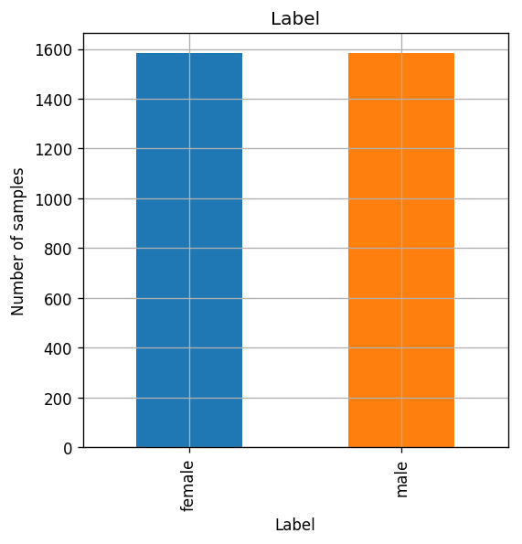
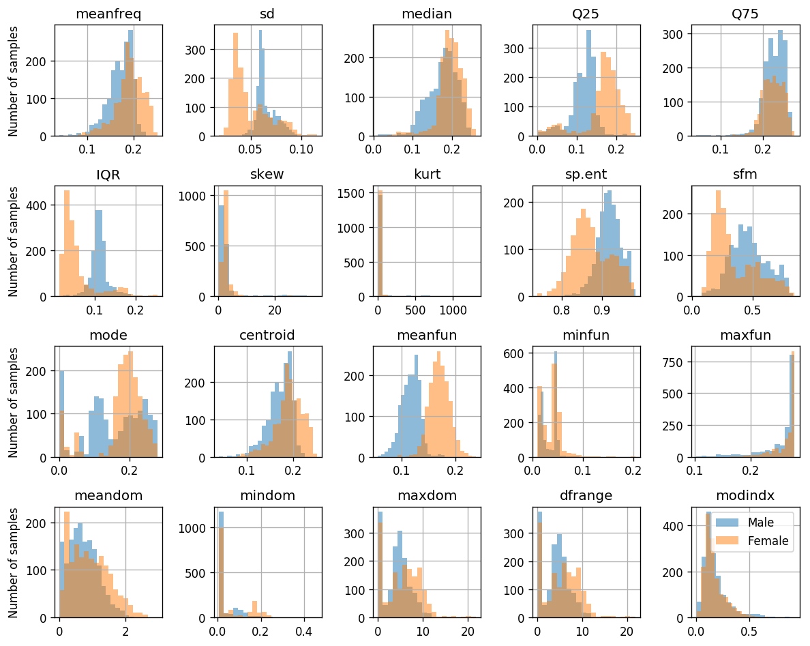
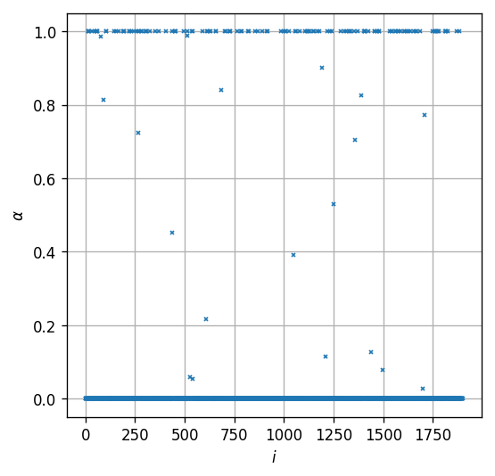
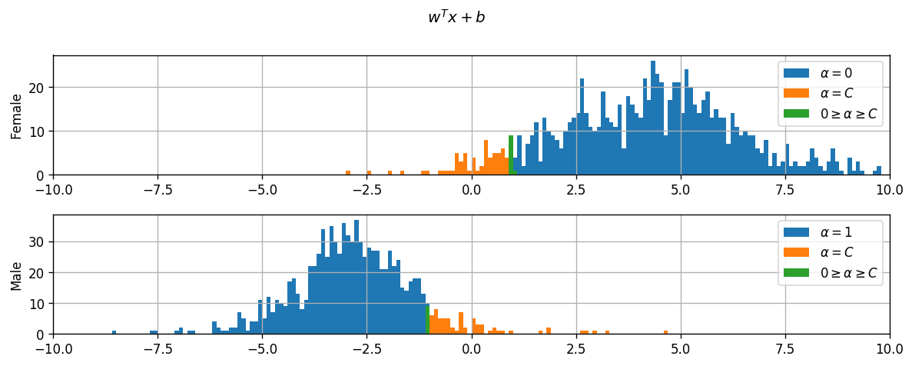
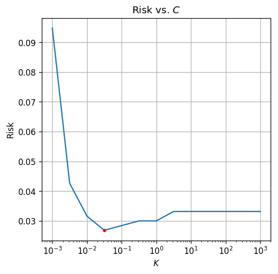
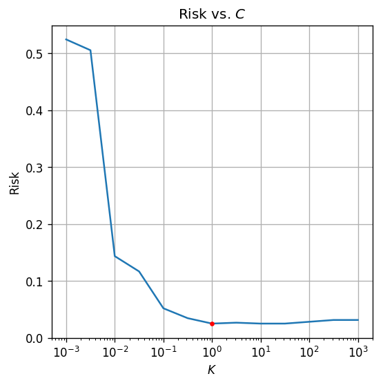

<!-- .slide: class="center" -->

<h1 class="workshop-title">Workshop 11<br>SVM</h1>

---new slide---

### Hard SVM

When the data is linearly separable:

<br>

The primal problem:

`$$
\boldsymbol{w}^*,b^*=\underset{\boldsymbol{w},b}{\arg\min} \frac{1}{2}\left\lVert\boldsymbol{w}\right\rVert^2 \\
\begin{align*}
\text{s.t.}\quad y_i\left(\boldsymbol{w}^T\boldsymbol{x}_i+b\right)\geq1\quad&\forall i
\end{align*}
$$`

---new slide---

### Hard SVM - Cont.

<br>

The dual problem:

`$$
\left\{\alpha_i\right\}^*=\underset{\left\{\alpha_i\right\}}{\arg\max} \sum_i\alpha_i-\frac{1}{2}\sum_{i,j}y_iy_j\alpha_i\alpha_j\left<\boldsymbol{x}_i,\boldsymbol{x}_j\right> \\
\begin{align*}
\text{s.t.}\quad&\alpha_i\geq0\quad&\forall i\\
&\sum_i\alpha_iy_i=0
\end{align*}
$$`

Where
$$
\boldsymbol{w}=\sum_i\alpha_iy_i\boldsymbol{x}_i\\
$$

---new slide---

### Hard SVM - Cont. 2

<br>

Each point obeys one of the two:

1. $\alpha_i=0$ and $y_i\left(\boldsymbol{w}_i^Tx_i+b\right)>1$

2. $\alpha_i>0$ and $y_i\left(\boldsymbol{w}_i^Tx_i+b\right)=1$

<br>

- $\boldsymbol{w}=\sum_i\alpha_iy_i\boldsymbol{x}_i$ we can conclude that.

- Only the points with $\alpha_i>0$ define the value of $\boldsymbol{w}$.

- These points are called the support vectors.

- In the general case, their number will be small.

---new slide---

### Soft SVM

When the data is not linearly separable we introducing slack variables `$\left\{\xi_i\right\}$`:

The primal problem is this case will be:

`$$
\boldsymbol{w}^*,b^*=\underset{\boldsymbol{w},b}{\arg\min} \frac{1}{2}\left\lVert\boldsymbol{w}\right\rVert^2+C\sum_i\xi_i \\
\begin{align*}
\text{s.t.}\quad &y_i\left(\boldsymbol{w}^T\boldsymbol{x}_i+b\right)\geq1-\xi_i\quad&\forall i\\
&\xi_i\geq0\quad&\forall i
\end{align*}
$$`

---new slide---

### Soft SVM - Cont.

The dual problem is this case will be:

`$$
\left\{\alpha_i\right\}^*=\underset{\left\{\alpha_i\right\}}{\arg\max} \sum_i\alpha_i-\frac{1}{2}\sum_{i,j}y_iy_j\alpha_i\alpha_j\left<\boldsymbol{x}_i,\boldsymbol{x}_j\right> \\
\begin{align*}
\text{s.t.}\quad&0\leq\alpha_i\leq C\quad&\forall i\\
&\sum_i\alpha_iy_i=0
\end{align*}
$$`
Where
$$
\boldsymbol{w}=\sum_i\alpha_iy_i\boldsymbol{x}_i\\
$$

---new slide---

### Soft SVM - Cont.

<br>

Here the points in the dataset will obey one of:

1. $\alpha_i=0$ and $y_i\left(\boldsymbol{w}_i^Tx_i+b\right)>1$

2. $C>\alpha_i>0$ and $y_i\left(\boldsymbol{w}_i^Tx_i+b\right)=1$

3. $\alpha_i=C$ and $y_i\left(\boldsymbol{w}_i^Tx_i+b\right)<11$

---new slide---

## Problem: Identify Gender by Voice

<br>

- We will use SVM to identify the gender of a speaker by his voice.

- For example: can be used to make a virtual personal assistants gender aware.

- Can be extended to identify the person's identity or his mood etc.

---new slide---

## Dataset Labeled Voices

<br>

3168 voice samples and their label were collected from the following resources:

- [The Harvard-Haskins Database of Regularly-Timed Speech](http://www.nsi.edu/~ani/download.html)

- [Telecommunications & Signal Processing Laboratory (TSP) Speech Database at McGill University](http://www-mmsp.ece.mcgill.ca/Documents../Data/index.html)

- [VoxForge Speech Corpus](http://www.repository.voxforge1.org/downloads/SpeechCorpus/Trunk/Audio/Main/8kHz_16bit/)

- [Festvox CMU_ARCTIC Speech Database at Carnegie Mellon University](http://festvox.org/cmu_arctic/)

Each voice track was processed using [WarbleR](https://cran.r-project.org/web/packages/warbleR/warbleR.pdf) to extract 20 numerical features.

---new slide---

## 🕵️ Data Inspection

Number of rows in the dataset: $N=3168$

<table border="1" class="dataframe">
  <thead>
    <tr style="text-align: right;">
      <th></th>
      <th>meanfreq</th>
      <th>sd</th>
      <th>median</th>
      <th>Q25</th>
      <th>Q75</th>
      <th>IQR</th>
      <th>skew</th>
      <th>kurt</th>
      <th>sp.ent</th>
      <th>sfm</th>
      <th>...</th>
      <th>centroid</th>
      <th>meanfun</th>
      <th>minfun</th>
      <th>maxfun</th>
      <th>meandom</th>
      <th>mindom</th>
      <th>maxdom</th>
      <th>dfrange</th>
      <th>modindx</th>
      <th>label</th>
    </tr>
  </thead>
  <tbody>
    <tr>
      <th>0</th>
      <td>0.059781</td>
      <td>0.064241</td>
      <td>0.032027</td>
      <td>0.015071</td>
      <td>0.090193</td>
      <td>0.075122</td>
      <td>12.863462</td>
      <td>274.402906</td>
      <td>0.893369</td>
      <td>0.491918</td>
      <td>...</td>
      <td>0.059781</td>
      <td>0.084279</td>
      <td>0.015702</td>
      <td>0.275862</td>
      <td>0.007812</td>
      <td>0.007812</td>
      <td>0.007812</td>
      <td>0.000000</td>
      <td>0.000000</td>
      <td>male</td>
    </tr>
    <tr>
      <th>1</th>
      <td>0.066009</td>
      <td>0.067310</td>
      <td>0.040229</td>
      <td>0.019414</td>
      <td>0.092666</td>
      <td>0.073252</td>
      <td>22.423285</td>
      <td>634.613855</td>
      <td>0.892193</td>
      <td>0.513724</td>
      <td>...</td>
      <td>0.066009</td>
      <td>0.107937</td>
      <td>0.015826</td>
      <td>0.250000</td>
      <td>0.009014</td>
      <td>0.007812</td>
      <td>0.054688</td>
      <td>0.046875</td>
      <td>0.052632</td>
      <td>male</td>
    </tr>
    <tr>
      <th>2</th>
      <td>0.077316</td>
      <td>0.083829</td>
      <td>0.036718</td>
      <td>0.008701</td>
      <td>0.131908</td>
      <td>0.123207</td>
      <td>30.757155</td>
      <td>1024.927705</td>
      <td>0.846389</td>
      <td>0.478905</td>
      <td>...</td>
      <td>0.077316</td>
      <td>0.098706</td>
      <td>0.015656</td>
      <td>0.271186</td>
      <td>0.007990</td>
      <td>0.007812</td>
      <td>0.015625</td>
      <td>0.007812</td>
      <td>0.046512</td>
      <td>male</td>
    </tr>
    <tr>
      <th>3</th>
      <td>0.151228</td>
      <td>0.072111</td>
      <td>0.158011</td>
      <td>0.096582</td>
      <td>0.207955</td>
      <td>0.111374</td>
      <td>1.232831</td>
      <td>4.177296</td>
      <td>0.963322</td>
      <td>0.727232</td>
      <td>...</td>
      <td>0.151228</td>
      <td>0.088965</td>
      <td>0.017798</td>
      <td>0.250000</td>
      <td>0.201497</td>
      <td>0.007812</td>
      <td>0.562500</td>
      <td>0.554688</td>
      <td>0.247119</td>
      <td>male</td>
    </tr>
    <tr>
      <th>4</th>
      <td>0.135120</td>
      <td>0.079146</td>
      <td>0.124656</td>
      <td>0.078720</td>
      <td>0.206045</td>
      <td>0.127325</td>
      <td>1.101174</td>
      <td>4.333713</td>
      <td>0.971955</td>
      <td>0.783568</td>
      <td>...</td>
      <td>0.135120</td>
      <td>0.106398</td>
      <td>0.016931</td>
      <td>0.266667</td>
      <td>0.712812</td>
      <td>0.007812</td>
      <td>5.484375</td>
      <td>5.476562</td>
      <td>0.208274</td>
      <td>male</td>
    </tr>
    <tr>
      <th>5</th>
      <td>0.132786</td>
      <td>0.079557</td>
      <td>0.119090</td>
      <td>0.067958</td>
      <td>0.209592</td>
      <td>0.141634</td>
      <td>1.932562</td>
      <td>8.308895</td>
      <td>0.963181</td>
      <td>0.738307</td>
      <td>...</td>
      <td>0.132786</td>
      <td>0.110132</td>
      <td>0.017112</td>
      <td>0.253968</td>
      <td>0.298222</td>
      <td>0.007812</td>
      <td>2.726562</td>
      <td>2.718750</td>
      <td>0.125160</td>
      <td>male</td>
    </tr>
    <tr>
      <th>6</th>
      <td>0.150762</td>
      <td>0.074463</td>
      <td>0.160106</td>
      <td>0.092899</td>
      <td>0.205718</td>
      <td>0.112819</td>
      <td>1.530643</td>
      <td>5.987498</td>
      <td>0.967573</td>
      <td>0.762638</td>
      <td>...</td>
      <td>0.150762</td>
      <td>0.105945</td>
      <td>0.026230</td>
      <td>0.266667</td>
      <td>0.479620</td>
      <td>0.007812</td>
      <td>5.312500</td>
      <td>5.304688</td>
      <td>0.123992</td>
      <td>male</td>
    </tr>
    <tr>
      <th>7</th>
      <td>0.160514</td>
      <td>0.076767</td>
      <td>0.144337</td>
      <td>0.110532</td>
      <td>0.231962</td>
      <td>0.121430</td>
      <td>1.397156</td>
      <td>4.766611</td>
      <td>0.959255</td>
      <td>0.719858</td>
      <td>...</td>
      <td>0.160514</td>
      <td>0.093052</td>
      <td>0.017758</td>
      <td>0.144144</td>
      <td>0.301339</td>
      <td>0.007812</td>
      <td>0.539062</td>
      <td>0.531250</td>
      <td>0.283937</td>
      <td>male</td>
    </tr>
    <tr>
      <th>8</th>
      <td>0.142239</td>
      <td>0.078018</td>
      <td>0.138587</td>
      <td>0.088206</td>
      <td>0.208587</td>
      <td>0.120381</td>
      <td>1.099746</td>
      <td>4.070284</td>
      <td>0.970723</td>
      <td>0.770992</td>
      <td>...</td>
      <td>0.142239</td>
      <td>0.096729</td>
      <td>0.017957</td>
      <td>0.250000</td>
      <td>0.336476</td>
      <td>0.007812</td>
      <td>2.164062</td>
      <td>2.156250</td>
      <td>0.148272</td>
      <td>male</td>
    </tr>
    <tr>
      <th>9</th>
      <td>0.134329</td>
      <td>0.080350</td>
      <td>0.121451</td>
      <td>0.075580</td>
      <td>0.201957</td>
      <td>0.126377</td>
      <td>1.190368</td>
      <td>4.787310</td>
      <td>0.975246</td>
      <td>0.804505</td>
      <td>...</td>
      <td>0.134329</td>
      <td>0.105881</td>
      <td>0.019300</td>
      <td>0.262295</td>
      <td>0.340365</td>
      <td>0.015625</td>
      <td>4.695312</td>
      <td>4.679688</td>
      <td>0.089920</td>
      <td>male</td>
    </tr>
  </tbody>
</table>

---new slide---


## The Data Fields and Types

<div style="font-size:29px" markdown="1">
<ul>
<li><strong>meanfreq</strong>: mean frequency (in kHz)</li>
<li><strong>sd</strong>: standard deviation of frequency</li>
<li><strong>median</strong>: median frequency (in kHz)</li>
<li><strong>Q25</strong>: first quantile (in kHz)</li>
<li><strong>Q75</strong>: third quantile (in kHz)</li>
<li><strong>IQR</strong>: interquantile range (in kHz)</li>
<li><strong>skew</strong>: skewness (see note in specprop description)</li>
<li><strong>kurt</strong>: kurtosis (see note in specprop description)</li>
<li><strong>sp.ent</strong>: spectral entropy</li>
<li><strong>sfm</strong>: spectral flatness</li>
<li><strong>mode</strong>: mode frequency</li>
<li><strong>centroid</strong>: frequency centroid (see specprop)</li>
<li><strong>meanfun</strong>: average of fundamental frequency measured across acoustic signal</li>
<li><strong>minfun</strong>: minimum fundamental frequency measured across acoustic signal</li>
<li><strong>maxfun</strong>: maximum fundamental frequency measured across acoustic signal</li>
<li><strong>meandom</strong>: average of dominant frequency measured across acoustic signal</li>
<li><strong>mindom</strong>: minimum of dominant frequency measured across acoustic signal</li>
<li><strong>maxdom</strong>: maximum of dominant frequency measured across acoustic signal</li>
<li><strong>dfrange</strong>: range of dominant frequency measured across acoustic signal</li>
<li><strong>modindx</strong>: modulation index. Calculated as the accumulated absolute difference between</li>

<li><strong>label</strong>: The label of each track: male/female</li>
</ul>
</div>

---new slide---

###  📉 Some Plots

<center><div style="display:inline-block;background-color:rgba(255, 255, 255, 0.7); box-shadow: 0 0 5px 10px rgba(255, 255, 255, 0.7)">

</div></center>

---new slide---

###  📉 Some Plots - Cont.

<center><div style="display:inline-block;background-color:rgba(255, 255, 255, 0.7); box-shadow: 0 0 5px 10px rgba(255, 255, 255, 0.7)">

</div></center>

---new slide---

## 📜 Problem Definition

For the following given random system:

- Random sample: $\omega$ - A voice sample.
- Random variables:
  - $\boldsymbol{x}=X\left(\omega\right)$: A list of 20 numeric features extracted for the voice recording.
  - $y=Y\left(\omega\right)$: The gender of the speaker: -1 male & 1 female.

Find a binary discrimination function $\hat{y}=h^*\left(\boldsymbol{x}\right)$ which minimizes the misclassification rate:

`$$
h^*=\underset{h}{\arg\min}\ E\left[I\left\{h\left(\boldsymbol{x}\right)\neq y\right\}\right]
$$`

---new slide---

## 💡 Model & Learning Method Suggestion: Soft SVM

- We will use Soft SVM
- We will use the [cvxpy](https://www.cvxpy.org/) for the convex optimization problem.

<br>

### Parameters:

- $\boldsymbol{w}$ and $b$

<br>

### Hyper-parameters

- The penalty parameter of the slack variables, $C$.

---new slide---

## Data preprocessing

### Normalizing the Data

In this case, it is important to normalize the data because:

1. The data is a variant of different features in different units and scales.

2. Soft SVM has a distance based objective.

We will calculate the normalization on the train set and apply it to all of the data.


```python
## Calculating the mean and std
x_mean = x_train.mean(axis=0, keepdims=True)
x_std = x_train.std(axis=0, keepdims=True)

## Normalizing the data
x_train_norm = (x_train - x_mean) / x_std
x_val_norm = (x_val - x_mean) / x_std
x_test_norm = (x_test - x_mean) / x_std
```

---new slide---

## ⚙️ Learning - Dual Problem

<br>

We will solve the dual problem:
`$$
\left\{\alpha_i\right\}^*=\underset{\left\{\alpha_i\right\}}{\arg\max} \sum_i\alpha_i-\frac{1}{2}\sum_{i,j}y_iy_j\alpha_i\alpha_j\left<\boldsymbol{x}_i,\boldsymbol{x}_j\right> \\
\begin{align*}
\text{s.t.}\quad&0\leq\alpha_i\leq C\quad&\forall i\\
&\sum_i\alpha_iy_i=0
\end{align*}
$$`

We will start with $C=1$, and will later try to fine tune it.

---new slide---

## ⚙️ Learning - Dual Problem - Cont.

```python
import cvxpy as cp

## Defining C
c = 1.

n_features = x_train_norm.shape[1]

## Defining the variables
alpha = cp.Variable(n_samples_train)

# Create the list of constraints
constraints = []
for i in range(len(x_train_norm)):
    constraints.append(alpha[i] >= 0)
    constraints.append(alpha[i] <= c)

constraints.append(y_train.T * alpha == 0)

## Define the objective
objective = cp.Maximize(cp.sum(alpha) - 0.5 * cp.quad_form(alpha, (x_train_norm @ x_train_norm.T) * (y_train[:, None] * y_train[None, :])))

## Defining and solving the optimization problem
prob = cp.Problem(objective, constraints)
prob.solve()
```

---new slide---

## ⚙️ Learning - Dual Problem - Cont.

Let us examine the result we got. 

<center><div style="display:inline-block;background-color:rgba(255, 255, 255, 0.7); box-shadow: 0 0 5px 10px rgba(255, 255, 255, 0.7)">

</div></center>

---new slide---

## ⚙️ Learning - Dual Problem - Cont. 2

<center><div style="display:inline-block;background-color:rgba(255, 255, 255, 0.7); box-shadow: 0 0 5px 10px rgba(255, 255, 255, 0.7)">

</div></center>

We got 3 types of values correspond to the three cases:
- $\alpha_i=0$: $y_i\left(\boldsymbol{w}^T\boldsymbol{x}_i+b\right) > 1$

- $0<\alpha_i<C$: $y_i\left(\boldsymbol{w}^T\boldsymbol{x}_i+b\right) = 1$

- $\alpha_i=C$: $y_i\left(\boldsymbol{w}^T\boldsymbol{x}_i+b\right) < 1$

---new slide---

## ⚙️ Learning - Dual Problem - Cont. 3

<br>
Let us calculate $\boldsymbol{w}$ and $b$.

<br>
<br>

$$
\boldsymbol{w}=\sum_i\alpha_iy_i\boldsymbol{x}_i
$$

<br>

$b$ can be calculate using a points with $0<\alpha_i<C$ for witch: $y_i\left(\boldsymbol{w}^T\boldsymbol{x}_i+b\right) = 1$.

---new slide---

## ⚙️ Learning - Dual Problem - Cont. 3

```python
w = (alpha.value * y_train) @ x_train_norm
i = np.where((alpha.value > 0.1) & (alpha.value < 0.9))[0][0]
b = y_train[i] - w @ x_train_norm[i]
```
<br>

<center><div style="display:inline-block;background-color:rgba(255, 255, 255, 0.7); box-shadow: 0 0 5px 10px rgba(255, 255, 255, 0.7)">

</div></center>

---new slide---

## ⏱️ Performance evaluation

<br>

Let us calculate the risk on the test set

<br>


```python
predictions = ((x_test_norm @ w + b) > 0) * 2 - 1
test_risk = (y_test != predictions).mean()
print_math('The test risk is: ${:.3}$'.format(test_risk))
```

<br>

The test risk is: $0.0205$

---new slide---

## ⚙️ Learning - sklearn.svm.SVC

- [sklearn.svm.SVC](https://scikit-learn.org/stable/modules/generated/sklearn.svm.SVC.html) can be used to build an SVM classifier.
- Arguments:

  - **C**: The penalty parameter for the slack variables.

  - **kernel**: The kernel which will be used to build the classifier. 'linear' result in a plain SVM.

```python
from sklearn.svm import SVC

## Create the SVC object
svc = SVC(C = 1.0, kernel='linear')

## Run the learning algorithm
svc.fit(x_train_norm, y_train)

## Evaluate in the test set
predictions = svc.predict(x_test_norm)
test_risk = (y_test != predictions).mean()
print_math('The test risk is: ${:.3}$'.format(test_risk))
```

The test risk is: $0.0205$

---new slide---

## Hyper-Parameter Adjustment

<br>

$C$. We will test values of $C$ in the range of $10^{-3}$ - $10^3$.

<br>

```python
## Define the list of C values to test
c_list = np.logspace(-3, 3, 13)

risk_array = np.zeros((len(c_list), ))

## Train and evaluate the algorithm for each C
for i_c, c in enumerate(c_list):
    svc = SVC(C=c, kernel='linear')
    svc.fit(x_train_norm, y_train)

    predictions = svc.predict(x_val_norm)
    risk_array[i_c] = (y_val != predictions).mean()
```

---new slide---

## Hyper-Parameter Adjustment - Cont.

<center><div style="display:inline-block;background-color:rgba(255, 255, 255, 0.7); box-shadow: 0 0 5px 10px rgba(255, 255, 255, 0.7)">

</div></center>

The optimal $C$ is $0.0316$

The test risk is: $0.017$

---new slide---

## Using kernels

<br>

By using a popular kernel called Radial Basis Function (RBF) we get a slight improvement in the results:

<br>

```python
## Train and evaluate the algorithm for each C
for i_c, c in enumerate(c_list):
    svc = SVC(C=c, kernel='rbf', gamma=0.01)
    svc.fit(x_train_norm, y_train)

    predictions = svc.predict(x_val_norm)
    risk_array[i_c] = (y_val != predictions).mean()
```

---new slide---

## Using kernels - Cont

<center><div style="display:inline-block;background-color:rgba(255, 255, 255, 0.7); box-shadow: 0 0 5px 10px rgba(255, 255, 255, 0.7)">

</div></center>

The optimal $C$ is $1.0$

The test risk is: $0.016$
