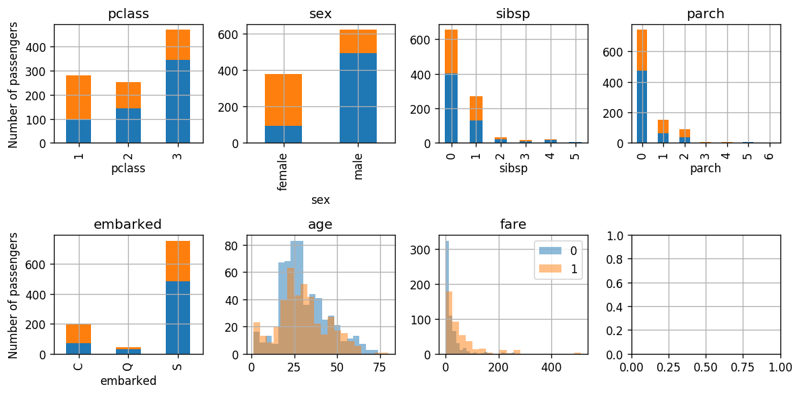
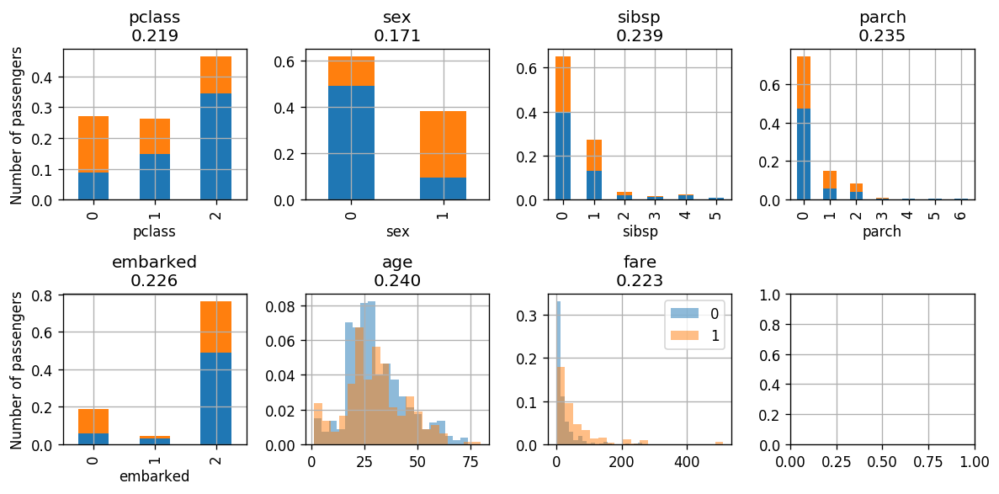
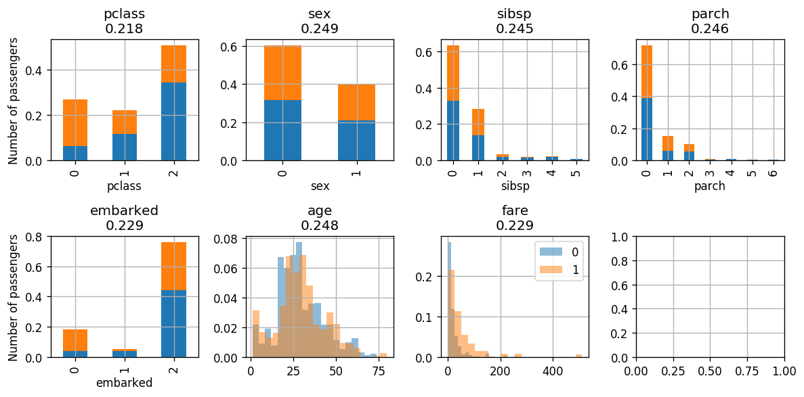
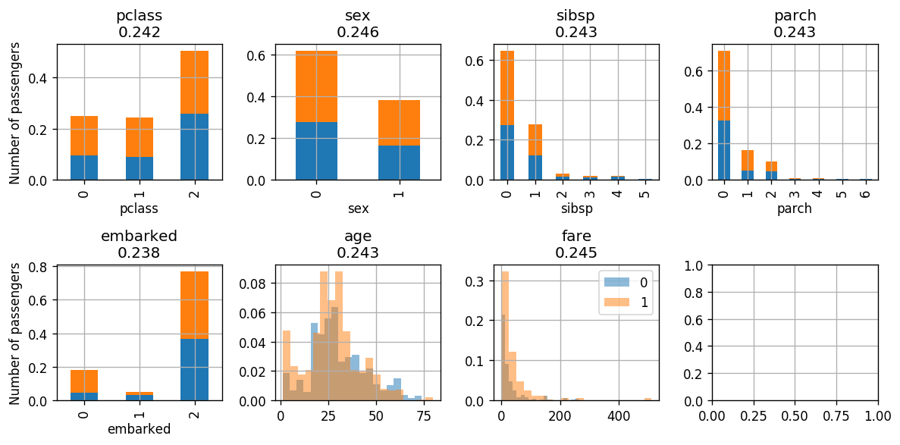
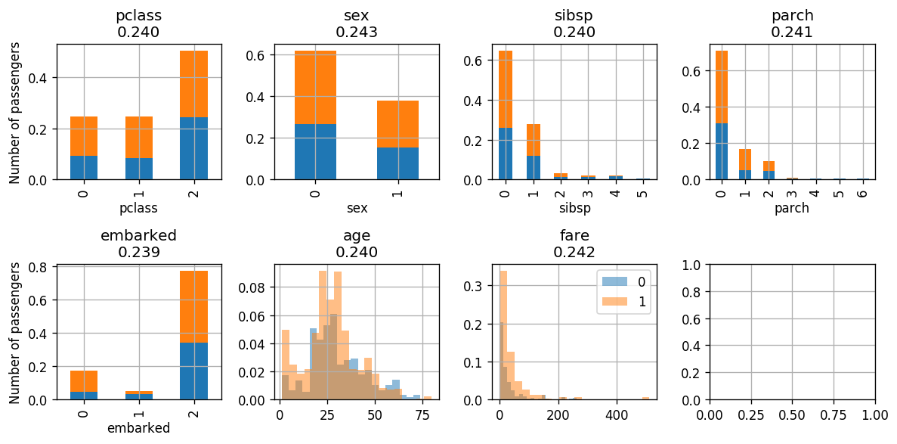

<!-- .slide: class="center" -->

<h1 class="workshop-title">Workshop 12<br>AdaBoost</h1>

---new slide---

## AdaBoost

- Initialize uniform weights: $w^{\left(t=0\right)}_i=\frac{1}{N}$

- Iterate over:

  1. Build an optimal classifier $h_t$.

  2. `$\varepsilon=\sum_i w^t_iI\left\{h\left(\boldsymbol{x}_i\right)\neq y_i\right\}$`

  3. $\alpha_t=\frac{1}{2}\ln\left(\frac{1-\varepsilon}{\varepsilon}\right)$

  4. $w^t_i=w^{t-1}_i\exp\left(-\alpha_ty_ih_t\left(\boldsymbol{x}_i\right)\right)$

  5. Normalize the weights

The final prediction is
$$
h\left(\boldsymbol{x}_i\right)=\text{sign}\left(\sum_t\alpha_th_t\left(\boldsymbol{x}_i\right)\right)
$$

---new slide---

## Problem:  Back to the Titanic

<br>

<center></center>

Predict whether a passenger has survived or not based on the manifest.

---new slide---

## 🕵️ Data Inspection

Number of rows in the dataset: $N=1001$

<table border="1" class="dataframe">
  <thead>
    <tr style="text-align: right;">
      <th></th>
      <th>pclass</th>
      <th>survived</th>
      <th>name</th>
      <th>sex</th>
      <th>age</th>
      <th>sibsp</th>
      <th>parch</th>
      <th>ticket</th>
      <th>fare</th>
      <th>cabin</th>
      <th>embarked</th>
      <th>boat</th>
      <th>body</th>
      <th>home.dest</th>
      <th>numeric_sex</th>
    </tr>
  </thead>
  <tbody>
    <tr>
      <th>0</th>
      <td>1</td>
      <td>1</td>
      <td>Allen, Miss. Elisabeth Walton</td>
      <td>female</td>
      <td>29</td>
      <td>0</td>
      <td>0</td>
      <td>24160</td>
      <td>211.3375</td>
      <td>B5</td>
      <td>S</td>
      <td>2</td>
      <td>NaN</td>
      <td>St Louis, MO</td>
      <td>1</td>
    </tr>
    <tr>
      <th>1</th>
      <td>1</td>
      <td>0</td>
      <td>Allison, Miss. Helen Loraine</td>
      <td>female</td>
      <td>2</td>
      <td>1</td>
      <td>2</td>
      <td>113781</td>
      <td>151.5500</td>
      <td>C22 C26</td>
      <td>S</td>
      <td>NaN</td>
      <td>NaN</td>
      <td>Montreal, PQ / Chesterville, ON</td>
      <td>1</td>
    </tr>
    <tr>
      <th>2</th>
      <td>1</td>
      <td>0</td>
      <td>Allison, Mr. Hudson Joshua Creighton</td>
      <td>male</td>
      <td>30</td>
      <td>1</td>
      <td>2</td>
      <td>113781</td>
      <td>151.5500</td>
      <td>C22 C26</td>
      <td>S</td>
      <td>NaN</td>
      <td>135.0</td>
      <td>Montreal, PQ / Chesterville, ON</td>
      <td>0</td>
    </tr>
    <tr>
      <th>3</th>
      <td>1</td>
      <td>0</td>
      <td>Allison, Mrs. Hudson J C (Bessie Waldo Daniels)</td>
      <td>female</td>
      <td>25</td>
      <td>1</td>
      <td>2</td>
      <td>113781</td>
      <td>151.5500</td>
      <td>C22 C26</td>
      <td>S</td>
      <td>NaN</td>
      <td>NaN</td>
      <td>Montreal, PQ / Chesterville, ON</td>
      <td>1</td>
    </tr>
    <tr>
      <th>4</th>
      <td>1</td>
      <td>1</td>
      <td>Anderson, Mr. Harry</td>
      <td>male</td>
      <td>48</td>
      <td>0</td>
      <td>0</td>
      <td>19952</td>
      <td>26.5500</td>
      <td>E12</td>
      <td>S</td>
      <td>3</td>
      <td>NaN</td>
      <td>New York, NY</td>
      <td>0</td>
    </tr>
    <tr>
      <th>5</th>
      <td>1</td>
      <td>1</td>
      <td>Andrews, Miss. Kornelia Theodosia</td>
      <td>female</td>
      <td>63</td>
      <td>1</td>
      <td>0</td>
      <td>13502</td>
      <td>77.9583</td>
      <td>D7</td>
      <td>S</td>
      <td>10</td>
      <td>NaN</td>
      <td>Hudson, NY</td>
      <td>1</td>
    </tr>
    <tr>
      <th>6</th>
      <td>1</td>
      <td>0</td>
      <td>Andrews, Mr. Thomas Jr</td>
      <td>male</td>
      <td>39</td>
      <td>0</td>
      <td>0</td>
      <td>112050</td>
      <td>0.0000</td>
      <td>A36</td>
      <td>S</td>
      <td>NaN</td>
      <td>NaN</td>
      <td>Belfast, NI</td>
      <td>0</td>
    </tr>
    <tr>
      <th>7</th>
      <td>1</td>
      <td>1</td>
      <td>Appleton, Mrs. Edward Dale (Charlotte Lamson)</td>
      <td>female</td>
      <td>53</td>
      <td>2</td>
      <td>0</td>
      <td>11769</td>
      <td>51.4792</td>
      <td>C101</td>
      <td>S</td>
      <td>D</td>
      <td>NaN</td>
      <td>Bayside, Queens, NY</td>
      <td>1</td>
    </tr>
    <tr>
      <th>8</th>
      <td>1</td>
      <td>0</td>
      <td>Artagaveytia, Mr. Ramon</td>
      <td>male</td>
      <td>71</td>
      <td>0</td>
      <td>0</td>
      <td>PC 17609</td>
      <td>49.5042</td>
      <td>NaN</td>
      <td>C</td>
      <td>NaN</td>
      <td>22.0</td>
      <td>Montevideo, Uruguay</td>
      <td>0</td>
    </tr>
    <tr>
      <th>9</th>
      <td>1</td>
      <td>0</td>
      <td>Astor, Col. John Jacob</td>
      <td>male</td>
      <td>47</td>
      <td>1</td>
      <td>0</td>
      <td>PC 17757</td>
      <td>227.5250</td>
      <td>C62 C64</td>
      <td>C</td>
      <td>NaN</td>
      <td>124.0</td>
      <td>New York, NY</td>
      <td>0</td>
    </tr>
  </tbody>
</table>
</div>

---new slide---

### The Data Fields and Types
In this workshop we will use the following fields:

- **pclass**: 1st, 2nd or 3rd class

- **sex**: male or female

- **age**: the passenger's age

- **sibsp**: number of Siblings/Spouses aboard

- **parch**: number of Parents/Children aboard

- **fare**: The price for the ticket

- **embarked**: C = Cherbourg; Q = Queenstown; S = Southampton

- **survived**: Whether this passenger has survived: 0 or 1

---new slide---

###  📉 Some Plots


<center><div style="display:inline-block;background-color:rgba(255, 255, 255, 0.7); box-shadow: 0 0 5px 10px rgba(255, 255, 255, 0.7)">

</div></center>

---new slide---

## Massageing the Data

We will change all the discrete features to be numeric and start at 0

<br>

```python
dataset2 = pd.DataFrame({
    'survived': dataset['survived'],
    'pclass': dataset['pclass'].map({1:0, 2:1, 3:2}),
    'sex': dataset['sex'].map({'male':0, 'female':1}),
    'sibsp': dataset['sibsp'],
    'parch': dataset['parch'],
    'embarked': dataset['embarked'].map({'C':0, 'Q':1, 'S':2}),
    'age': dataset['age'],
    'fare': dataset['fare'],
    })

dataset2.dropna(axis=0, inplace=True)
dataset2['embarked'] = dataset2['embarked'].astype(int)
dataset2['weights'] = np.ones(len(dataset2)) / len(dataset2)
```

---new slide---

## 📜 Problem Definition

<br>

For the following given random system:

- Random sample: $\omega$ - A passenger on board the Titanic.
- Random variables:
  - $\boldsymbol{x}=X\left(\omega\right)$: The passenger parameters extracted from the manifest.
  - $y=Y\left(\omega\right)$: An indicator of whether or not the passenger survived.

<br>

Find a binary discrimination function $\hat{y}=h^*\left(\boldsymbol{x}\right)$ which minimizes the misclassification rate:

`$$
h^*=\underset{h}{\arg\min}\ E\left[I\left\{h\left(\boldsymbol{x}\right)\neq y\right\}\right]
$$`

---new slide---

## 💡 Model & Method: Stumps + AdaBoost

- We will use Stumps classifiers + AdaBoost 

- We will use the **weighted Gini index** to build our classifiers:

<div style="font-size:31px" markdown="1">
`$$
N_1=\sum_{i\in\mathcal{C}_1}w_i\\
N_2=\sum_{i\in\mathcal{C}_2}w_i\\
p_1=\frac{1}{N_1}\sum_{i\in\mathcal{C}_1}w_iI\left\{y_i=1\right\}\\
p_2=\frac{1}{N_2}\sum_{i\in\mathcal{C}_2}w_iI\left\{y_i=1\right\}\\
G=N_1p_1\left(1-p_1\right)+N_2p_2\left(1-p_2\right)
$$`
</div>

---new slide---

## 💡 Model & Method - Cont.

<br>

### Parameters:

- The splitting performed by each stump.
- The weighting of the stumps. $\alpha_i$.

<br>

### Hyper-parameters

- The stopping criteria of AdaBoost.

---new slide---

### 📚 Splitting the dataset

<br>

We will split the dataset into 80% train - 20% test.

```python
n_samples = len(dataset2)

## Generate a random generator with a fixed seed
rand_gen = np.random.RandomState(0)

## Generating a vector of indices
indices = np.arange(n_samples)

## Shuffle the indices
rand_gen.shuffle(indices)

## Split the indices into 80% train / 20% test
n_samples_train = int(n_samples * 0.8)
n_samples_test = n_samples - n_samples_train
train_indices = indices[:n_samples_train]
test_indices = indices[n_samples_train:]

train_set = dataset2.iloc[train_indices]
test_set = dataset2.iloc[test_indices]
```

---new slide---

## Implementing a Single Stump

```python
def calc_gini_on_split(split, y, weights):
    """
    A function for calculating the the weighted Gini index for a given split of the data.
    """

    p1 = (split * y * weights).sum() / (split * weights).sum()
    ## The ratio of positive labels in branch 2
    p2 = ((1 - split) * y * weights).sum() / ((1 - split) * weights).sum()
    ## The Gini index
    res = p1 * (1 - p1) * (split * weights).sum() + p2 * (1 - p2) * ((1 - split) * weights).sum()
    return res
```

---new slide---

## Implementing a Single Stump - Cont

```python
class Stump:
    """
    A class for fitting and predicting a single stump
    """
    def __init__(self):
        ...

    def fit(self, dataset, field):

        ...
        if self.is_discrete:
            ## The finit discrete case

            ## A trick for generating all possible splits
            tmp = np.arange(2 ** n_unique_vals, dtype=np.uint8)
            all_possibles_splits = np.unpackbits(tmp[:, None], axis=1)[1:-1, -n_unique_vals:].astype(int)

            ## Loop over possible splits to look for the optimal split
            gini_min = np.inf
            for split_mask in all_possibles_splits:
                cls = split_mask[x]
                gini = calc_gini_on_split(cls, y, weights)
                if gini < gini_min:
                    gini_min = gini
                    self.split_mask = split_mask
```

---new slide---

## Implementing a Single Stump - Cont 2

```python
        else:
            ## The continues case
            ## Al relevant thresholds
            all_possibles_thresholds = (x[:-1] + x[1:]) / 2

            ## Looping over thresholds
            gini_min = np.inf
            for threshold in all_possibles_thresholds:
                cls = x > threshold
                gini = calc_gini_on_split(cls, y, weights)
                if gini < gini_min:
                    gini_min = gini
                    self.threshold = threshold

        self.gini = gini_min

        return self
```

---new slide---

## Implementing a Single Stump - Cont 3

```python
    def predict(self, dataset):
        x = dataset[self.field].values

        if self.is_discrete:
            y = self.split_mask[x]
        else:
            y = x > self.threshold

        return y
```

---new slide---

### Implementing AdaBoost

```python
class AdaBoost:
    """
    A class which implaments the AdaBoost algorithm
    """
    def __init__(self, dataset):
        self.dataset['weights'] = np.ones(len(self.dataset)) / len(self.dataset)

    def fit_step(self, field):
        stump = Stump().fit(self.dataset, field)

        y_hat = stump.predict(self.dataset)

        err = (self.dataset['weights'].values * (self.y != y_hat)).sum()

        alpha = 0.5 * np.log((1 - err) / err)

        self.dataset['weights'] *= np.exp(-alpha * ((self.y == y_hat) * 2 - 1))
        self.dataset['weights'] /= self.dataset['weights'].sum()

        self.stumps_list.append(stump)
        self.alpha_list.append(alpha)
```

---new slide---

### Implementing AdaBoost - Cont.

```python
    def predict(self, dataset):
        y_hat = np.zeros(len(dataset))
        for alpha, stump in zip(self.alpha_list, self.stumps_list):
            y_hat += alpha * (stump.predict(dataset) * 2 - 1)
        y_hat = y_hat > 0
        return y_hat
```

---new slide---

### Training

#### Initializing the Algorithm

```python
adaboost = AdaBoost(train_set)
```

<br>

##### The Data

<table border="1" class="dataframe">
  <thead>
    <tr style="text-align: right;">
      <th></th>
      <th>age</th>
      <th>embarked</th>
      <th>fare</th>
      <th>parch</th>
      <th>pclass</th>
      <th>sex</th>
      <th>sibsp</th>
      <th>survived</th>
      <th>weights</th>
    </tr>
  </thead>
  <tbody>
    <tr>
      <th>724</th>
      <td>11</td>
      <td>2</td>
      <td>46.9000</td>
      <td>2</td>
      <td>2</td>
      <td>0</td>
      <td>5</td>
      <td>0</td>
      <td>0.001252</td>
    </tr>
    <tr>
      <th>77</th>
      <td>27</td>
      <td>2</td>
      <td>30.5000</td>
      <td>0</td>
      <td>0</td>
      <td>0</td>
      <td>0</td>
      <td>1</td>
      <td>0.001252</td>
    </tr>
    <tr>
      <th>879</th>
      <td>6</td>
      <td>2</td>
      <td>21.0750</td>
      <td>1</td>
      <td>2</td>
      <td>0</td>
      <td>3</td>
      <td>0</td>
      <td>0.001252</td>
    </tr>
    <tr>
      <th>615</th>
      <td>22</td>
      <td>2</td>
      <td>7.2500</td>
      <td>0</td>
      <td>2</td>
      <td>0</td>
      <td>1</td>
      <td>0</td>
      <td>0.001252</td>
    </tr>
    <tr>
      <th>905</th>
      <td>24</td>
      <td>2</td>
      <td>8.6625</td>
      <td>0</td>
      <td>2</td>
      <td>0</td>
      <td>0</td>
      <td>0</td>
      <td>0.001252</td>
    </tr>
    <tr>
      <th>533</th>
      <td>42</td>
      <td>2</td>
      <td>7.5500</td>
      <td>0</td>
      <td>2</td>
      <td>0</td>
      <td>0</td>
      <td>0</td>
      <td>0.001252</td>
    </tr>
    <tr>
      <th>401</th>
      <td>50</td>
      <td>2</td>
      <td>13.0000</td>
      <td>0</td>
      <td>1</td>
      <td>0</td>
      <td>0</td>
      <td>0</td>
      <td>0.001252</td>
    </tr>
    <tr>
      <th>454</th>
      <td>39</td>
      <td>2</td>
      <td>26.0000</td>
      <td>0</td>
      <td>1</td>
      <td>0</td>
      <td>0</td>
      <td>0</td>
      <td>0.001252</td>
    </tr>
    <tr>
      <th>31</th>
      <td>58</td>
      <td>2</td>
      <td>26.5500</td>
      <td>0</td>
      <td>0</td>
      <td>1</td>
      <td>0</td>
      <td>1</td>
      <td>0.001252</td>
    </tr>
    <tr>
      <th>358</th>
      <td>18</td>
      <td>2</td>
      <td>13.0000</td>
      <td>0</td>
      <td>1</td>
      <td>0</td>
      <td>0</td>
      <td>0</td>
      <td>0.001252</td>
    </tr>
  </tbody>
</table>

---new slide---

#### Initializing the Algorithm - Cont.

<center><div style="display:inline-block;background-color:rgba(255, 255, 255, 0.7); box-shadow: 0 0 5px 10px rgba(255, 255, 255, 0.7)">

</div></center>

<br>

- The Weighted Gini Indexes are plotted in the title. 
- In each step we will select the feature with the lowest index. 
- In this case this will be the **sex**.

---new slide---

#### Iteration: $t=1$

Classiffing according to the sex

<br>

```python
adaboost.fit_step('sex')
adaboost.plot()
adaboost.dataset.head(10)
```

<br>

---new slide---

#### Iteration: $t=1$ - Cont

- Error: 0.220

- Alpha: 0.632

- Classifing sex according to: {0: [0], 1: [1]}

<br>

<table border="1" class="dataframe">
  <thead>
    <tr style="text-align: right;">
      <th></th>
      <th>age</th>
      <th>embarked</th>
      <th>fare</th>
      <th>parch</th>
      <th>pclass</th>
      <th>sex</th>
      <th>sibsp</th>
      <th>survived</th>
      <th>weights</th>
    </tr>
  </thead>
  <tbody>
    <tr>
      <th>724</th>
      <td>11</td>
      <td>2</td>
      <td>46.9000</td>
      <td>2</td>
      <td>2</td>
      <td>0</td>
      <td>5</td>
      <td>0</td>
      <td>0.000803</td>
    </tr>
    <tr>
      <th>77</th>
      <td>27</td>
      <td>2</td>
      <td>30.5000</td>
      <td>0</td>
      <td>0</td>
      <td>0</td>
      <td>0</td>
      <td>1</td>
      <td>0.002841</td>
    </tr>
    <tr>
      <th>879</th>
      <td>6</td>
      <td>2</td>
      <td>21.0750</td>
      <td>1</td>
      <td>2</td>
      <td>0</td>
      <td>3</td>
      <td>0</td>
      <td>0.000803</td>
    </tr>
    <tr>
      <th>615</th>
      <td>22</td>
      <td>2</td>
      <td>7.2500</td>
      <td>0</td>
      <td>2</td>
      <td>0</td>
      <td>1</td>
      <td>0</td>
      <td>0.000803</td>
    </tr>
    <tr>
      <th>905</th>
      <td>24</td>
      <td>2</td>
      <td>8.6625</td>
      <td>0</td>
      <td>2</td>
      <td>0</td>
      <td>0</td>
      <td>0</td>
      <td>0.000803</td>
    </tr>
    <tr>
      <th>533</th>
      <td>42</td>
      <td>2</td>
      <td>7.5500</td>
      <td>0</td>
      <td>2</td>
      <td>0</td>
      <td>0</td>
      <td>0</td>
      <td>0.000803</td>
    </tr>
    <tr>
      <th>401</th>
      <td>50</td>
      <td>2</td>
      <td>13.0000</td>
      <td>0</td>
      <td>1</td>
      <td>0</td>
      <td>0</td>
      <td>0</td>
      <td>0.000803</td>
    </tr>
    <tr>
      <th>454</th>
      <td>39</td>
      <td>2</td>
      <td>26.0000</td>
      <td>0</td>
      <td>1</td>
      <td>0</td>
      <td>0</td>
      <td>0</td>
      <td>0.000803</td>
    </tr>
    <tr>
      <th>31</th>
      <td>58</td>
      <td>2</td>
      <td>26.5500</td>
      <td>0</td>
      <td>0</td>
      <td>1</td>
      <td>0</td>
      <td>1</td>
      <td>0.000803</td>
    </tr>
    <tr>
      <th>358</th>
      <td>18</td>
      <td>2</td>
      <td>13.0000</td>
      <td>0</td>
      <td>1</td>
      <td>0</td>
      <td>0</td>
      <td>0</td>
      <td>0.000803</td>
    </tr>
  </tbody>
</table>

---new slide---

#### Iteration: $t=1$ - Cont 2

<center><div style="display:inline-block;background-color:rgba(255, 255, 255, 0.7); box-shadow: 0 0 5px 10px rgba(255, 255, 255, 0.7)">

</div></center>

- The weighted data will become uniformly distributed as a function of the labels.

- Classifier's classification error will go to 0.5.

- The weighting parameter $\alpha_t$ will decrease over time.

Next we will classify according to the **pclass** which has the lowest index.

---new slide---

#### Iteration $T=2$

- Error: 0.667
- Alpha: -0.349
- Classifing pclass according to: {0: [0], 1: [1, 2]}

<br>

<table border="1" class="dataframe">
  <thead>
    <tr style="text-align: right;">
      <th></th>
      <th>age</th>
      <th>embarked</th>
      <th>fare</th>
      <th>parch</th>
      <th>pclass</th>
      <th>sex</th>
      <th>sibsp</th>
      <th>survived</th>
      <th>weights</th>
    </tr>
  </thead>
  <tbody>
    <tr>
      <th>724</th>
      <td>11</td>
      <td>2</td>
      <td>46.9000</td>
      <td>2</td>
      <td>2</td>
      <td>0</td>
      <td>5</td>
      <td>0</td>
      <td>0.000601</td>
    </tr>
    <tr>
      <th>77</th>
      <td>27</td>
      <td>2</td>
      <td>30.5000</td>
      <td>0</td>
      <td>0</td>
      <td>0</td>
      <td>0</td>
      <td>1</td>
      <td>0.002127</td>
    </tr>
    <tr>
      <th>879</th>
      <td>6</td>
      <td>2</td>
      <td>21.0750</td>
      <td>1</td>
      <td>2</td>
      <td>0</td>
      <td>3</td>
      <td>0</td>
      <td>0.000601</td>
    </tr>
    <tr>
      <th>615</th>
      <td>22</td>
      <td>2</td>
      <td>7.2500</td>
      <td>0</td>
      <td>2</td>
      <td>0</td>
      <td>1</td>
      <td>0</td>
      <td>0.000601</td>
    </tr>
    <tr>
      <th>905</th>
      <td>24</td>
      <td>2</td>
      <td>8.6625</td>
      <td>0</td>
      <td>2</td>
      <td>0</td>
      <td>0</td>
      <td>0</td>
      <td>0.000601</td>
    </tr>
    <tr>
      <th>533</th>
      <td>42</td>
      <td>2</td>
      <td>7.5500</td>
      <td>0</td>
      <td>2</td>
      <td>0</td>
      <td>0</td>
      <td>0</td>
      <td>0.000601</td>
    </tr>
    <tr>
      <th>401</th>
      <td>50</td>
      <td>2</td>
      <td>13.0000</td>
      <td>0</td>
      <td>1</td>
      <td>0</td>
      <td>0</td>
      <td>0</td>
      <td>0.000601</td>
    </tr>
    <tr>
      <th>454</th>
      <td>39</td>
      <td>2</td>
      <td>26.0000</td>
      <td>0</td>
      <td>1</td>
      <td>0</td>
      <td>0</td>
      <td>0</td>
      <td>0.000601</td>
    </tr>
    <tr>
      <th>31</th>
      <td>58</td>
      <td>2</td>
      <td>26.5500</td>
      <td>0</td>
      <td>0</td>
      <td>1</td>
      <td>0</td>
      <td>1</td>
      <td>0.000601</td>
    </tr>
    <tr>
      <th>358</th>
      <td>18</td>
      <td>2</td>
      <td>13.0000</td>
      <td>0</td>
      <td>1</td>
      <td>0</td>
      <td>0</td>
      <td>0</td>
      <td>0.000601</td>
    </tr>
  </tbody>
</table>

---new slide---

#### Iteration $T=2$ - Cont

<center><div style="display:inline-block;background-color:rgba(255, 255, 255, 0.7); box-shadow: 0 0 5px 10px rgba(255, 255, 255, 0.7)">

</div></center>

<br>

Next we will classify according to the **embarked** which has the lowest index.

---new slide---

#### Iteration $T=3$

- Error: 0.532
- Alpha: -0.064
- Classifing embarked according to: {0: [0], 1: [1, 2]}

<br>

<table border="1" class="dataframe">
  <thead>
    <tr style="text-align: right;">
      <th></th>
      <th>age</th>
      <th>embarked</th>
      <th>fare</th>
      <th>parch</th>
      <th>pclass</th>
      <th>sex</th>
      <th>sibsp</th>
      <th>survived</th>
      <th>weights</th>
    </tr>
  </thead>
  <tbody>
    <tr>
      <th>724</th>
      <td>11</td>
      <td>2</td>
      <td>46.9000</td>
      <td>2</td>
      <td>2</td>
      <td>0</td>
      <td>5</td>
      <td>0</td>
      <td>0.000564</td>
    </tr>
    <tr>
      <th>77</th>
      <td>27</td>
      <td>2</td>
      <td>30.5000</td>
      <td>0</td>
      <td>0</td>
      <td>0</td>
      <td>0</td>
      <td>1</td>
      <td>0.002274</td>
    </tr>
    <tr>
      <th>879</th>
      <td>6</td>
      <td>2</td>
      <td>21.0750</td>
      <td>1</td>
      <td>2</td>
      <td>0</td>
      <td>3</td>
      <td>0</td>
      <td>0.000564</td>
    </tr>
    <tr>
      <th>615</th>
      <td>22</td>
      <td>2</td>
      <td>7.2500</td>
      <td>0</td>
      <td>2</td>
      <td>0</td>
      <td>1</td>
      <td>0</td>
      <td>0.000564</td>
    </tr>
    <tr>
      <th>905</th>
      <td>24</td>
      <td>2</td>
      <td>8.6625</td>
      <td>0</td>
      <td>2</td>
      <td>0</td>
      <td>0</td>
      <td>0</td>
      <td>0.000564</td>
    </tr>
    <tr>
      <th>533</th>
      <td>42</td>
      <td>2</td>
      <td>7.5500</td>
      <td>0</td>
      <td>2</td>
      <td>0</td>
      <td>0</td>
      <td>0</td>
      <td>0.000564</td>
    </tr>
    <tr>
      <th>401</th>
      <td>50</td>
      <td>2</td>
      <td>13.0000</td>
      <td>0</td>
      <td>1</td>
      <td>0</td>
      <td>0</td>
      <td>0</td>
      <td>0.000564</td>
    </tr>
    <tr>
      <th>454</th>
      <td>39</td>
      <td>2</td>
      <td>26.0000</td>
      <td>0</td>
      <td>1</td>
      <td>0</td>
      <td>0</td>
      <td>0</td>
      <td>0.000564</td>
    </tr>
    <tr>
      <th>31</th>
      <td>58</td>
      <td>2</td>
      <td>26.5500</td>
      <td>0</td>
      <td>0</td>
      <td>1</td>
      <td>0</td>
      <td>1</td>
      <td>0.000643</td>
    </tr>
    <tr>
      <th>358</th>
      <td>18</td>
      <td>2</td>
      <td>13.0000</td>
      <td>0</td>
      <td>1</td>
      <td>0</td>
      <td>0</td>
      <td>0</td>
      <td>0.000564</td>
    </tr>
  </tbody>
</table>

---new slide---

#### Iteration $T=3$ -Cont

<center><div style="display:inline-block;background-color:rgba(255, 255, 255, 0.7); box-shadow: 0 0 5px 10px rgba(255, 255, 255, 0.7)">

</div></center>

<br>

Will classify according to **embarked** again.

---new slide---

#### Iteration $T=4$

- Error: 0.5000000000000001
- Alpha: -2.2204e-16
- Classifing embarked according to: {0: [0], 1: [1, 2]}

<table border="1" class="dataframe">
  <thead>
    <tr style="text-align: right;">
      <th></th>
      <th>age</th>
      <th>embarked</th>
      <th>fare</th>
      <th>parch</th>
      <th>pclass</th>
      <th>sex</th>
      <th>sibsp</th>
      <th>survived</th>
      <th>weights</th>
    </tr>
  </thead>
  <tbody>
    <tr>
      <th>724</th>
      <td>11</td>
      <td>2</td>
      <td>46.9000</td>
      <td>2</td>
      <td>2</td>
      <td>0</td>
      <td>5</td>
      <td>0</td>
      <td>0.000564</td>
    </tr>
    <tr>
      <th>77</th>
      <td>27</td>
      <td>2</td>
      <td>30.5000</td>
      <td>0</td>
      <td>0</td>
      <td>0</td>
      <td>0</td>
      <td>1</td>
      <td>0.002274</td>
    </tr>
    <tr>
      <th>879</th>
      <td>6</td>
      <td>2</td>
      <td>21.0750</td>
      <td>1</td>
      <td>2</td>
      <td>0</td>
      <td>3</td>
      <td>0</td>
      <td>0.000564</td>
    </tr>
    <tr>
      <th>615</th>
      <td>22</td>
      <td>2</td>
      <td>7.2500</td>
      <td>0</td>
      <td>2</td>
      <td>0</td>
      <td>1</td>
      <td>0</td>
      <td>0.000564</td>
    </tr>
    <tr>
      <th>905</th>
      <td>24</td>
      <td>2</td>
      <td>8.6625</td>
      <td>0</td>
      <td>2</td>
      <td>0</td>
      <td>0</td>
      <td>0</td>
      <td>0.000564</td>
    </tr>
    <tr>
      <th>533</th>
      <td>42</td>
      <td>2</td>
      <td>7.5500</td>
      <td>0</td>
      <td>2</td>
      <td>0</td>
      <td>0</td>
      <td>0</td>
      <td>0.000564</td>
    </tr>
    <tr>
      <th>401</th>
      <td>50</td>
      <td>2</td>
      <td>13.0000</td>
      <td>0</td>
      <td>1</td>
      <td>0</td>
      <td>0</td>
      <td>0</td>
      <td>0.000564</td>
    </tr>
    <tr>
      <th>454</th>
      <td>39</td>
      <td>2</td>
      <td>26.0000</td>
      <td>0</td>
      <td>1</td>
      <td>0</td>
      <td>0</td>
      <td>0</td>
      <td>0.000564</td>
    </tr>
    <tr>
      <th>31</th>
      <td>58</td>
      <td>2</td>
      <td>26.5500</td>
      <td>0</td>
      <td>0</td>
      <td>1</td>
      <td>0</td>
      <td>1</td>
      <td>0.000643</td>
    </tr>
    <tr>
      <th>358</th>
      <td>18</td>
      <td>2</td>
      <td>13.0000</td>
      <td>0</td>
      <td>1</td>
      <td>0</td>
      <td>0</td>
      <td>0</td>
      <td>0.000564</td>
    </tr>
  </tbody>
</table>

---new slide---

#### Iteration $T=3$ -Cont

<center><div style="display:inline-block;background-color:rgba(255, 255, 255, 0.7); box-shadow: 0 0 5px 10px rgba(255, 255, 255, 0.7)">

</div></center>

<br>

We eventually reached a point where the classifier's classification error is very close to 0.5 and $\alpha_t$ is very small.

---new slide---

## ⏱️ Performance evaluation

```python
predictions = adaboost.predict(test_set)
# predictions = adaboost.stumps_list[0].predict(test_set)

test_risk = (y_test != predictions).mean()
print_math('The test risk is: ${:.3}$'.format(test_risk))
```

The test risk is: $0.225$